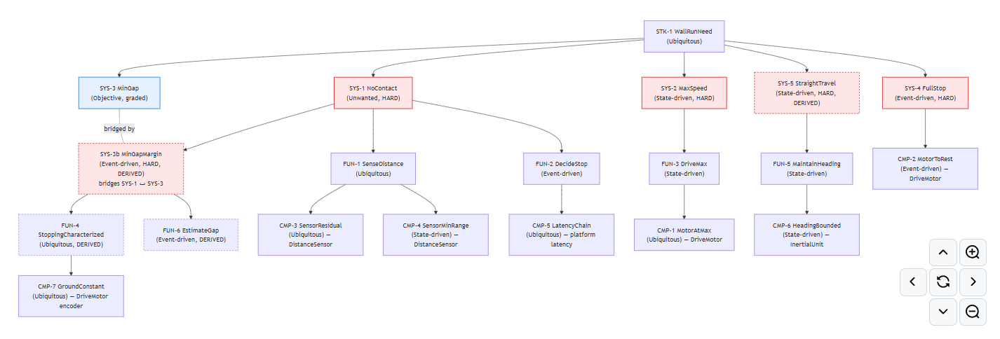
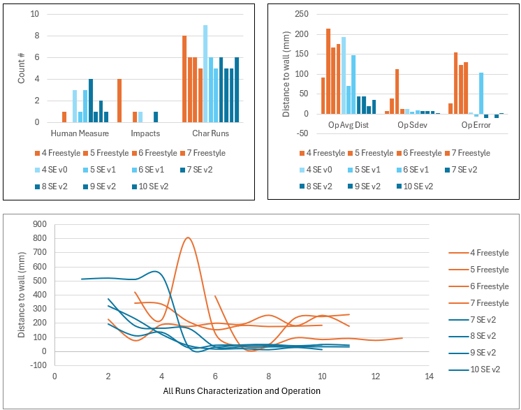

# System Engineering method for self-learning robotics with Claude, Lego Spike Prime and SysML v2

## Focus

The focus of this project is to see if the application of a systems engineering approach can help an AI learn to control a physical system in the real world. Each test campaign is run as a clean slate: the AI starts by knowing very little about a robotic rover it must learn to control to do a task with no memory of prior attempts. The non-deterministic nature of AI models, coupled with dispersions in real hardware performance, provides for a wide variety of approaches and outcomes.

## Systems Engineering Approach

The systems engineering approach has been used successfully over time to guide engineers to create order out of chaos to determine and control the performance and outcomes of complex systems. This project explores whether the same discipline can create the same order when the engineer is an AI. A systems engineering (SE) method was developed and refined over the course of this project (v0, v1, v2). It instructs the AI to break the task into requirements, build an engineering model of the system (in SysML v2), perform a sensitivity study using this model to determine which data is most important, use this study to focus data gathering and any anomaly investigation, then provide a performance prediction and finally run a verification test.



*Figure 1: Requirements and SysML v2 models generated in SE test 7*

## Test Architecture

This approach is applied over a test architecture consisting of first a characterization phase where the AI develops and tests its approach to the task via an MCP server to the rover hardware. The AI is instructed to do this in as few tries as possible with as few human measurements as possible. Then when the AI thinks it has figured out how to control the system it is instructed to freeze a written prediction for a key performance metric and then run the program for verification. If verification passes, the program is locked and run five times in an operation phase where real world rover performance is compared to the prediction (once all five runs are completed). This method is compared to asking the AI to complete the task any way it sees fit ("freestyle"), using the exact same hardware, AI model settings, characterization phase, operation phase and scoring.

 

*Figure 2: Lego Spike Prime Rover*

## The Task

The task is to drive the rover at full speed towards a wall 1m away and stop as close as possible to the wall without hitting it. The AI is instructed that analysis is free and so is repositioning and rebooting the rover between runs. Each flashing of a new program on the rover and all other requests for human measurement or observational information about the rover will count against its score. The hardware configuration under test is a Lego rover based on the Spike Prime architecture. This hardware includes several realities that must be discovered and overcome such as which sensor and motor are on which port. Also, each differential drive motor has different top speeds (creating rover yaw at full power). One of the two forward facing ultrasonic distance sensors has an erroneous offset (and both are positioned at an angle). The wheel encoder can slip when starting and stopping abruptly. Finally, there is a third ultrasonic sensor pointing aft and a color reflectivity sensor pointing down which are not needed for the task and must be ignored. The AI must decide how to identify, diagnose and overcome real world ambiguous data in each test campaign.

## Results



*Figure 3: Freestyle and SE Test Results*

The results of this project are based on testing using Claude Opus 4.8 Max with Thinking on. Because each test campaign learns from scratch, differences in what the AI discovers first compound. For example, four identical SE prompts on the same rover hardware produced four different rover stopping architectures. Despite this, in every test during the operational phase, for both the freestyle and SE campaigns the rover never hit the wall. There was, however, a wide degree of variation in how close it got, how close it was to its prediction, and how repeatable the gap was across the five operational runs. The freestyle runs generally averaged ~100mm to 200mm away from the wall in operation, while the SE runs were able to get much closer. The final version of the SE approach (v2) was used for the last four campaigns and consistently stopped less than 50mm from the wall. The predicted gap as well as the standard deviation across the five operational runs were also consistently much less for the SE campaigns. Interestingly the path to these results involved a similar number of characterization runs, with both the freestyle and SE campaigns generally needing 5-6 runs (each with an outlier to 8 and 9 runs respectively). Also of note is that in the characterization phase the SE campaigns were far more likely to ask for a human measurement, and freestyle campaigns were somewhat more likely to see impacts during characterization.

Per-campaign artifacts — the derived requirements, SysML models, calibration and verification plans and reports, locked programs, and a one-page summary per arm — are committed under [`latest/`](latest); the numbers above are from [`latest/Spike-SysML Summary.xlsx`](latest/Spike-SysML%20Summary.xlsx).

## Next Steps

The next steps of this project will dig deeper into the changes made to the SE approach over the course of this project and evaluate their direct ties to AI behavior and rover performance. Also testing is planned with both more and less capable models for comparison.

## What this is not

Spike SysML is not a SPIKE programming environment and not a competitor to SPIKE App or Pybricks. It does not generate certifiable artifacts and does not perform V&V — it is a scoped engineering project in which LEGO hardware stands in for a target system, producing the kinds of inputs a human-led verification process would consume.

## Repository guide

- [`latest/`](latest) — per-campaign artifacts for tests 4–10, plus [`Spike-SysML Summary.xlsx`](latest/Spike-SysML%20Summary.xlsx), the campaign summary workbook the results figure is rendered from.
- [`prompts/`](prompts) — the runnable instruments: the shared `Task_core.md` both arms prepend, plus `Se_arm_prompt.md` and `Freestyle_arm_prompt.md`.
- [`docs/`](docs) — [`evaluation.md`](docs/evaluation.md) (the locked experiment design: information diet, two-phase protocol, metrics), [`architecture.md`](docs/architecture.md), [`wire_contract.md`](docs/wire_contract.md), and [`system_prompts.md`](docs/system_prompts.md).
- [`models/`](models) — `rover_generic`, the rover-agnostic SysML v2 starting point the SE arm composes from: a bare component skeleton, a free-parameter physics-relation catalog, and requirement templates. The worked wall-run instantiation is produced per campaign under `latest/`.
- [`spike_prime_mcp/`](spike_prime_mcp) — the MCP server (`flash_program`, `run_program`, `get_telemetry`): the shared hardware seam both arms drive through. See [`spike_prime_mcp/README.md`](spike_prime_mcp/README.md).
- [`spike_prime_direct/`](spike_prime_direct) and [`tools/`](tools) — the developer cockpit (`spiketelem.py`) and the tool surface beneath it.

## Architecture and tool surface

The build follows two patterns from [*Building Effective Agents*](https://www.anthropic.com/research/building-effective-agents), plus human review gates. **Prompt-chaining** carries the requirements-and-modeling thread: a single governed sequence works the spec top-down — STK→SYS→FUN→CMP to the single-effector level, authored in EARS to INCOSE GtWR / ISO-29148 — then composes a SysML v2 model by binding calibrated parameters into generic relation templates. **Evaluator-optimizer** carries the hardware-in-the-loop stages, with the hardware as the evaluator: calibration and verification iterate against real telemetry until the fit is sufficient or the prediction holds. **Human review gates** sit before the costly hardware steps; the gate delivers artifacts and decides continue-or-stop on the evidence they carry — it never modifies the test.

Tool surface (v0.1): `sysml_validate`, `check_trace_complete`, `spike_deploy`, `spike_run`, `test_eval`. See [`docs/architecture.md`](docs/architecture.md) for the pipeline sketch and [`docs/wire_contract.md`](docs/wire_contract.md) for the telemetry wire format and requirements model schema.

## Setup

Requires Python 3.10+, and for hardware runs a SPIKE Prime hub on Pybricks firmware. Install the dependencies:

```
pip install pybricksdev matplotlib mcp
```

- `pybricksdev` — BLE communication with the hub (deploy + run).
- `matplotlib` — live telemetry plots in `spiketelem.py`. Required unless you pass `--no-plot`.
- `mcp` — only needed for the `spike_prime_mcp` server (see [`spike_prime_mcp/README.md`](spike_prime_mcp/README.md)).

## Quickstart

```
# validate a requirements model
python spike_prime_direct/spiketelem.py validate spike_prime_direct/requirements_example.json

# run the full pipeline against a real hub (Pybricks firmware required)
python spike_prime_direct/spiketelem.py run spike_prime_direct/hub_program_example.py \
                        spike_prime_direct/requirements_example.json \
                        --log run.jsonl

# or synthesize telemetry without hardware to exercise the pipeline
python spike_prime_direct/spiketelem.py demo spike_prime_direct/requirements_example.json --seconds 8
```

A live plot window opens during `run` and `demo`, one panel per sensor named in a requirement, with each requirement's pass band shaded. Add `--no-plot` to skip it, or `--snapshot out.png` on `demo` to render headless. `spiketelem.py` is a developer cockpit on top of the tool surface; the automated pipeline's agents would call the `tools/` functions directly.

## Status

Implementation v0.1. **Built:** the tool surface, and the evaluator-optimizer right-half (deploy → run → eval) running end-to-end against hardware via `spiketelem.py` and via the `spike-prime-mcp` server. The committed `models/` SysML v2 model validates clean in Syside (the SysML v2 VSCode tooling), though not yet through the in-pipeline grammar loop. **Run in-context, not yet automated:** the structured-vs-freestyle comparison itself — seven campaigns complete (tests 4–10), performed by the model under the [`prompts/`](prompts) instruments through the MCP, with artifacts under [`latest/`](latest). **Not yet built:** the automated requirements-and-modeling left-half — see [Planned](#planned).

### Known issues

- **`reaches` crossing precision.** `test_eval` scores `reaches` by attainment-or-crossing (a sign change in `value - target` between samples), which fixes the prior exact-float-equality bug. Sub-sample crossing time is not interpolated; see the TODO in `tools/test_eval.py`.

## Planned

The direction is a **fully automated pipeline**: a model takes a free-text spec and runs the whole loop — requirements decomposition, effector selection, SysML model composition, calibration, the pre-run verification argument, and the integrated verification run — with the human gates preserved but the requirements-and-modeling left-half executed in code rather than in-context. Today that left-half exists as design ([`docs/architecture.md`](docs/architecture.md)) and draft prompts ([`docs/system_prompts.md`](docs/system_prompts.md)). Also planned: the `verified`-stage checks, the `full` SysML v2 grammar mode, and the calibration/verification tool surface the pipeline's hardware loops will add.

## License

MIT. See [LICENSE](LICENSE).