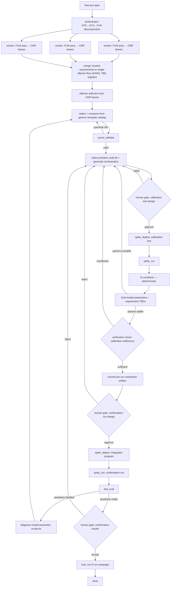

# Architecture

> **Status:** v0.4 — this document describes the full intended pipeline ahead of
> the build. The evaluator-optimizer right-half (deploy → run → eval) runs
> end-to-end against real hardware via `spiketelem.py` and via the
> `spike-prime-mcp` server. The left-half requirements decomposition, model
> selection and composition, the calibration stage, and the human review gates are
> designed here but not yet built. The seed unit models are committed under
> [`../models/`](../models) (validated clean in Syside, the SysML v2 VSCode tooling;
> not yet validated through the in-pipeline grammar loop). The structured-vs-freestyle
> comparison this pipeline anchors is specified in [`evaluation.md`](evaluation.md);
> the A/B's structured arm is the in-context realization of this pipeline, run
> through the MCP from [`../experiments/se_arm_prompt.md`](../experiments/se_arm_prompt.md).
>
> *v0.4 changes: requirements decomposition specified as top-down STK→SYS→FUN→CMP
> to the single-effector floor, EARS-authored to INCOSE GtWR / ISO-29148 (the four
> functional/behavioral/interface/constraint categories become requirement types),
> with a TBD register and a visual requirement tree; an effector-selection stage
> added between requirements and model composition; calibration binds both the
> model's free parameters and the requirement TBDs; the pre-run verification
> artifact made explicit as the committed-before-the-run centerpiece; the integrated
> test reframed as a single confirmation run that tests the committed prediction
> (falsification → diagnose the model parameter and re-derive), with the 5-run
> campaign as the experimental wrapper.*
>
> *v0.3 changes: both comparison arms now run through the MCP (routing resolved);
> the generation/selection rule refined to "develop what calibration can verify";
> the comparison design consolidated into evaluation.md.*

## Pattern selection

Spike SysML uses two patterns from [*Building Effective Agents*](https://www.anthropic.com/research/building-effective-agents):

1. **Orchestrator-workers** — for requirements decomposition.
2. **Evaluator-optimizer** — for hardware-in-the-loop code generation.

Why these two: requirements decomposition fans out — the top-down STK→SYS→FUN split is done once, then each function area decomposes to its single-effector (CMP) leaves in parallel, so orchestrator-workers fits the FUN→CMP step; and the hardware loop has a natural critic — the robot either does the thing or it doesn't. The two other major patterns from the post are less interesting here: prompt chaining is too linear for the parallel leaf-decomposition step, and routing implies a choice between specialists where this system has only one path.

Two published systems ground the harder halves of this pipeline without displacing the two patterns above; they sit underneath them. **Iserte et al.** (*Computers in Industry* 172, 2025) generate valid SysML v2 from natural language by pairing retrieval over a curated example repository with an ANTLR-grammar validation engine in a self-correcting loop; Spike SysML borrows the validation-in-a-loop half and declines the generate-from-scratch half (see *Generation vs. selection* under Resolved decisions). **Aegis** (arXiv 2410.12475) structures functional-safety work as a hierarchical multi-agent team whose progress is gated by a review-before-proceed node — the pattern Spike SysML adopts for its human calibration gate (see *The review gate*).

One refinement to the pattern map: the evaluator-optimizer pattern recurs twice — once in the calibration loop (stage 5, hardware as evaluator for unit parameters) and once at the integrated confirmation run (stage 6, hardware as evaluator for the committed system prediction). Orchestrator-workers applies to requirements derivation (stage 2) — the top-down split, then per-function-area decomposition to the single-effector leaves in parallel; effector selection and model selection-and-composition (stage 3) are selection-and-composition steps rather than worker-parallelism, and are treated as such below. The two patterns from *Building Effective Agents* remain the spine; Iserte and Aegis are domain-specific grounding layered beneath them.

## Requirements method

Requirements are decomposed top-down through four levels — **STK** (stakeholder need) → **SYS** (system black-box) → **FUN** (function) → **CMP** (single-effector leaf, the verification floor) — with every child traced to its parent. Each requirement is authored in **EARS** grammar (Ubiquitous / State-driven / Event-driven / Optional / Unwanted) to the **INCOSE GtWR** quality rules over **ISO/IEC/IEEE 29148**, with **NASA SP-2016-6105** for the decomposition and V&V framing. The familiar functional / behavioral / interface / constraint categories survive as requirement *types* tagged on the leaves rather than as the decomposition axis. Decomposition stops at a requirement verifiable by a test on a single effector, or where it is irreducibly integrative. Two artifacts fall out and are part of the build record: a **TBD register** binding each unknown value to the calibration activity that closes it, and a **visual requirement tree** (Mermaid). An effector with no requirement tracing to it drops out — verified, not assumed.

## System modeling method

The requirements are realized as one connected **SysML v2** model in packages — not a monolith, and not a scatter of standalone models: a structural **skeleton** (the platform's effectors and sensors as blocks, no relations), a **relation-template catalog** (the physics — drive, braking, speed-from-budget — as free-parameter `calc def`s), a **requirement-template catalog** (parameterized `requirement def` shapes), and a **design** that specialises the skeleton and instantiates only the templates its requirements call for. Requirements live *in* the model as formal `requirement def`s — the EARS prose becomes the `doc`, the verifiable predicate becomes a `require constraint` over the subject's attributes — and the design claims them with `satisfy`. The **satisfy/require roll-up, evaluated against the calibrated values, is the pre-run verification artifact**: the inspectable predicted-pass/fail tree the freestyle arm structurally cannot emit. Relation forms follow the same develop-or-select rule as calibration — develop a relation only where calibration can falsify its form, select a pre-validated template otherwise. The braking quadratic shows the rule's two branches: where the speed envelope spans a range, a sweep's fit-residual curvature would expose a dropped term (develop); where the task runs at a single operating point — as the wall-run does — there is nothing to extrapolate and so no form error to expose, and the template is selected with its stopping distance calibrated directly at that point (the deceleration back-solved for the feasibility check only). An effector that no requirement traces to drops out by the same **absence-by-traceability** that governs the requirements (here the downward reflectance sensor). The model is also the **calibration intake**: it carries the consolidated calibration surface — every free model parameter and every requirement TBD as a value-less attribute, indexed in one place — and the calibration plan's register adds procedure, units, and value slots on top of it. Source of truth is the **requirements specification, not the model**: the model is a formal realisation, and on any disagreement the spec governs and the model is reconciled to it. Authored to the OMG **SysML v2** specification with the standard library for quantities/units; the formal-requirements and satisfaction/verification constructs follow the OMG beta-spec lessons (Sensmetry *Advent of SysML v2*, 23–24).

Validation note: no local SysML v2 grammar checker is in the loop, so constructs are restricted to forms already validated in the four unit models or the beta-spec examples, and four mechanical checks stand in until Syside runs — delimiter balance, requirement-tree reachability from the root, the realized decomposition edge-set against the spec tree, and a per-package import-resolution audit.

## Flow

> Left half (spec → requirements → effectors) is orchestrator-workers over the
> leveled decomposition, with the grammar loop on `sysml_validate` the retained
> half of Iserte. The two hardware activities (calibration, the integrated
> confirmation run) are both evaluator-optimizer, with deterministic fitting
> between. There are four human checkpoints: a test-design review gate before each
> hardware run, and a results verification after each — the calibration-sufficiency
> check (the Aegis review-before-proceed node) gating the expensive integrated run,
> and the confirmation-results acceptance gating the campaign. The **pre-run
> verification artifact** is committed at `ART`, before the integrated run, and is
> the centerpiece of the structured-vs-freestyle contrast; on a falsified prediction
> the loop re-derives the model parameter rather than tweaking the program. The
> 5-run **campaign** (`CAMP`) is the experimental wrapper specified in
> [`evaluation.md`](evaluation.md), not part of the per-build pipeline.
>
> The select-and-compose step (`SEL`) is also where each requirement's
> `pass_criteria` and `verified_by` are written: it is the first stage holding the
> channels and bound parameters those reference, so the upstream workers emit only
> requirement semantics (`text`, `type`, `source`). See
> [`wire_contract.md` §2.1](wire_contract.md#21-pass_criteria-operator-grammar-v01).

## Tool surface

| Tool                   | Purpose                                                                                                                                                                                                                                                                                                                           | Status                                   |
| ---------------------- | --------------------------------------------------------------------------------------------------------------------------------------------------------------------------------------------------------------------------------------------------------------------------------------------------------------------------------- | ---------------------------------------- |
| `sysml_validate`       | Validate a composed SysML v2 model against the `lego` grammar subset; returns the parse result and a list of violations, empty on success. Fails closed — an unparseable model blocks codegen.                                                                                                                                    | v0.1, `lego` subset                      |
| `check_trace_complete` | Companion to `sysml_validate` at the composed stage: confirms the traceability spine is *present* (every requirement carries `unit_model` and a non-empty `depends_on_parts`), as opposed to merely well-formed. Returns a `complete` verdict kept separate from `valid`, so structural validity never depends on pipeline stage. | v0.1, `composed` stage                   |
| `spike_deploy`         | Transfer a MicroPython program to the hub over BLE and confirm receipt; returns a deploy handle or a transport error. Does not execute.                                                                                                                                                                                           | v0.1, BLE via `pybricksdev`              |
| `spike_run`            | Execute a deployed program and stream hub-emitted telemetry until the `{"event":"end"}` sentinel; returns the JSONL trace. Surfaces truncation via stop conditions rather than absorbing it.                                                                                                                                      | v0.1, BLE via `pybricksdev`              |
| `test_eval`            | Score a telemetry trace against the `pass_criteria` of the requirement it implements; returns per-criterion pass/fail and the joined evidence. Zero matching samples is a fail, not an error.                                                                                                                                     | v0.1, grammar in `docs/wire_contract.md` |

> Calibration (stage 5) and the integrated confirmation run (stage 6) will add tool surface — a calibration-test selector, a deterministic constant-fitter, and a sufficiency-report builder for the human gate. These are unbuilt and deliberately kept out of the table above.

The hub-to-host wire format and the requirements model schema both live in [`wire_contract.md`](wire_contract.md). The orchestrator-workers prompts are in [`system_prompts.md`](system_prompts.md).

## Interactive seam: spike-prime-mcp

The tool surface above is the *in-process* pipeline interface — the orchestrator and `spiketelem.py` call those functions directly. A second, parallel front-end reaches the same hardware: the `spike-prime-mcp` server (see [`../spike_prime_mcp/README.md`](../spike_prime_mcp/README.md)) exposes three tools — `flash_program`, `run_program`, `get_telemetry` — over the Model Context Protocol, so a conversational client such as Claude Desktop can deploy code, run it, and read telemetry directly. Both front-ends sit on the same async runtime (`tools/_runtime.py`) and differ only in caller: in-process Python for the pipeline, stdio MCP for the interactive client.

This seam is the shared hardware interface for the structured-vs-freestyle comparison (see [`evaluation.md`](evaluation.md)): **both arms drive the hardware through the MCP**, so the comparison varies only the governance layer, not the seam. The freestyle arm is the model over the MCP with no SysML governance in front of it; the structured arm runs its calibration and verifying runs through the same tools. Because the MCP returns a complete trace at end-of-run rather than streaming, the structured arm's calibration reads its decay points from on-hub buffering rather than a live feed; live plotting is preserved on the in-process diagnostic path (`spiketelem.py`) for development use, outside the scored comparison.

The runnable instruments for the comparison live in [`../experiments/`](../experiments): a shared `task_core.md` (task, primitives, wire format, two-phase protocol, scoring) that both arms prepend, plus the arm-specific deltas `freestyle_arm_prompt.md` (no method) and `se_arm_prompt.md` (the requirements method, tenets, model strategy, and develop-model-calibrate-verify-gate mandate). The structured arm of the A/B is this pipeline's discipline performed *in-context* under that prompt and routed through the MCP, rather than the fully automated multi-agent pipeline described here; the pipeline is the broader vision the A/B's structured arm realizes a slice of.

## Calibration

Unit models enter composition with free parameters — the rpm-to-speed constant, the achievable deceleration `a`, the composite response time `t_response`, the distance-sensor offset. None are known until they are measured on the specific hardware. Stage 5 binds two kinds of unknown: these **model-completion parameters** (which the model needs to predict, but no requirement names) and the **requirement TBDs** the decomposition flagged (the heading tolerance, the stopping-distance prediction and clearance-measurement uncertainties, and the run-to-run spread that together size the margin). The first complete the model; the second close the TBD register; the calibration runs are designed together to bind both. For each, the system selects a calibration test (drive a known motor command and read actual travel off the gyro/clock; brake from speed and measure stopping distance; approach a wall slowly to zero the distance offset), runs it, and fits the constant.

Division of labor matters here. The agent selects the test and interprets the result; the numerical fit is deterministic code, not the LLM — eyeballed constants produce plausible-but-wrong calibration, the worst failure mode because it passes review. Calibration that estimates a single linear constant must be designed to expose the terms it might otherwise absorb — but only when the operating envelope makes those terms reachable. The braking term `v²/(2a)` is quadratic in speed, so a single-speed fit *extrapolated* across a range folds it silently into the linear constant and is quietly wrong at the envelope edges; the mitigation there is a speed sweep with fit-residual-curvature inspection. When the task instead runs at one operating point — calibration point = operating point — there is no extrapolation, the quantity is measured directly at that point, and the sweep is unnecessary. The wall-run is this single-point case (max speed only): it calibrates the stopping distance directly at v_max and back-solves the deceleration for the feasibility ceiling. Cross-sourcing is also the discipline's fault detector: every characterization run logs every independent channel that bears on the quantity, so a discrepant sensor reveals itself against the others rather than being assumed.

*Status: designed, not built.*

## Open questions

- **Evidence package for the gate.** The human gate is only as good as what it surfaces. Open question: the contents of the sufficiency package — fitted parameters with residuals, fit-quality flags (including the curvature check where a sweep was used), and a map from each parameter to the integrated-test requirements that depend on it. Too little and the gate rubber-stamps; too much and it bottlenecks.
- **Agent pre-screen of sufficiency.** Whether an Aegis-style expert agent should pre-screen calibration sufficiency and hand the human a recommendation, or the human reviews unaided. The former is richer and more faithful to Aegis; the latter keeps the accountable judgment unambiguously human.
- **Higher-order calibration terms.** Where the line sits for promoting a calibration model from linear to higher-order. The braking term is the first case; the policy (sweep and test for curvature *where the envelope spans the relevant range*, measure directly at the operating point where it does not, and add terms only on demonstrated residual structure) generalizes to other parameters.
- **Safety-margin ownership.** The `margin` term in the stop constraint is a risk-acceptance decision set by the human at the gate. Default value, and whether it should scale with speed, are open. (In the requirements model this is SYS-7's margin `M`, sized from the calibrated uncertainties — see the TBD register.)
- **SysML v2 schema source.** The OMG draft, or a constrained subset suitable for the LEGO domain? Likely the latter — full SysML v2 is overkill for SPIKE Prime, and a subset is easier to validate against. v0.1 implements the `lego` subset; the `full` mode in `sysml_validate` is deferred.
- **Iteration budget on the evaluator-optimizer loops.** Applies to the calibration loop (stage 5) and the integrated confirmation run with its re-derive path (stage 6). Hard cap (e.g., 5 retries) or cost-aware? A hard cap is simpler; cost-aware is more honest about the production-shaped constraint. The two may warrant different budgets.
- **Signal-name pre-flight check.** The agreement between `pass_criteria.sensor` and the channels a run actually produces is currently caught only at runtime (`test_eval` returns zero samples for a mismatched name). There are two halves to close earlier, and they belong in different places. The model-internal half — `pass_criteria.sensor` must name a channel some part *declares* in `parts[].emits` — is the emit-coverage check of the `verified` stage of `check_trace_complete` (see [`wire_contract.md` §2.3](wire_contract.md#23-traceability-spine-fields)), kept out of `sysml_validate` so "valid" stays strictly "well-formed." The program-conformance half — the candidate program actually emits the channel it declares — still needs the program in hand and remains a runtime discovery for now; see [`wire_contract.md` §3](wire_contract.md#3-signal-name-agreement).

## Resolved decisions

- **The review gates (human in the loop).** The pipeline has human touchpoints at five places: authoring the original spec at the front, and four checkpoints on the hardware side arranged as a pre-run gate and a post-run verification around each of the two hardware activities. A *test-design gate* precedes each run — the human approves the calibration test (design + code) before it runs, and the confirmation-run design before the integrated run — so no hardware actuates on an unreviewed plan. A *results verification* follows each: after calibration, a *sufficiency check* confirms the fit is physical and adequate (fitted values, the residual-curvature flag where a sweep was used, parameter plausibility) before the expensive integrated run is authorized; after the confirmation run, a *results acceptance* confirms the committed prediction held (evidence sound, pass not spurious, requirements actually exercised) before the campaign is locked. The calibration-sufficiency check is the V-model integration gate, structurally the review-before-proceed node from **Aegis**, with a human in the seat instead of an expert agent. An Aegis-faithful extension, noted under Open questions, is to have an agent pre-screen sufficiency and present the human a drafted assessment and recommendation: agent drafts, human decides. Everything else is agent-owned.
- **Generation vs. selection.** The pipeline **composes** a SysML model — it selects from a catalog of *generic, rover-agnostic* relation templates (e.g. speed-from-rotation, stopping-distance = reaction + braking, parameters left free), instantiates them against the requirements it derived, binds calibrated parameters, and grammar-validates the result. It does not synthesize models freely from natural language (the **Iserte et al.** approach), which buys generality the domain doesn't need and adds a failure surface it can't justify. Retained from Iserte is the grammar-validation-in-a-loop: the *composed* model validates against the SysML v2 grammar via `sysml_validate`, because composition — interconnections and bound parameters — is where invalidity enters even when templates are individually valid. The selection/generation line is drawn by **what calibration can verify**: the pipeline may *develop* a relation whose structural error its calibration can independently expose, and must *select* a validated template for any relation the calibration cannot check. The stop relation sits on that boundary, and which side it falls on depends on the task: across a speed range a sweep's residual curvature would expose a dropped quadratic term (develop — a stronger demonstration, the process catching its own error); at a single operating point the calibration cannot expose a form error, so the relation is selected and calibrated directly at the point. The wall-run is single-point and therefore selects; a speed-spanning variant is the case that would demonstrate the develop branch. This is graded by consequence: develop-with-calibration-backstop is appropriate for this LEGO demonstrator; safety-critical hardware would tighten to validated, reviewed relations and not rely on calibration to find model-structure errors. The committed seed models in [`../models/`](../models) are rover-specific *exemplars*; for the structured arm they are the reference the generic catalog and the agent's developed composition are checked against — not the input handed to the arm.
- **Library primitives vs. generated orchestration.** Code is split at the hardware boundary. Primitive operations — commanding a motor to a speed, reading a sensor channel — are templated library blocks: the operation set is closed, and pre-tested code is more trustworthy than generated MicroPython where there is no upside to generating it. Mission orchestration — the control logic that sequences primitives to satisfy a spec — is generated, because it varies per requirement and is where generation earns its place. The split mirrors ordinary software practice: the standard library is not regenerated on every build; the application logic that calls it is. The evaluator-optimizer loop iterates on the orchestration, not on whether the motor API was called correctly.
- **The SysML layer carries constraints and parameters, not labels.** With the unit relations supplied as generic templates, the SysML v2 layer earns its place through what it holds rather than what it generates: requirement-to-element-to-test traceability, the parametric relations that encode the system physics, and the calibration constants those relations depend on. Two worked examples: *motor turn → rover speed* is a parametric edge whose constant (bundling wheel geometry, gear ratio, and slip) is bound by calibration, not computed; and the stop constraint, `d_measured ≥ v·t_response + v²/(2a) + margin`, encodes reaction distance, braking distance, and a human-set safety margin as a formal relation rather than logic buried in code. This is the distinction between the model and a configuration table, and it is the point at which calibration (stage 5) becomes model anchoring — binding a parametric model's free parameters to physical hardware through designed tests.
- **SPIKE communication.** Bluetooth via `pybricksdev`. The JSONL framing plus `{"event":"end"}` sentinel is the reliability pattern that closes the gap originally flagged against USB — buffer-drain races at end-of-run are fenced by the sentinel; chunk-boundary line assembly is handled in `tools/_runtime.py`.
- **Requirements-to-test traceability.** Telemetry is sensor-tagged, not requirement-tagged; the requirements model is the single source of truth, and `test_eval` joins on `pass_criteria.sensor` per requirement. This keeps the wire format general (any telemetry consumer can read a trace without knowing the requirements model) and makes re-grading an old trace against a new model trivial.