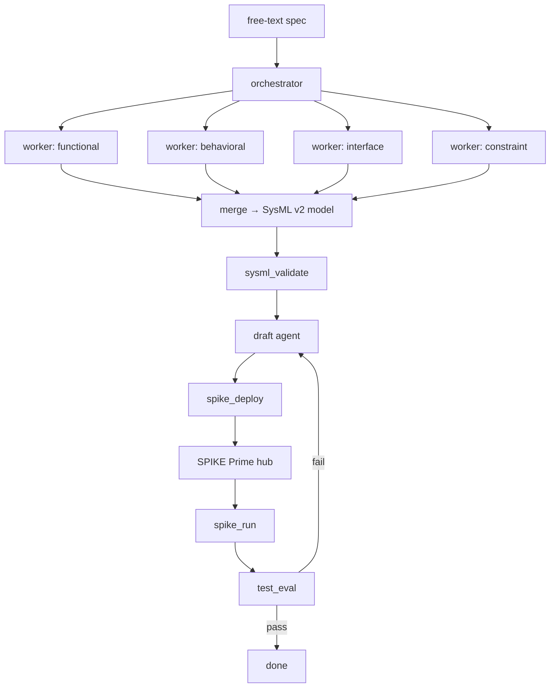

# Architecture

> **Status:** v0.1 — tool surface implemented; the evaluator-optimizer right-half runs end-to-end against real hardware via `spiketelem.py`. The orchestrator-workers left-half is still in prompts only.

## Pattern selection

Spike SysML uses two patterns from [*Building Effective Agents*](https://www.anthropic.com/research/building-effective-agents):

1. **Orchestrator-workers** — for requirements decomposition.
2. **Evaluator-optimizer** — for hardware-in-the-loop code generation.

Why these two: requirements decomposition is naturally parallel (functional, behavioral, interface, and constraint requirements can be extracted independently), and the hardware loop has a natural critic — the robot either does the thing or it doesn't. The two other major patterns from the post are less interesting here: prompt chaining is too linear for the parallel decomposition step, and routing implies a choice between specialists where this system has only one path.

## Flow

## Tool surface

| Tool | Purpose | Status |
|------|---------|--------|
| `sysml_validate` | Schema-check structured requirements against SysML v2. | v0.1, `lego` subset |
| `spike_deploy` | Push generated MicroPython to the SPIKE Prime hub. | v0.1, BLE via `pybricksdev` |
| `spike_run` | Execute a test program and stream sensor telemetry. | v0.1, BLE via `pybricksdev` |
| `test_eval` | Score a run against the requirement it implements. | v0.1, `pass_criteria` grammar in `docs/wire_contract.md` |

The hub-to-host wire format and the requirements model schema both live in [`docs/wire_contract.md`](wire_contract.md). The orchestrator-workers prompts are in [`docs/system_prompts.md`](system_prompts.md).

## Open questions

- **SysML v2 schema source.** The OMG draft, or a constrained subset suitable for the LEGO domain? Likely the latter — full SysML v2 is overkill for SPIKE Prime, and a subset is easier to validate against. v0.1 implements the `lego` subset; the `full` mode in `sysml_validate` is deferred.
- **Iteration budget on the evaluator-optimizer loop.** Hard cap (e.g., 5 retries) or cost-aware? A hard cap is simpler; cost-aware is more honest about the production-shaped constraint.
- **Where does the human stay in the loop?** The evaluator is hardware, but a human still has to write the original spec and ultimately accept the result. Worth being explicit about which decisions stay with the human and which are agent-owned.
- **Signal-name pre-flight check.** The agreement between `pass_criteria.sensor` in the requirements model and the sensors the draft agent's program actually emits is currently validated only at runtime (`test_eval` returns zero samples for a mismatched name). The intended fix is a pre-flight check inside `sysml_validate` that takes both the model and the candidate program; see [`docs/wire_contract.md` §3](wire_contract.md#3-signal-name-agreement).

## Resolved decisions

- **SPIKE communication.** Bluetooth via `pybricksdev`. The JSONL framing plus `{"event":"end"}` sentinel is the reliability pattern that closes the gap originally flagged against USB — buffer-drain races at end-of-run are fenced by the sentinel; chunk-boundary line assembly is handled in `tools/_runtime.py`.
- **Requirements-to-test traceability.** Telemetry is sensor-tagged, not requirement-tagged; the requirements model is the single source of truth, and `test_eval` joins on `pass_criteria.sensor` per requirement. This keeps the wire format general (any telemetry consumer can read a trace without knowing the requirements model) and makes re-grading an old trace against a new model trivial.
