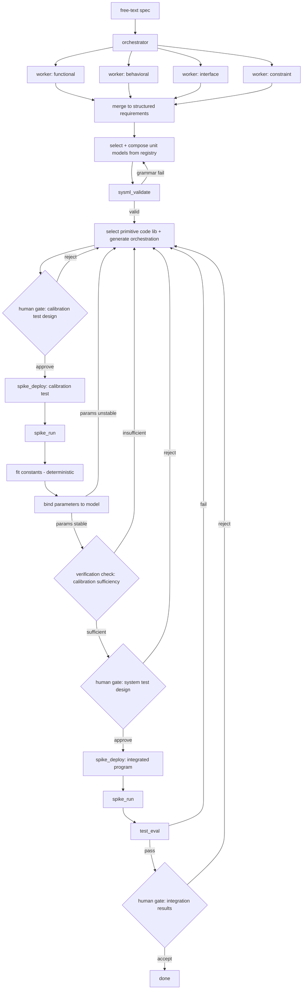

# Architecture

> **Status:** v0.2 — this document now describes the full intended pipeline;
> implementation is unchanged. The evaluator-optimizer right-half
> (deploy → run → eval) runs end-to-end against real hardware via
> `spiketelem.py` and via the `spike-prime-mcp` server. The left-half model
> selection and composition, the calibration stage, and the human review gates
> are designed here but not yet built. The seed unit models are committed under
> [`../models/`](../models/) (drafted, not yet grammar-validated).

## Pattern selection

Spike SysML uses two patterns from [*Building Effective Agents*](https://www.anthropic.com/research/building-effective-agents):

1. **Orchestrator-workers** — for requirements decomposition.
2. **Evaluator-optimizer** — for hardware-in-the-loop code generation.

Why these two: requirements decomposition is naturally parallel (functional, behavioral, interface, and constraint requirements can be extracted independently), and the hardware loop has a natural critic — the robot either does the thing or it doesn't. The two other major patterns from the post are less interesting here: prompt chaining is too linear for the parallel decomposition step, and routing implies a choice between specialists where this system has only one path.

Two published systems ground the harder halves of this pipeline without displacing the two patterns above; they sit underneath them. **Iserte et al.** (*Computers in Industry* 172, 2025) generate valid SysML v2 from natural language by pairing retrieval over a curated example repository with an ANTLR-grammar validation engine in a self-correcting loop; Spike SysML borrows the validation-in-a-loop half and declines the generate-from-scratch half (see *Generation vs. selection* under Resolved decisions). **Aegis** (arXiv 2410.12475) structures functional-safety work as a hierarchical multi-agent team whose progress is gated by a review-before-proceed node — the pattern Spike SysML adopts for its human calibration gate (see *The review gate*).
 
One refinement to the pattern map: the evaluator-optimizer pattern now recurs twice — once in the calibration loop (stage 5, hardware as evaluator for unit parameters) and once in the integration loop (stage 6, hardware as evaluator for system behavior). Orchestrator-workers still applies to requirements derivation (stage 2); model selection and composition (stage 3) is a selection step rather than worker-parallelism, and is treated as such below. The two patterns from *Building Effective Agents* remain the spine; Iserte and Aegis are domain-specific grounding layered beneath them.

## Flow

> Left half (spec → requirements) is orchestrator-workers. The grammar loop on
> `sysml_validate` is the retained half of Iserte. The two hardware loops
> (calibration, integration) are both evaluator-optimizer. There are four human
> checkpoints: a test-design review gate before each hardware run, and a results
> verification after each — the calibration-sufficiency check (the Aegis
> review-before-proceed node) gating the expensive integrated test, and the
> integration-results acceptance gating "done".
>
> The select-and-compose step (`SEL`) is also where each requirement's
> `pass_criteria` and `verified_by` are written: it is the first stage holding
> the channels and bound parameters those reference, so the upstream workers
> emit only requirement semantics (`text`, `type`, `source`). See
> [`wire_contract.md` §2.1](wire_contract.md#21-pass_criteria-operator-grammar-v01).

## Tool surface

| Tool | Purpose | Status |
|------|---------|--------|
| `sysml_validate` | Validate a composed SysML v2 model against the `lego` grammar subset; returns the parse result and a list of violations, empty on success. Fails closed — an unparseable model blocks codegen. | v0.1, `lego` subset |
| `check_trace_complete` | Companion to `sysml_validate` at the composed stage: confirms the traceability spine is *present* (every requirement carries `unit_model` and a non-empty `depends_on_parts`), as opposed to merely well-formed. Returns a `complete` verdict kept separate from `valid`, so structural validity never depends on pipeline stage. | v0.1, `composed` stage |
| `spike_deploy` | Transfer a MicroPython program to the hub over BLE and confirm receipt; returns a deploy handle or a transport error. Does not execute. | v0.1, BLE via `pybricksdev` |
| `spike_run` | Execute a deployed program and stream hub-emitted telemetry until the `{"event":"end"}` sentinel; returns the JSONL trace. Surfaces truncation via stop conditions rather than absorbing it. | v0.1, BLE via `pybricksdev` |
| `test_eval` | Score a telemetry trace against the `pass_criteria` of the requirement it implements; returns per-criterion pass/fail and the joined evidence. Zero matching samples is a fail, not an error. | v0.1, grammar in `docs/wire_contract.md` |

> Calibration (stage 5) and the integration gate (stage 6) will add tool surface — a calibration-test selector, a deterministic constant-fitter, and a sufficiency-report builder for the human gate. These are unbuilt and deliberately kept out of the table above.

The hub-to-host wire format and the requirements model schema both live in [`docs/wire_contract.md`](wire_contract.md). The orchestrator-workers prompts are in [`docs/system_prompts.md`](system_prompts.md).

## Interactive seam: spike-prime-mcp

The tool surface above is the *in-process* pipeline interface — the orchestrator and `spiketelem.py` call those functions directly. A second, parallel front-end reaches the same hardware: the `spike-prime-mcp` server (see [`../spike_prime_mcp/README.md`](../spike_prime_mcp/README.md)) exposes three tools — `flash_program`, `run_program`, `get_telemetry` — over the Model Context Protocol, so a conversational client such as Claude Desktop can deploy code, run it, and read telemetry directly. Both front-ends sit on the same async runtime (`tools/_runtime.py`) and differ only in caller: in-process Python for the pipeline, stdio MCP for the interactive client.

This seam is also the apparatus for the control arm of the structured-vs-zero-shot comparison (see the README's *Evaluation* section): the zero-shot arm is Claude driving the hardware over the MCP with no SysML governance in front of it. The structured arm currently reaches the hardware through the in-process tool path instead; routing it through the MCP too — so a controlled head-to-head varies only the governance layer, not the seam — is a deliberate design choice still to be settled (the calibration loop's live plotting is the tension, since the MCP returns a trace only at the end rather than streaming).

## Calibration
 
Unit models enter composition with free parameters — the rpm-to-speed constant, the achievable deceleration `a`, the composite response time `t_response`, the distance-sensor offset. None are known until they are measured on the specific
hardware. Stage 5 binds them: for each parameter the system selects a calibration test (drive a known motor command and read actual travel off the gyro/clock; brake from speed and measure stopping distance; approach a wall slowly to zero the distance offset), runs it, and fits the constant.
 
Division of labor matters here. The agent selects the test and interprets the result; the numerical fit is deterministic code, not the LLM — eyeballed constants produce plausible-but-wrong calibration, the worst failure mode because it passes review. Calibration that estimates a single linear constant must also be designed to expose the terms it might otherwise absorb: the braking term `v²/(2a)` is quadratic in speed, so a single-speed calibration folds it silently into the linear constant and is quietly wrong at the edges of the envelope. The mitigation is a speed sweep with inspection of the fit residuals for curvature — design the test to surface the second-order term, then let the data retire it if it proves negligible.
 
*Status: designed, not built.*

## Open questions

- **Evidence package for the gate.** The human gate is only as good as what it surfaces. Open question: the contents of the sufficiency package — fitted parameters with residuals, fit-quality flags (including the curvature check),  and a map from each parameter to the integrated-test requirements that depend on it. Too little and the gate rubber-stamps; too much and it bottlenecks.
- **Agent pre-screen of sufficiency.** Whether an Aegis-style expert agent should pre-screen calibration sufficiency and hand the human a recommendation, or the human reviews unaided. The former is richer and more faithful to Aegis; the latter keeps the accountable judgment unambiguously human.
- **Higher-order calibration terms.** Where the line sits for promoting a calibration model from linear to higher-order. The braking term is the first case; the policy (always sweep and test for curvature vs. add terms only on demonstrated residual structure) generalizes to other parameters.
- **Safety-margin ownership.** The `margin` term in the stop constraint is a risk-acceptance decision set by the human at the gate. Default value, and whether it should scale with speed, are open.
- **SysML v2 schema source.** The OMG draft, or a constrained subset suitable for the LEGO domain? Likely the latter — full SysML v2 is overkill for SPIKE Prime, and a subset is easier to validate against. v0.1 implements the `lego` subset; the `full` mode in `sysml_validate` is deferred.
- **Iteration budget on the evaluator-optimizer loops.** Now applies to two loops — calibration (stage 5) and integration (stage 6). Hard cap (e.g., 5 retries) or cost-aware? A hard cap is simpler; cost-aware is more honest about the production-shaped constraint. The two loops may warrant different budgets.
- **Signal-name pre-flight check.** The agreement between `pass_criteria.sensor` and the channels a run actually produces is currently caught only at runtime (`test_eval` returns zero samples for a mismatched name). There are two halves to close earlier, and they belong in different places. The model-internal half — `pass_criteria.sensor` must name a channel some part *declares* in `parts[].emits` — is the emit-coverage check of the `verified` stage of `check_trace_complete` (see [`docs/wire_contract.md` §2.3](wire_contract.md#23-traceability-spine-fields)), kept out of `sysml_validate` so "valid" stays strictly "well-formed." The program-conformance half — the candidate program actually emits the channel it declares — still needs the program in hand and remains a runtime discovery for now; see [`docs/wire_contract.md` §3](wire_contract.md#3-signal-name-agreement).

## Resolved decisions

- **The review gates (human in the loop).** The pipeline has human touchpoints at five places: authoring the original spec at the front, and four checkpoints on the hardware side arranged as a pre-run gate and a post-run verification around each of the two hardware activities. A *test-design gate* precedes each run — the human approves the calibration test (design + code) before it runs, and the requirement/system test before the integrated run — so no hardware actuates on an unreviewed plan. A *results verification* follows each: after calibration, a *sufficiency check* confirms the fit is physical and adequate (fitted values, the residual-curvature flag, parameter plausibility) before the expensive integrated test is authorized; after integration, a *results acceptance* confirms the run genuinely passed (evidence sound, pass not spurious, requirements actually exercised) before the build is declared done. The calibration-sufficiency check is the V-model integration gate, structurally the review-before-proceed node from **Aegis**, with a human in the seat instead of an expert agent. An Aegis-faithful extension, noted under Open questions, is to have an agent pre-screen sufficiency and present the human a drafted assessment and recommendation: agent drafts, human decides. Everything else is agent-owned.
- **Generation vs. selection.** For SysML model construction, Spike SysML selects and composes from a fixed registry of unit models rather than generating them from natural language. With only three unit models on this hardware (distance sensor, reflectivity sensor, drive/steer motors), synthesis-from-scratch — the **Iserte et al.** approach — buys generality the domain doesn't need and adds a failure surface it can't justify; template-based selection (cf. **SysTemp**) is the better fit. What is retained from Iserte is the grammar-validation-in-a-loop: the *composed* model still validates against the SysML v2 grammar via `sysml_validate`, because composition — the interconnections and bound parameters — is where invalidity is introduced even when the unit models are individually valid.
- **Library primitives vs. generated orchestration.** Code is split at the hardware boundary. Primitive operations — commanding a motor to a speed, reading a sensor channel — are templated library blocks: the operation set is closed, and pre-tested code is more trustworthy than generated MicroPython where there is no upside to generating it. Mission orchestration — the control logic that sequences primitives to satisfy a spec — is generated, because it varies per requirement and is where generation earns its place. The split mirrors ordinary software practice: the standard library is not regenerated on every build; the application logic that calls it is. The evaluator-optimizer loop iterates on the orchestration, not on whether the motor API was called correctly.
- **The SysML layer carries constraints and parameters, not labels.** With unit models reduced to registry entries, the SysML v2 layer earns its place through what it holds rather than what it generates: requirement-to-element-to-test  traceability, the parametric relations that encode the system physics, and the calibration constants those relations depend on. Two worked examples: *motor turn → rover speed* is a parametric edge whose constant (bundling wheel geometry, gear ratio, and slip) is bound by calibration, not computed; and the stop constraint, `d_measured ≥ v·t_response + v²/(2a) + margin`, encodes reaction distance, braking distance, and a human-set safety margin as a formal relation rather than logic buried in code. This is the distinction between the model and a configuration table, and it is the point at which calibration (stage 5) becomes model anchoring — binding a parametric model's free parameters to physical hardware through designed tests.
- **SPIKE communication.** Bluetooth via `pybricksdev`. The JSONL framing plus `{"event":"end"}` sentinel is the reliability pattern that closes the gap originally flagged against USB — buffer-drain races at end-of-run are fenced by the sentinel; chunk-boundary line assembly is handled in `tools/_runtime.py`.
- **Requirements-to-test traceability.** Telemetry is sensor-tagged, not requirement-tagged; the requirements model is the single source of truth, and `test_eval` joins on `pass_criteria.sensor` per requirement. This keeps the wire format general (any telemetry consumer can read a trace without knowing the requirements model) and makes re-grading an old trace against a new model trivial.