# Wall-Run Requirements Specification — SE-arm output record

The SE arm's output record for the wall-run task: a **requirements specification**, its **TBD
register**, and the **visual requirement tree** — all three. Traceable to the locked task in
`task_core.md`. (Also the reference/answer-key the arm's own decomposition is graded against.)

Method: INCOSE GtWR over ISO/IEC/IEEE 29148, EARS grammar, NASA SP-2016-6105 framing
(see `se_arm_prompt.md`). Levels STK → SYS → FUN → CMP. EARS pattern in brackets; trace with `←`.

---

## 1. Requirements

### Level 0 — Need
**STK-1** *(compound — split below)*: From a fixed ~1000 mm start squared to the wall, the rover
shall approach at the drive motors' maximum speed and come to a complete stop without contact,
minimizing the residual gap. *Source: task statement.*

### Level 1 — System (rover black-box)
- **SYS-1** *[State-driven · HARD CONSTRAINT]* ←STK-1: While approaching, the rover shall command
  both drive motors at maximum angular velocity. *Speed may not be traded for margin.*
- **SYS-2** *[State-driven]* ←STK-1: While approaching, the rover shall translate along the
  start-line normal toward the wall.
- **SYS-3** *[State-driven · DERIVED]* ←STK-1: While approaching, the rover shall hold heading
  within ±**θ_max (TBD)** of the normal. *Derived: lateral drift changes effective closing distance
  and risks glancing contact. Held open-loop — see the steering finding.*
- **SYS-4** *[Event-driven]* ←STK-1: When forward clearance reaches the **braking threshold (TBD)**,
  the rover shall decelerate to a complete stop.
- **SYS-5** *[Unwanted · HARD CONSTRAINT]* ←STK-1: The rover shall not contact the wall.
  *Binary pass/fail; dominant success criterion.*
- **SYS-6** *[Objective — "should"]* ←STK-1: The rover should minimize the residual gap at final
  stop. *Graded objective, traded against SYS-5 — not a shall-threshold.*
- **SYS-7** *[Ubiquitous · DERIVED · HARD CONSTRAINT]* ←SYS-5/6: The rover shall stop with a
  clearance margin **M** sized to cover (a) stopping-distance prediction uncertainty,
  (b) clearance-measurement uncertainty, and (c) run-to-run variability. *The verifiable proxy for
  "as close as possible without contact"; the campaign verifies M covers the spread. Three TBDs.*
  `M = k·√(σ_d_stop² + σ_d_meas² + σ_run²)`

### Level 2 — Function
**Drive** — **FUN-D1** ←SYS-2: forward translation at commanded ground speed. **FUN-D2** ←SYS-1:
reach maximum ground speed at maximum commanded angular velocity. **FUN-D3** ←SYS-4: controlled
deceleration to zero on stop command.

**Guidance** *(open-loop — see steering finding)* — **FUN-G1** ←SYS-3: monitor heading vs the normal
(verification, not feedback). **FUN-G2** ←SYS-3: equalize drive so open-loop heading drift stays
≤ θ_max (matched-drive trim, not a run-time controller).

**Sensing** — **FUN-S1** ←SYS-4/7: estimate forward clearance. **FUN-S2** ←SYS-7: estimate distance
traveled / speed independently of the drive command. **FUN-S3** ←SYS-4/7: estimate deceleration
during braking. **FUN-S4** *[DERIVED]* ←SYS-7: cross-validate the distance estimate across
independent channels; flag and exclude any channel discrepant beyond tolerance. *Fault-agnostic —
the hardware-error detector; presumes no specific bad sensor.*

**Stop-control** — **FUN-C1** ←SYS-4/5: command stop when estimated clearance hits the braking
threshold. **FUN-C2** ←SYS-7: hold final clearance ≥ M.

### Level 3 — Single-effector leaves (verification floor)
Each verifiable by a test on one effector; method class in brackets. Shared allocations make this a
DAG at the leaf level — that overlap is where cross-sourcing (B1) lives.

- **CMP-M1** ←FUN-D1, FUN-S4: each drive motor shall hold a repeatable ground-distance-per-revolution
  over the speed range used. *[motor: commanded displacement vs ground-truth distance]*
- **CMP-M2** ←FUN-D2, FUN-G2: each motor shall report achieved angular velocity; its maximum shall be
  characterized (sets the matched straight-line max). *[motor: command max, read achieved]*
- **CMP-M3** ←FUN-D3: each motor shall produce a repeatable deceleration profile from max speed.
  *[motor: stop from known speed, measure decel / stop distance]*
- **CMP-M4** ←FUN-D1/G2 *(interface)*: forward drive-sign convention per motor. *[motor: command +,
  observe direction]*
- **CMP-U1** ←FUN-S1, FUN-S4: each forward ultrasonic shall report range with characterized bias/scale
  over the approach range (~50–1000 mm), per sensor. *[ultrasonic vs ground truth]*
- **CMP-U2** ←FUN-S1: forward clearance shall be defined as min(L,R) and validated. *[two-sensor
  fusion]*
- **CMP-U4** ←FUN-S1/C1: forward ultrasonic refresh interval / latency shall be characterized.
  *[ultrasonic: sample timing vs motion — bounds distance per stale reading at max speed]*
- **CMP-U5** ←FUN-S2, FUN-S4: rear ultrasonic shall report range-from-start with characterized
  bias/scale (independent distance channel). *[ultrasonic vs ground truth]*
- **CMP-I1** ←FUN-G1: the IMU shall report yaw with characterized drift over a run. *[IMU: known
  rotation / static-hold drift]*
- **CMP-I2** ←FUN-S3: the IMU shall report forward-axis acceleration with characterized bias/noise
  sufficient to corroborate deceleration. *[IMU: known decel, integrate, compare]*
- **Color/reflectance sensor — no CMP requirement.** Nothing in STK-1 traces to it. *Absence by
  traceability — why the fall model will not instantiate.*

## 2. TBD register → calibration activities

| TBD | Req | Calibration activity that closes it |
|---|---|---|
| θ_max | SYS-3 | IMU yaw-drift (CMP-I1) + lateral-clearance geometry |
| braking threshold | SYS-4 | derived = d_stop + M; resolves with the three below |
| σ(d_stop) — prediction uncertainty | SYS-7a | motor max + driveConstant (CMP-M1/M2), decel (CMP-M3), latency (CMP-U4) |
| σ(d_meas) — clearance uncertainty | SYS-7b | forward range bias/scale (CMP-U1) + cross-validation (FUN-S4) |
| σ(run) — run-to-run variability | SYS-7c | repeatability characterization (repeated identical stops, Phase 1) |

> The register is *part of* calibration's input list; the rest is **model completion** — free model
> parameters (e.g. `driveConstant`, motor rev → linear distance) the model needs to predict but no
> requirement names.

## 3. Requirement tree

DAG, not a strict tree — CMP-M1, U1, U5 each serve more than one function (cross-allocation, B1).
Tags in node text: **HARD CONSTRAINT** / **OBJECTIVE** / **DERIVED** / **TBD**; effector class after
the middot on each CMP leaf. (`theta_max` used in node text to keep the Mermaid parser happy.)

```mermaid
graph TD
    STK1["STK-1 · Approach wall at max speed, stop without contact, minimize gap"]

    STK1 --> SYS1["SYS-1 · Both motors at max angular velocity · HARD CONSTRAINT"]
    STK1 --> SYS2["SYS-2 · Translate along start-line normal"]
    STK1 --> SYS3["SYS-3 · Hold heading within ±theta_max · DERIVED · theta_max = TBD"]
    STK1 --> SYS4["SYS-4 · Decelerate to stop at braking threshold · threshold = TBD"]
    STK1 --> SYS5["SYS-5 · Shall NOT contact wall · HARD CONSTRAINT"]
    STK1 --> SYS6["SYS-6 · Minimize residual gap · OBJECTIVE"]
    STK1 --> SYS7["SYS-7 · Stop with clearance margin M · DERIVED · 3 TBD (a,b,c)"]

    SYS2 --> FUND1["FUN-D1 · Forward translation at commanded speed"]
    SYS1 --> FUND2["FUN-D2 · Reach max ground speed"]
    SYS4 --> FUND3["FUN-D3 · Controlled deceleration to zero"]
    SYS3 --> FUNG1["FUN-G1 · Monitor heading — verify drift ≤ theta_max"]
    SYS3 --> FUNG2["FUN-G2 · Equalize drive for open-loop straightness"]
    SYS4 --> FUNS1["FUN-S1 · Estimate forward clearance"]
    SYS7 --> FUNS1
    SYS7 --> FUNS2["FUN-S2 · Independent distance/speed estimate"]
    SYS4 --> FUNS3["FUN-S3 · Estimate deceleration"]
    SYS7 --> FUNS4["FUN-S4 · Cross-validate distance across channels · DERIVED · fault-agnostic"]
    SYS4 --> FUNC1["FUN-C1 · Trigger stop at threshold"]
    SYS5 --> FUNC1
    SYS7 --> FUNC2["FUN-C2 · Hold final clearance ≥ M"]

    FUND1 --> CMPM1["CMP-M1 · Ground distance per revolution · motor"]
    FUND2 --> CMPM2["CMP-M2 · Max angular velocity · motor"]
    FUNG2 --> CMPM2
    FUND3 --> CMPM3["CMP-M3 · Deceleration profile from max speed · motor"]
    FUND1 --> CMPM4["CMP-M4 · Forward drive-sign convention · motor"]
    FUNG2 --> CMPM4
    FUNS1 --> CMPU1["CMP-U1 · Forward range bias/scale, each sensor · ultrasonic"]
    FUNS4 --> CMPU1
    FUNS1 --> CMPU2["CMP-U2 · Clearance = min(L,R) · two sensors"]
    FUNS1 --> CMPU4["CMP-U4 · Forward refresh latency · ultrasonic"]
    FUNC1 --> CMPU4
    FUNS2 --> CMPU5["CMP-U5 · Rear range, independent channel · ultrasonic"]
    FUNS4 --> CMPU5
    FUNS4 --> CMPM1
    FUNG1 --> CMPI1["CMP-I1 · Yaw drift over run · IMU"]
    FUNS3 --> CMPI2["CMP-I2 · Forward-axis accel bias/noise · IMU"]

    COLOR["Color/reflectance sensor · NO requirement traces in · absence by traceability"]

    classDef derived fill:#e7f0ff,stroke:#3b6fb5,color:#000;
    classDef constraint fill:#ffe0e0,stroke:#c0392b,color:#000;
    classDef none fill:#eeeeee,stroke:#999999,color:#555555,stroke-dasharray: 4 4;
    class SYS3,SYS7,FUNS4 derived;
    class SYS1,SYS5 constraint;
    class COLOR none;
```

## 4. Where decomposition stops, and why
The CMP leaves are the single-effector floor — each checkable on one device against ground truth.
Three things above them are **irreducibly integrative** and verified by composition downstream (the
integrated test): straight-line tracking (SYS-3 / FUN-G), the braking-trigger logic (FUN-C1), and
end-to-end stop-before-wall (SYS-4/5).

## 5. Steering finding (drives the FUN-G reframe)
Under SYS-1, run-time differential steering authority is ~zero: you cannot exceed max, and slowing a
motor to steer violates the constraint. So straightness is **open-loop**, a calibration property:
- "Maximum speed" = maximum *straight-line* speed = both motors trimmed to the **slower motor's max**
  (matched). Matching the faster motor down is not slowing-for-margin.
- FUN-G2 is a matched-drive trim (from CMP-M2); FUN-G1 is monitoring — the IMU trace verifies drift
  stayed within θ_max; if not, re-trim *between* runs, never during.
- θ_max feasibility is bounded by motor-match quality and drivetrain trueness; if matched-max drift
  over 1000 mm exceeds θ_max, M must absorb a lateral component.

## 6. Consequence for the model
SYS-1 fixes speed at max and un-tradeable, so the only control authority over no-contact is
braking-initiation timing and margin. The problem collapses onto predicting stopping distance
accurately — which is why CMP-M3, CMP-U4, and the distance cross-checks are the high-value leaves,
and the stopping-distance relation is the auditability centerpiece.