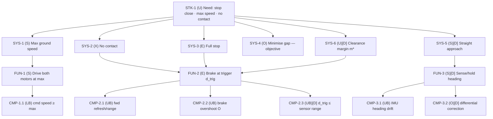

# Requirements Specification — Wall-Approach Rover

**Document type:** Specification (source of truth for requirements; the SysML model realises it)
**Version:** 1.0 · **Phase:** Pre-hardware (GATE A package)
**Standards:** INCSE GtWR (4th ed.) over ISO/IEC/IEEE 29148:2018, EARS grammar; NASA SP-2016-6105 for decomposition/V&V framing.

---

## 1. Task restatement (verbatim intent)

A wall is directly ahead, rover squared up at a marked start line ≈ 1000 mm out. Drive **straight at the wall at maximum speed** and **stop as close as possible without touching it**. Hard constraints: maximum speed (no slowing for margin); no contact. Objective (graded): minimise the final gap.

## 2. EARS pattern legend

U = Ubiquitous · S = State-driven · E = Event-driven · O = Optional · X = Unwanted (shall not).
Hard constraint = pass/fail **shall**; Objective = graded **should**. Derived requirements (not literal in the task) are flagged **[D]** with rationale.

---

## 3. Requirements

### 3.1 Stakeholder need (STK)

| ID | Pattern | Requirement | Rationale |
|---|---|---|---|
| **STK-1** | U | The rover shall stop as close as achievable to the wall ahead, having approached at maximum speed, without contacting it. | Verbatim task. Root of the tree; all SYS requirements trace here. |

### 3.2 System black-box (SYS)

| ID | Pattern | Requirement | Parent | [D] | Rationale | Verify |
|---|---|---|---|---|---|---|
| **SYS-1** | S | While approaching the wall, the rover shall travel forward at its maximum achievable ground speed. | STK-1 | | Hard constraint "maximum speed; do not slow for safety". | Measure cruise ground speed = calibrated ceiling. |
| **SYS-2** | X | The rover shall not contact the wall. | STK-1 | | Hard constraint "without touching it". Pass/fail. | Operator observes no contact on each run. |
| **SYS-3** | E | When the stop maneuver completes, the rover shall be stationary (ground speed within stop tolerance of zero). | STK-1 | | "Come to a complete stop." | Speed → 0 in telemetry at rest. |
| **SYS-4** | O | When stopped, the rover **should** minimise the final gap to the wall. | STK-1 | | Graded objective. | Final clearance, graded smaller-is-better. |
| **SYS-5** | S | While approaching, the rover shall hold a straight heading normal to the wall within bounded deviation. | STK-1 | **[D]** | Derived from "drive straight at the wall": keeps the forward range equal to the true normal gap and prevents an angled glance into the wall. | Heading deviation at wall ≤ `maxHeadingDev` (TBD-dev). |
| **SYS-6** | U | When stopped, the rover's final clearance shall be no less than the verified no-contact margin **m\*** = k_σ·RSS(σ_pred, σ_meas, σ_r2r). | STK-1 | **[D]** | **Margin bridge (Rule 3 / tenet A6):** couples the hard no-contact constraint (SYS-2) to the minimise-gap objective (SYS-4). m\* sized from uncertainty, not guessed. | finalClearance ≥ m\* over all runs (TBD-m\*). |

### 3.3 Functions (FUN)

| ID | Pattern | Requirement | Parent | [D] | Rationale |
|---|---|---|---|---|---|
| **FUN-1** | S | While approaching, the drivetrain shall drive both motors at maximum speed. | SYS-1 | | Realises max speed through the two-motor differential drive. |
| **FUN-2** | E | When the forward range decreases to the computed trigger distance d_trig, the drivetrain shall brake both motors to a stop. | SYS-2, SYS-3, SYS-6 | | The stop decision. d_trig comes from the `StoppingDistance` relation: d_trig = v·tResponse + v²/(2a) + m\*. |
| **FUN-3** | S | While approaching, the rover shall sense its heading and bound its deviation. | SYS-5 | **[D]** | Realises straight approach; sensing + (conditional) correction. |

### 3.4 Single-effector leaves (CMP)

| ID | Pattern | Requirement | Parent | [D] | Effector | Verify / binds |
|---|---|---|---|---|---|---|
| **CMP-1.1** | U (LB) | The drive motor shall be commanded at a speed ≥ its maximum achievable speed (commandedSpeed ≥ maxSpeed). | FUN-1 | | DriveMotor ×2 | Command, confirm achieved = ceiling. Binds **TBD-vmax** ceiling. |
| **CMP-2.1** | S (UB) | While approaching, the forward distance sensor shall report wall range with refresh interval ≤ TBD-refresh, reliable above TBD-minrange. | FUN-2 | | Forward DistanceSensor ×2 | Sample cadence + close-range validity. Binds **TBD-refresh**, **TBD-minrange**. |
| **CMP-2.2** | E (UB) | When braked from maximum speed, the drive motor shall bring the rover to rest within the calibrated stopping overshoot O. | FUN-2 | | DriveMotor ×2 | Brake at max, measure overshoot. Binds **TBD-O**, **TBD-a**. |
| **CMP-2.3** | U (UB) | The computed trigger distance d_trig shall not exceed the forward sensor's reliable range. | FUN-2 | **[D]** | (integrative feasibility) | Analytic: d_trig (model) ≤ forwardMaxRange. Ensures the trigger fires inside sensor range. |
| **CMP-3.1** | S (UB) | Over the approach, the inertial unit's heading drift shall be ≤ TBD-drift. | FUN-3 | | InertialUnit | Yaw over approach vs odometry. Binds **TBD-drift**. |
| **CMP-3.2** | O (UB) | Where measured heading deviation exceeds the correction threshold, the drivetrain shall apply a differential speed correction to null it. | FUN-3 | **[D]** | DriveMotor ×2 | **Conditional** — instantiated only if C1 shows uncorrected drift breaches SYS-5; gain derived from measured drift, never hand-tuned. |

**Rule 2 stop note.** SYS-4 (minimise gap) is irreducibly integrative — it rolls up from speed × sensing × braking × margin and is not reducible to one effector; decomposition stops at the trigger model. CMP-2.3 is likewise an integrative-feasibility leaf, retained because it gates whether the whole stop is realisable within the sensor's range.

---

## 4. Cross-sourcing allocation (Rule 6 — independent channels per quantity)

Every quantity that bears on no-contact is observed by ≥ 2 independent onboard channels so disagreement is the hardware-fault detector. Full channel catalog (directness ranks, binding runs) is in the Calibration Plan §3; summary:

| Quantity | Primary channel | Independent cross-channel(s) |
|---|---|---|
| Ground speed v | Forward ultrasonic range slope dR/dt | Motor odometry (Δangle·k); IMU forward-accel ∫ (weak) |
| Forward range / gap | Forward ultrasonic #1 | Forward ultrasonic #2; motor odometry from known start ≈1000 mm; operator ground truth (verification only) |
| Heading / straightness | IMU yaw | Differential odometry (left vs right wheel angle); two forward sensors' L/R disagreement (skew) |
| Stop overshoot O | (R_trigger − R_final) ultrasonic | Odometry Δangle from trigger to rest |

---

## 5. Effector selection by traceability (Rule 7 — absence is verified, not assumed)

| Effector (platform) | Requirement(s) tracing to it | Status |
|---|---|---|
| Drive motor ×2 | CMP-1.1, CMP-2.2, CMP-3.2 | **KEEP** |
| Forward distance sensor ×2 | CMP-2.1, CMP-2.3 (+ cross-source §4) | **KEEP** (both — redundancy + skew detection) |
| Inertial unit (IMU) | CMP-3.1 (+ speed/skew cross-source) | **KEEP** |
| **Rear distance sensor** | none — no obstacle behind is guaranteed at the start line; forward gap is the goal | **DROP** (logged opportunistically, bears no requirement) |
| **Downward reflectance sensor** | none — start-line position is already obtained from the forward sensor at t=0; no requirement needs floor reflectance | **DROP** (logged opportunistically, bears no requirement) |

Dropped effectors are still logged in characterization (free data, fault cross-check) but no requirement depends on them and none is on the operation hot path.

---

## 6. TBD register (Rule 8 — every unknown bound to a calibration activity)

| TBD | Quantity | Used by | Bound at | Tier target |
|---|---|---|---|---|
| **TBD-k** | RotationToSpeed constant k (m/rad) | relation rotToSpeed; v | Run C1 (Δrange ÷ Δodometry) | multi-point onboard |
| **TBD-vmax** | Max ground speed v_max (m/s) | SYS-1, model | Run C1 (cruise slope; cross odometry) | multi-point onboard |
| **TBD-O** | Stop overshoot at max speed (mm) | CMP-2.2, d_trig | Run C1 (onboard, bias-uncorrected) → **Verification** (bias-free via operator) | onboard → operator-anchored |
| **TBD-a** | Deceleration a (m/s²) | StoppingDistance feasibility | Run C1 (back-solved from O, v, tResponse) | derived |
| **TBD-tResponse** | Response latency tChain + sensor staleness (s) | StoppingDistance | Run C1 (loop period + refresh; or lumped in O) | onboard |
| **TBD-refresh** | Forward sensor refresh interval (ms) | CMP-2.1 | Run C1 (sample cadence) | onboard |
| **TBD-minrange** | Forward sensor reliable floor (mm) | CMP-2.1, CMP-2.3 | Run C1 if observable + **Verification** (close approach) | onboard → operator-anchored |
| **TBD-maxrange** | Forward sensor reliable ceiling (mm) | CMP-2.3 | Run C1 (start ≈1000 mm reading quality) | onboard |
| **TBD-bias** | Forward sensor static bias R_static − true (mm) | gap estimate, O correction | **Verification** (operator true gap) | operator |
| **TBD-drift** | Heading drift over approach (deg) | SYS-5, CMP-3.1 | Run C1 (IMU yaw + odometry) | multi-channel onboard |
| **TBD-dev** | maxHeadingDev allowed (deg) | SYS-5 | Derived from gap-geometry + sensor beam (computed) | analytic |
| **TBD-sig** | σ_pred, σ_meas, σ_r2r | SYS-6 m\* | Run C1 (residual/scatter) + reasoning (r2r) → refine at Verification | onboard + analysis |
| **TBD-m\*** | No-contact margin m\* = k_σ·RSS(σ) | SYS-6, d_trig | Derived once σ-components bound | analytic |
| **TBD-stop** | Stop tolerance (speed ≈ 0) | SYS-3 | Run C1 (residual motion at rest) | onboard |
| **TBD-gap** | Objective gap budget (reporting) | SYS-4 | Set from m\* + reporting band | analytic |
| **TBD-corr** | Heading-correction threshold + derived gain | CMP-3.2 | Run C1 (only if drift breaches SYS-5) | conditional |

---

## 7. Requirement tree (Mermaid)

---

## 8. Hard-constraint / objective separation (Rule 3 summary)

- **Hard (pass/fail):** SYS-1 (max speed), SYS-2 (no contact), SYS-3 (full stop).
- **Objective (graded):** SYS-4 (minimise gap).
- **Bridge (derived):** SYS-6 clearance margin m\* — the single knob that trades the objective against the no-contact constraint; its value is the RSS of calibrated uncertainties, set in the Calibration/Verification chain, never eyeballed.

*End of specification v1.0.*
