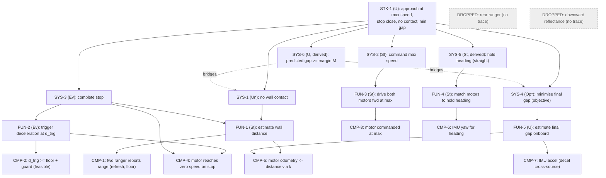

# Wall-Approach Rover — Requirements Specification
**Document type:** record (spec) · **Version:** v1 · **Phase:** pre-GATE-A (step 1)

**Authored to:** INCOSE GtWR (4th ed.) over ISO/IEC/IEEE 29148:2018, EARS grammar;
decomposition & V&V framing per NASA SP-2016-6105. This specification is the **source of
truth** for requirements; the SysML model is a formal realisation of it — on any disagreement,
this spec governs.

---

## 1. Task → requirement scope

The rover must **drive straight at a wall directly ahead, at maximum speed, and come to a
complete stop as close as possible without touching it**. Setup is fixed: rover squared to the
wall at a marked start line, ~1000 mm out. Two hard constraints (max speed; no contact) and one
graded objective (minimise final gap).

**EARS patterns** (tagged per requirement): `U` Ubiquitous · `St` State-driven · `Ev`
Event-driven · `Op` Optional · `Un` Unwanted.
**Levels:** STK (stakeholder need) → SYS (system black-box) → FUN (function) → CMP
(single-effector leaf).
**Derived** = not literal in the task statement; every derived requirement carries rationale.
Objectives use *should* (graded); constraints use *shall* / *shall not* (pass/fail); a derived
**margin** requirement bridges them (rule 3).

---

## 2. Stakeholder level (STK)

| ID | EARS | Requirement | Rationale | Derived |
|----|------|-------------|-----------|---------|
| **STK-1** | U | The rover **shall** approach the wall at maximum speed and stop close to it without contact, minimising the final gap. | Verbatim mission need; the top need the design claims via `satisfy`. | No |

---

## 3. System level (SYS) — black-box, children of STK-1

| ID | EARS | Requirement | Parent | Rationale | Derived | V-method (planned) |
|----|------|-------------|--------|-----------|---------|--------------------|
| **SYS-1** | Un | The WallRover **shall not** make physical contact with the wall. | STK-1 | Literal hard constraint; contact = run failure. | No | Test (operator observes contact / no-contact) + analysis (clearance roll-up) |
| **SYS-2** | St | *While* approaching the wall, the WallRover **shall** command its drivetrain at the maximum achievable speed, with no throttling for safety margin. | STK-1 | Literal ("maximum speed. Do not slow down for safety margin."). | No | Inspection (commanded == rated) + test (telemetry cruise speed) |
| **SYS-3** | Ev | *When* the stop is triggered, the WallRover **shall** decelerate to a complete stop (zero ground speed). | STK-1 | Literal ("come to a complete stop"). | No | Test (telemetry speed → 0) |
| **SYS-4** | Op* | The WallRover **should** minimise the final gap between its front face and the wall. | STK-1 | Literal graded objective ("as close as possible", "minimise the final gap"). *Objective, not pass/fail. | No | Analysis + test (onboard estimate validated vs operator ground truth at operating point) |
| **SYS-5** | St | *While* approaching, the WallRover **shall** hold heading within **TBD-HEAD** of the initial wall-normal. | STK-1 | **Derived**: "drive **straight** at the wall" implies heading control; drift would angle the closing geometry (risking a corner contact) and skew the forward ultrasonic beam off the wall face, corrupting the ranging the stop depends on. | **Yes** | Test (IMU yaw excursion during approach) |
| **SYS-6** | U | The **predicted** final gap **shall** be no less than the safety margin **M**, where **M** is the root-sum-square of the independent uncertainty contributors (prediction, measurement, run-to-run) at confidence **TBD-KSIG**. | Bridges SYS-1↔SYS-4 | **Derived** (rule 3, tenet A6): converts the pass/fail no-contact constraint into a sizing constraint on how aggressively closeness may be targeted; M is *computed from calibrated uncertainty*, never guessed. | **Yes** | Analysis (executable-model roll-up on calibrated σ's) |

---

## 4. Function level (FUN) — children of SYS

| ID | EARS | Requirement | Parent | Rationale | Derived | V-method |
|----|------|-------------|--------|-----------|---------|----------|
| **FUN-1** | St | *While* approaching, the WallRover **shall** continuously estimate its distance to the wall. | SYS-1, SYS-3 | The stop decision needs a live distance estimate. | No | Test |
| **FUN-2** | Ev | *When* the estimated distance crosses the trigger threshold **d_trig**, the WallRover **shall** command deceleration. | SYS-3 | The event that starts braking. | No | Test |
| **FUN-3** | St | *While* approaching, the WallRover **shall** drive both motors forward at maximum speed. | SYS-2 | Realises max-speed approach on a differential drivetrain. | No | Test |
| **FUN-4** | St | *While* approaching, the WallRover **shall** keep the two motors' outputs matched to hold heading. | SYS-5 | Differential imbalance is the drift mechanism SYS-5 bounds. | Yes | Test |
| **FUN-5** | U | The WallRover **shall** estimate its final gap from onboard channels for the closeness objective. | SYS-4 | Closeness needs an onboard estimate (later anchored to ground truth). | Yes | Test/analysis |

---

## 5. Component level (CMP) — single-effector leaves

Each CMP requirement is verifiable by a test on **one** effector.

| ID | EARS | Requirement | Effector | Parent | Rationale | V-method |
|----|------|-------------|----------|--------|-----------|----------|
| **CMP-1** | U | Each forward DistanceSensor **shall** report range every refresh interval **TBD-REFRESH** with valid readings above its floor **TBD-FLOOR**. | Forward ultrasonic ×2 | FUN-1 | Primary wall-distance channel. | Test |
| **CMP-2** | U | The trigger threshold **shall** exceed the forward DistanceSensor floor plus a feasibility guard: `d_trig ≥ TBD-FLOOR + guard`. | Forward ultrasonic | FUN-2 | The trigger must fire while the reading is still valid (below floor the sensor saturates and the crossing is never seen). | Analysis (roll-up) |
| **CMP-3** | U | Each DriveMotor **shall** be commanded at its achievable maximum speed **TBD-VMAX**. | DriveMotor ×2 | FUN-3 | Realises SYS-2 at the effector. | Inspection + test |
| **CMP-4** | Ev | *When* commanded to stop, each DriveMotor **shall** reach zero speed. | DriveMotor ×2 | FUN-2, SYS-3 | Realises the complete stop. | Test |
| **CMP-5** | U | Each DriveMotor **shall** report rotation from which ground distance is computed via constant **TBD-K**. | DriveMotor ×2 (odometer) | FUN-1, FUN-5 | Independent, floor-immune distance channel (cross-source to ultrasonic; the *only* channel that works near the wall below the ultrasonic floor). | Test |
| **CMP-6** | U | The InertialUnit **shall** report yaw for heading monitoring/control. | IMU | FUN-4 | Realises heading channel for SYS-5. | Test |
| **CMP-7** | U | The InertialUnit **shall** report forward acceleration as an independent deceleration channel. | IMU | FUN-5 | Cross-source on the stopping-distance composite (fault-agnostic detection). | Test |

---

## 6. Effector traceability — used vs dropped (rule 7: verified, not assumed)

| Effector (platform) | Requirement traces? | Disposition |
|---------------------|---------------------|-------------|
| DriveMotor ×2 (drive) | CMP-3, CMP-4 | **USED** — propulsion + stop |
| DriveMotor ×2 (odometry) | CMP-5 | **USED** — distance cross-source |
| Forward DistanceSensor ×2 | CMP-1, CMP-2 | **USED** — primary ranging (cross-sourced against each other) |
| InertialUnit (yaw) | CMP-6 | **USED** — heading |
| InertialUnit (accel) | CMP-7 | **USED** — decel cross-source |
| **Rear DistanceSensor** | none | **DROPPED** — nothing behind bears on a forward stop; absence by traceability. (Logged once in CHAR-1 to *verify* it carries no wall information.) |
| **Downward ReflectanceSensor** | none | **DROPPED** — considered as a start-line position anchor and rejected: the start distance is only ~approximate and non-critical (operation triggers off live wall distance, not absolute start position), and the sensor cannot observe the wall. Absence by traceability. (Logged once in CHAR-1 to verify.) |

---

## 7. TBD register (each bound to a specific calibration activity)

| TBD | Quantity | Units | Bound by | Source-of-truth tier |
|-----|----------|-------|----------|----------------------|
| TBD-VMAX | Motor max achievable speed / cruise ground speed `v_cruise` | mm/s | CHAR-1 (odometry + ultrasonic slope at speed) | multi-point onboard |
| TBD-K | Rotation→ground constant `k_rot` (wheel r × gear × slip) | mm/rad | CHAR-1 (odometry vs ultrasonic Δ over known travel) | multi-point onboard |
| TBD-TCHAIN | Platform latency chain `t_chain` | s | CHAR-1 (command→motion onset) | onboard |
| TBD-TRESP | Total response latency `t_response` = t_chain + sample staleness | s | CHAR-1 (from D_dyn decomposition/profile) | onboard |
| TBD-ADEC | Deceleration at v_max `a_decel` | mm/s² | CHAR-1 (brake profile: odometry + IMU accel) | multi-point onboard |
| TBD-DDYN | **Composite dynamic stopping distance at v_max** `D_dyn` | mm | CHAR-1 (**direct** measure; odometry ⊕ ultrasonic ⊕ IMU) | multi-point onboard |
| TBD-REFRESH | Ultrasonic refresh interval | s | CHAR-1 (timestamp spacing of readings) | onboard |
| TBD-FLOOR | Ultrasonic minimum valid range | mm | Datasheet prior + CHAR-1 observation | datasheet + onboard |
| TBD-BIAS | Ultrasonic bias `sensor_bias` (reading = true + bias) | mm | **VER-1 operator measurement at the operating point** (weak long-range prior from the t=0 ~1000 mm reading) | **external ground truth** |
| TBD-SRUN | Run-to-run stopping-distance σ | mm | CHAR-1 channel spread + physical estimate | onboard/weak |
| TBD-HEAD | Allowable heading drift | deg | Derived from geometry (beam width, corner clearance) | analysis |
| TBD-KSIG | Confidence multiplier for M | — | Chosen by consequence (A1); baseline 3 | choice |
| TBD-DTRIG | Operating trigger threshold | mm | Computed at GATE B from bound D_dyn + bias-prior + M | model |
| TBD-M | Safety margin = KSIG × RSS(σ's) | mm | Computed once σ's bound | model |

**Model-completion parameters** (needed to predict, named by no requirement): `t_chain`,
`t_response`, `a_decel`, `D_dyn`, `refresh`, `floor`, `k_rot`, `sigma_run` — all bound in CHAR-1.

---

## 8. Requirement tree (Mermaid)

---

## 9. Cross-sourcing allocation (rule 6 → CHARACTERIZATION METHOD 1)

Independent channels deliberately allocated to the same quantity, so disagreement is a
fault-agnostic detector:

| Quantity | Channel A (primary) | Channel B | Channel C |
|----------|---------------------|-----------|-----------|
| Wall distance | Forward ultrasonic #1 | Forward ultrasonic #2 | Odometry (relative, anchored) |
| Cruise speed `v_cruise` | Odometry rate | Ultrasonic Δreading/Δt | — |
| Stopping distance `D_dyn` | Odometry Δ (trigger→rest) | Ultrasonic (d_trig − final reading) | IMU ∬accel |
| Heading | IMU yaw | Odometry differential (L−R) | — |
| True gap (objective) | Onboard estimate (odometry near wall) | **Operator ground truth (higher tier)** | — |

---

*End of Requirements Specification v1. This document, its TBD register, and the Mermaid tree
are part of the record. It is re-issued as a new version if characterization reveals a
requirement it did not anticipate.*
