# Requirements Specification — Wall-Approach Rover (WAR)
**Document:** RS-WAR | **Version:** 1.0 | **Status:** Issued for Gate A review | **Type:** Specification (source of truth for requirements; the SysML model realises it and does not replace it)
**Method:** INCOSE GtWR (4th ed.) quality rules over ISO/IEC/IEEE 29148:2018; EARS grammar; NASA SP-2016-6105 decomposition & V&V framing.
**Scope of this issue:** Process steps 1 (requirements) and 2 (effector selection). Steps 3+ (SysML tailoring, executable analysis model, Calibration Plan) are issued separately at Gate A.

---

## 1. Mission statement and scope

One autonomous run: from a marked start line approximately 1000 mm from a wall, squared up, the rover shall drive straight at the wall at maximum speed and come to a complete stop as close to the wall as possible without touching it. The operation phase repeats this run five times with an identical, locked program on a power-cycled hub; success per run = full stop with no contact; the graded objective is the smallness of the final gap.

Out of scope: obstacle avoidance other than the wall, non-straight trajectories, multi-surface operation, operator interaction during a run.

## 2. Definitions

| Term | Definition |
|---|---|
| Wall | The flat vertical target surface ahead of the rover (ASM-1). |
| Front plane | Vertical plane through the rover's forward-most physical point(s). |
| Gap `G(t)` | Perpendicular horizontal distance from the front plane to the wall. |
| Final clearance `C_final` | Minimum distance between any rover point and the wall at complete stop (equals the stopped gap reduced by any yaw-induced corner advance, ≈ `G_stop − (W/2)·sin|ψ|`). |
| Complete stop | Both drive wheels at zero speed, sustained, with post-stop travel within the SYS-6 bound over 2 s. |
| Run states | `APPROACH` (drive-on → brake trigger), `BRAKING` (trigger → rest), `STOPPED` (after rest). |
| Run | One program execution on a freshly power-cycled hub (clock = 0, heading = 0 at start; no state carries across runs). |
| Corrected gap estimate `Ĝ` | Sensor reading mapped to front-plane gap: offset-corrected and data-age-corrected (see FUN-1/FUN-3). |
| Channels | US-A, US-B: forward ultrasonics; US-R: rear ultrasonic; ENC: wheel encoders (odometry); IMU: hub heading/acceleration. |
| `T3/T2/T1/T0` | Source-of-truth tiers: operator ground truth / anchored or multi-point onboard calibration / single onboard sample / unknown. |

## 3. Assumptions (validated or monitored as noted)

| ID | Assumption | Disposition |
|---|---|---|
| ASM-1 | Wall is flat, static, ultrasonic-reflective, wider than the rover plus lateral drift, taller than the sensor beam. | Qualitatively confirmed by sane US readings in the first characterization run. |
| ASM-2 | Start condition fixed across all runs: squared to the wall at the start line, `G₀ ≈ 1000 mm` (prior 900–1100 mm). | Operator-controlled per task setup; sanity-checked at each program start. |
| ASM-3 | Floor level and of uniform traction; path clear between start line and wall. | Monitored via odometry/US consistency. |
| ASM-4 | Hub is power-cycled before every run; battery state may drift run to run. | Protocol-guaranteed; speed adaptation handles battery drift (FUN-3). |
| ASM-5 | Port assignments, mountings, and vehicle geometry are fixed for the whole campaign. | Census self-check at every program start (SYS-13); mismatch → safe stop. |

## 4. Requirements

Conventions: **[H]** hard constraint (shall, pass/fail) · **[O]** objective (should, graded) · **[D]** derived (not literal in the task statement; rationale states the derivation) · EARS tag in braces. Every requirement carries a rationale and a planned verification method (T = test, A = analysis, I = inspection). One requirement, one verifiable claim.

### 4.1 Stakeholder level (STK)

| ID | Requirement | Tags | Rationale | V |
|---|---|---|---|---|
| STK-1 | The rover shall not make contact with the wall during a run. | {Unwanted} [H] | Literal task hard constraint; contact = failed run. | T + ground truth |
| STK-2 | While in APPROACH, the rover shall drive at its maximum achievable speed. | {State} [H] | Literal task hard constraint ("maximum speed; do not slow down for safety margin"). The prohibition on margin-motivated slowdown is realised verifiably by SYS-1 (100 % duty). | T |
| STK-3 | The rover should minimize the final clearance `C_final` at each operation stop. | {Ubiquitous} [O] | Literal task objective; graded, bridged to STK-1 by the derived margin requirement SYS-5. | A + T |
| STK-4 | When the approach terminates, the rover shall come to a complete stop and remain stopped. | {Event} [H] | Literal task requirement ("come to a complete stop"). | T |
| STK-5 | The rover shall produce, for every run, an onboard estimate of `C_final`. | {Ubiquitous} [H][D] | Derived from the operation close-out protocol (per-run estimates committed before ground truth) and from verification needs (an onboard channel must exist to be validated). | T + I |
| STK-6 | The rover shall complete each run autonomously, with no operator input between program start and program end. | {Ubiquitous} [H][D] | Derived from the operation protocol: no operator input during the five runs; the hub starts clean each run. | I + T |
| STK-7 | The rover shall emit telemetry sufficient to reconstruct the approach — at minimum forward distance and heading versus time — and shall terminate the stream with the flush sentinel. | {Ubiquitous} [H][D] | Derived from the task telemetry mandate and wire contract; observability underpins all V&V. | I |

### 4.2 System level (SYS) — black box

| ID | Requirement | Tags | Parent | Rationale | V |
|---|---|---|---|---|---|
| SYS-1 | While in APPROACH, the system shall command 100 % drive duty to both drive motors, with heading-hold trim permitted only as a reduction of the inner wheel's duty by at most 15 %. | {State} [H] | STK-2 | 100 % duty is the physical speed ceiling at the prevailing battery state, satisfying "maximum" without an arbitrary speed constant; the bounded inner-wheel trim is steering (SYS-8), not margin slowdown — worst-case momentary speed loss < 8 %. | T |
| SYS-2 | When the fused corrected gap estimate first satisfies `Ĝ ≤ G_trig`, the system shall command full braking on both drive motors within one control period. | {Event} [H] | STK-4, STK-1 | Deterministic, low-latency stop initiation; `G_trig` is derived in FUN-3 from calibrated stopping physics plus `G_target` (SYS-5). | T |
| SYS-3 | The system shall achieve final clearance `C_final > 0` at every complete stop. | {Ubiquitous} [H] | STK-1 | Black-box restatement of no-contact in the measurable quantity; closed at Gate C only against an operator ground-truth anchor at the operating point (source-of-truth rule). | T + ground truth |
| SYS-4 | The system should achieve `C_final ≤ G_target + 3·σ_stop` at each operation stop. | {Ubiquitous} [O] | STK-3 | Graded closeness objective stated against the designed stop target; predicted mean stop is `G_target`. | A + T |
| SYS-5 | The system shall set the stop target `G_target = z·σ_stop` with `z = 3.0`, where `σ_stop` is the root-sum-square of the independent stop-dispersion and calibration-residual contributors enumerated in the executable analysis model, each bound by calibration. Value: TBD-1. | {Ubiquitous} [H][D] | STK-1 ↔ STK-3 bridge | Rule-3 margin bridge between the hard constraint and the objective; Tenet A6 (margins sized from calibrated uncertainty, not guessed). `z = 3.0` gives per-run non-contact ≥ 99.87 % and 5-run ≥ 99.3 % under near-normal dispersion. | A |
| SYS-6 | While STOPPED, the system shall hold both drive motors such that post-stop travel is ≤ TBD-2 mm over the 2 s following rest. | {State} [H] | STK-4 | "Remain stopped" made verifiable; creep toward the wall would erode clearance after the stop is scored. | T |
| SYS-7 | When motion has ceased, the system shall compute and record `C_final` estimates from every valid channel (US-A, US-B, ENC dead-reckoning) and a fused value, before program end. | {Event} [H][D] | STK-5 | Multi-channel estimate supports cross-sourcing (Tenet B1) and survives US minimum-range invalidity at small gaps. | T + I |
| SYS-8 | While in APPROACH or BRAKING, the system shall keep the heading deviation \|ψ − ψ₀\| ≤ TBD-3 deg. | {State} [H][D] | STK-1 | Yaw advances a front corner toward the wall by ≈ `(W/2)·sin ψ`, eroding clearance; bound sized so the erosion fits its allocation inside `σ_stop`. Also bounds cosine error on odometry. | T |
| SYS-9 | While drive motors are commanded (APPROACH or BRAKING), the system shall perform no stream output; per-tick records shall be written to a pre-allocated RAM buffer. | {State} [H][D] | STK-7 | Test-like-you-fly hot path (Characterization Method 3): BLE writes can block the control loop; logging must not perturb timing that calibration transfers to operation. | I + T |
| SYS-10 | When the run terminates, normally or abnormally, the system shall emit the buffered telemetry and terminate the stream with the flush sentinel. | {Event} [H][D] | STK-7 | Wire contract: without the sentinel the last samples are lost; abnormal-path coverage requires try/finally structure. | T + I |
| SYS-11 | When a startup or in-run self-check fails (device census mismatch; no gap decrease within 500 ms of drive-on; all gap channels invalid), the system shall command full braking and proceed to telemetry emission. | {Event} [H][D] | STK-1 | Fail-safe beats fail-blind: configuration faults must stop the vehicle, not drive it into the wall at 100 % duty. | T (mock fault injection) + I |
| SYS-12 | When an ultrasonic sample is invalid — reading < `r_min` (TBD-4), reading at the no-echo ceiling, or stale beyond the staleness bound — the system shall exclude that sample and continue on the remaining channels, including ENC dead-reckoning. | {Event} [H][D] | STK-1 | Bounded-range hand-off (Characterization Method 1): never extrapolate a bounded channel past its validity; the DR guard also covers a frozen sensor, which would otherwise hold a stale high reading and defeat the trigger. | T + A |
| SYS-13 | The system shall self-configure at start from onboard discovery constants (port map, sign map) validated by a device-census check, requiring no operator input. | {Ubiquitous} [H][D] | STK-6 | Clean-hub protocol: every run stands alone; constants are bound in calibration, then verified at every start rather than assumed (ASM-5). | T + I |

### 4.3 Function level (FUN) — white box

| ID | Requirement | Tags | Parent | Rationale | V |
|---|---|---|---|---|---|
| FUN-1 | While in APPROACH, the gap-sensing function shall produce, each control tick, a per-sensor corrected gap estimate `Ĝᵢ = Rᵢ − ôᵢ − v̂·τ̂` for every valid front ultrasonic sensor *i*. | {State} [H] | SYS-2 (also SYS-3, SYS-12) | Reading `R` is offset from the front plane by mounting offset `ô` and lags truth by data age `τ̂` (reads high by `v·τ` on approach); both corrections are calibrated, not assumed. | T |
| FUN-2 | While in APPROACH or BRAKING, the odometry function shall produce, each control tick, traveled distance `k̂·Δθ̄` and speed `v̂` from the wheel encoders. | {State} [H] | SYS-2 (also SYS-7, SYS-12) | Independent second channel for distance and the only in-run speed source; `k̂` (mm/deg) is calibrated against US slope, not taken from wheel-spec assumptions (Tenet A3). | T |
| FUN-3 | While in APPROACH, the estimation function shall maintain the fused gap `Ĝ = min(valid Ĝᵢ, Ĝ_DR)` — where `Ĝ_DR` dead-reckons from the last valid fused fix — and shall assert the brake trigger when `Ĝ ≤ G_trig = G_target + v̂·(T̂_q + t̂_cmd) + v̂²/(2·â)`. | {State} [H] | SYS-2 (also SYS-5) | `min`-fusion fails toward an early stop (safe side). DR propagation between US updates removes update-interval quantization. The trigger law spends latency and braking distance from in-run measured `v̂`, making the stop insensitive to battery-driven speed variation. | T + A |
| FUN-4 | While in APPROACH, the drive function shall command both motors at 100 % duty with inner-wheel trim `δ = min(k_p·|ψ|, 15 %)` toward ψ = 0; `k_p` = TBD-12 (may bind to 0). | {State} [H] | SYS-1 (also SYS-8) | Single actuation path for max-speed drive and heading hold; trim-by-reduction preserves the outer wheel at the physical ceiling. | T |
| FUN-5 | When the brake trigger asserts, the braking function shall command hold() on both drive motors within the same control tick and maintain hold for ≥ 2 s. | {Event} [H] | SYS-2 (also SYS-6) | hold() is the strongest, most repeatable stop authority (active position hold); sustained hold enforces "remain stopped" through the scoring window. | T |
| FUN-6 | When motion has ceased, the reporting function shall sample rest gaps (median over a fixed window), form per-channel and fused `C_final` estimates, and emit the buffer, the estimates, and the sentinel under try/finally. | {Event} [H] | SYS-7 (also SYS-9, SYS-10) | Rest medians suppress noise; the DR estimate covers the case where the rest gap is below US minimum range; try/finally guarantees the sentinel on every exit path. | T + I |
| FUN-7 | When a self-check gate fails, the supervision function shall command safe stop and transfer control to the reporting function (FUN-6). | {Event} [H] | SYS-11 (also SYS-13, SYS-12) | Localises the fail-safe so every abnormal path converges on stop-then-report. | T (mock) + I |

### 4.4 Component level (CMP) — single-effector leaves

Each CMP requirement is verifiable by a test on a single effector. Motor requirements instantiate per motor (L, R); front-ultrasonic requirements instantiate per sensor (A, B).

| ID | Requirement | Tags | Parent | Rationale | V |
|---|---|---|---|---|---|
| CMP-M1 | While commanded 100 % duty in steady APPROACH, the drive motor shall sustain wheel speed within ±5 % of the bound plateau value (`v_max/k̂`; `v_max` = TBD-13). | {State} [H] | FUN-4 | Confirms the ceiling is reached and stable; the plateau value itself is bound by calibration, not spec'd a priori (Tenet A3). | T |
| CMP-M2 | When commanded hold() at approach speed, the drive motor shall bring its wheel to zero speed within braking distance `d_b = v²/(2·a_eff)`, with `a_eff` = TBD-10 and run-to-run dispersion `σ_b` = TBD-10b. | {Event} [H] | FUN-5 | Braking physics is the largest distance consumer after the trigger; must be calibrated from ≥ 3 events, US-measured (true distance, slip included). | T |
| CMP-M3 | The drive motor's forward command sign `s ∈ {+1, −1}` shall be resolved such that commanded duty of sign `s` produces gap decrease. Values: TBD-14 (L), TBD-15 (R). | {Ubiquitous} [H] | FUN-4 | Direction conventions are unknown per task; a wrong sign at 100 % duty is a mission-ending configuration fault — resolved by guarded low-speed pulses before any full-speed segment. | T |
| CMP-M4 | While held after rest, the drive motor's shaft travel shall be ≤ TBD-2 mm equivalent over 2 s. | {State} [H] | FUN-5 | Component-level realisation of SYS-6 (no creep toward the wall). | T |
| CMP-M5 | The drive motor's encoder shall report monotone angle during unidirectional motion, without dropouts, at the control rate. | {Ubiquitous} [H] | FUN-2 | Odometry integrity precondition for FUN-2/FUN-3 and for the DR final-estimate chain. | I |
| CMP-U1 | The front ultrasonic sensor's static noise shall be `σ_US ≤` TBD-16 mm over the 80–1100 mm working range. | {Ubiquitous} [H] | FUN-1 | Noise at the trigger converts directly into stop dispersion; bound feeds `σ_stop`. | T |
| CMP-U2 | The front ultrasonic sensor's mounting offset `ô` (reading − true gap at rest) shall be bound with error ≤ 3 mm against operator ground truth (T3) at the operating point. Values: TBD-5 (A), TBD-6 (B). | {Ubiquitous} [H] | FUN-1 | The offset biases the scored gap 1:1 and no onboard channel observes it absolutely — this is where the costed operator measurement is spent (Tenet B4; source-of-truth rule). | T + ground truth |
| CMP-U3 | The front ultrasonic sensor's effective data age `τ̂` shall be bound with error ≤ 10 ms. | {Ubiquitous} [H] | FUN-1 | On approach the reading is high by `v·τ`; at full speed each 10 ms of unmodelled age ≈ 5 mm of gap error. Bound by dynamic cross-correlation against odometry. | T |
| CMP-U4 | When the true gap is below `r_min` (TBD-4), the front ultrasonic sensor's reading shall be flagged invalid rather than used. | {Event} [H] | FUN-1, SYS-12 | LEGO-class ultrasonics have a near-range floor; using sub-floor readings would corrupt the final estimate. A conservative lower bound plus DR fallback is acceptable closure. | T + A |
| CMP-U5 | The front ultrasonic sensor's update interval shall be `U ≤` TBD-17 ms, with staleness detectable from reading-change statistics. | {Ubiquitous} [H] | FUN-1 | Update interval sets raw trigger quantization (designed out by DR propagation in FUN-3, but its value must be known to validate that design) and staleness detection feeds SYS-12. | T |
| CMP-I1 | The hub IMU's heading drift plus noise shall be ≤ TBD-18 deg over a 10 s static window. | {Ubiquitous} [H] | FUN-4, SYS-8 | Heading is the SYS-8 witness and the trim feedback; its own stability must support the TBD-3 bound. | T |
| CMP-I2 | When longitudinal deceleration exceeds a contact-like spike threshold while the fused gap is near zero, the hub IMU function shall log a contact-witness event. | {Event} [H][D] | FUN-7 | Independent contact evidence for anomaly disposition in operation; expected never to fire. | I |
| CMP-H1 | The control loop shall execute at period `T_loop` = TBD-11 with p95 jitter ≤ TBD-19. | {Ubiquitous} [H] | FUN-3 | Loop period sets trigger quantization (`v·T_q`) and the reaction term in `G_trig`; jitter feeds `σ_stop`. | T |
| CMP-H2 | The telemetry emission shall complete within the run timeout and shall terminate with the sentinel on every exit path. | {Ubiquitous} [H] | FUN-6 | Component-level realisation of SYS-10 against the BLE throughput budget. | T + I |
| CMP-R1 | Where the rear ultrasonic sensor returns a valid, stable reading at start, its reading delta shall track encoder distance within TBD-20 mm as an independent odometry cross-check; otherwise the channel shall be dropped. | {Optional} [H][D] | FUN-2 | Rule-6 cross-sourcing applied opportunistically: the rear scene is uncontrolled, so the channel earns its keep at the first characterization run or is dropped by traceability. | T |

## 5. Requirement tree

Solid arrows: primary parent (this is the decomposition edge-set the SysML model must realise). Dotted arrows: secondary traces (documented here; carried as cross-references, not decomposition, in the model).

```mermaid
graph TD
  STK1["STK-1 No contact [H]"]
  STK2["STK-2 Max speed [H]"]
  STK3["STK-3 Min clearance [O]"]
  STK4["STK-4 Complete stop [H]"]
  STK5["STK-5 Onboard estimate [H,D]"]
  STK6["STK-6 Autonomous [H,D]"]
  STK7["STK-7 Telemetry+sentinel [H,D]"]

  STK1 --> SYS3["SYS-3 C_final > 0"]
  STK1 --> SYS8["SYS-8 |heading| bound"]
  STK1 --> SYS11["SYS-11 Fail-safe stop"]
  STK1 --> SYS12["SYS-12 Invalid-sample handling"]
  STK2 --> SYS1["SYS-1 100% duty"]
  STK3 --> SYS4["SYS-4 Closeness objective [O]"]
  SYS3 --> SYS5["SYS-5 Margin G_target = z·σ_stop"]
  SYS4 -.-> SYS5
  STK4 --> SYS2["SYS-2 Brake trigger"]
  STK4 --> SYS6["SYS-6 No post-stop creep"]
  STK5 --> SYS7["SYS-7 Multi-channel C_final"]
  STK6 --> SYS13["SYS-13 Self-configuration"]
  STK7 --> SYS9["SYS-9 Buffered hot path"]
  STK7 --> SYS10["SYS-10 Emit + sentinel always"]

  SYS2 --> FUN1["FUN-1 Corrected gap sensing"]
  SYS2 --> FUN2["FUN-2 Odometry"]
  SYS2 --> FUN3["FUN-3 Fusion + trigger"]
  SYS1 --> FUN4["FUN-4 Drive + heading hold"]
  SYS2 --> FUN5["FUN-5 Brake + hold"]
  SYS7 --> FUN6["FUN-6 Final estimate + report"]
  SYS11 --> FUN7["FUN-7 Self-check + safe stop"]
  SYS3 -.-> FUN1
  SYS12 -.-> FUN1
  SYS5 -.-> FUN3
  SYS8 -.-> FUN4
  SYS6 -.-> FUN5
  SYS9 -.-> FUN6
  SYS10 -.-> FUN6
  SYS13 -.-> FUN7
  SYS12 -.-> FUN7

  FUN4 --> CMPM1["CMP-M1 Speed plateau (L,R)"]
  FUN5 --> CMPM2["CMP-M2 Braking distance (L,R)"]
  FUN4 --> CMPM3["CMP-M3 Sign map (L,R)"]
  FUN5 --> CMPM4["CMP-M4 No creep (L,R)"]
  FUN2 --> CMPM5["CMP-M5 Encoder integrity (L,R)"]
  FUN1 --> CMPU1["CMP-U1 Noise (A,B)"]
  FUN1 --> CMPU2["CMP-U2 Offset anchor (A,B)"]
  FUN1 --> CMPU3["CMP-U3 Data age (A,B)"]
  FUN1 --> CMPU4["CMP-U4 Validity floor (A,B)"]
  FUN1 --> CMPU5["CMP-U5 Update interval (A,B)"]
  FUN4 --> CMPI1["CMP-I1 IMU heading stability"]
  FUN7 --> CMPI2["CMP-I2 Contact witness"]
  FUN3 --> CMPH1["CMP-H1 Loop period/jitter"]
  FUN6 --> CMPH2["CMP-H2 Emission + sentinel"]
  FUN2 --> CMPR1["CMP-R1 Rear-US cross-check (conditional)"]
```

## 6. TBD register

Every unknown value is TBD (uncalibrated, never zeroed or eyeballed — Tenet A3) and is bound to a specific calibration activity. Run names: **R-CAL** = combined discovery + calibration hardware run; **M1** = single operator ground-truth gap measurement immediately after R-CAL, rover in place; **R-VER** = verification run. The characterization-run designs and the sensitivity ranking that justifies them are issued in the Calibration Plan at Gate A.

| TBD | Quantity | Appears in | Prior (assumed range) | Binding activity | Target tier |
|---|---|---|---|---|---|
| TBD-1 | `G_target` stop target | SYS-5 | 20–60 mm (analysis outcome) | Analysis: RSS roll-up after calibration (Gate B) | A (from T2/T3 inputs) |
| TBD-2 | Post-stop travel bound | SYS-6, CMP-M4 | ≤ 2 mm expected | R-CAL rest windows | T2 |
| TBD-3 | Heading deviation bound | SYS-8 | 1–3 deg | Analysis from R-CAL drift data + corner allocation | A (from T2) |
| TBD-4 | US validity floor `r_min` | SYS-12, CMP-U4 | 40–80 mm | R-CAL creep mapping (lower bound acceptable with DR fallback) | T2 |
| TBD-5 | US-A offset `ô_A` | CMP-U2 | −10…+50 mm | **M1 anchor** + R-CAL rest medians | **T3** |
| TBD-6 | US-B offset `ô_B` | CMP-U2 | −10…+50 mm | **M1 anchor** + R-CAL rest medians | **T3** |
| TBD-7 | US data age `τ̂` | CMP-U3, FUN-1 | 10–80 ms | R-CAL dynamic cross-correlation vs odometry | T2 |
| TBD-8 | Odometry factor `k̂` (mm/deg) | FUN-2 | 0.30–1.00 | R-CAL slope fit (US vs encoder) + rest-delta cross-check | T2 |
| TBD-9 | Stop-command latency `t̂_cmd` | FUN-3 | 5–20 ms | R-CAL hold-command → deceleration-onset timing | T2 |
| TBD-10 | Effective braking decel `a_eff` | CMP-M2, FUN-3 | 1500–5000 mm/s² | R-CAL ≥ 3 brake events, US-measured distance | T2 |
| TBD-10b | Braking dispersion `σ_b` | CMP-M2, SYS-5 | 3–10 mm | R-CAL 3 samples (+ R-VER sample) | T2 |
| TBD-11 | Loop period `T_loop` | CMP-H1, FUN-3 | design 10 ms; 8–30 ms | R-CAL tick log | T2 |
| TBD-12 | Trim gain `k_p` | FUN-4 | 0 or small | Analysis from R-CAL heading data (0 if drift ≤ allocation) | A (from T2) |
| TBD-13 | Max speed `v_max` | CMP-M1, FUN-3 | 250–800 mm/s | R-CAL plateau ×3 segments | T2 |
| TBD-14 | Sign map, motor L | CMP-M3 | {+1, −1} | R-CAL guarded pulses (stage S1) | T2 |
| TBD-15 | Sign map, motor R (+ port map) | CMP-M3, SYS-13 | {+1, −1} | R-CAL guarded pulses + census | T2 |
| TBD-16 | US static noise `σ_US` | CMP-U1 | 1–5 mm | R-CAL static window + rest windows | T2 |
| TBD-17 | US update interval `U` | CMP-U5 | 10–100 ms | R-CAL static burst sampling | T2 |
| TBD-18 | IMU heading drift (10 s) | CMP-I1 | 0.1–1 deg | R-CAL static window + segment data | T2 |
| TBD-19 | Loop jitter p95 | CMP-H1 | 1–10 ms | R-CAL tick log | T2 |
| TBD-20 | Rear-US tracking tolerance / keep-drop verdict | CMP-R1 | ±15 mm or drop | R-CAL segment comparison | T2 |

Model-completion parameters (needed by the executable model to predict, named by no requirement — e.g. run-to-run speed dispersion, launch-slip flag, battery voltage) are enumerated in the Calibration Plan's calibration input list alongside this register, per Process step 4.

## 7. Effector selection and traceability (Process step 2)

Selection rule: an effector is kept if and only if at least one CMP-level requirement traces to it (Rule 7 — absence by traceability, verified not assumed).

| Effector / device | CMP requirements tracing to it | Verdict |
|---|---|---|
| Drive motor L | CMP-M1..M5 (instance L) | **Kept** — propulsion, braking, odometry |
| Drive motor R | CMP-M1..M5 (instance R) | **Kept** — propulsion, braking, odometry |
| Front ultrasonic A | CMP-U1..U5 (instance A) | **Kept** — primary gap channel |
| Front ultrasonic B | CMP-U1..U5 (instance B) | **Kept** — independent gap channel (min-fusion guard) |
| Hub IMU | CMP-I1, CMP-I2 | **Kept** — heading witness/feedback; contact witness |
| Hub executive + clock | CMP-H1, CMP-H2 | **Kept** — control loop, buffering, wire contract |
| Rear ultrasonic | CMP-R1 (conditional, {Optional}) | **Conditional** — kept only as an odometry cross-check channel if valid at R-CAL start; otherwise dropped by traceability |
| Downward color/reflectance sensor | none | **Dropped** — no requirement traces to it: start position is operator-fixed (ASM-2), so no line detection is needed; distance is cross-sourced by ENC + US (+ conditional US-R). It is identified once at the startup census purely to disambiguate ports, and is never read as a measurement channel. |

## 8. Forward dependencies

Steps 3+ (tailored SysML model, executable analysis model, Calibration Plan with sensitivity table) are blocked pending the validated template library `rover_generic.sysml` (RoverStructure skeleton, RelationTemplates, RequirementTemplates): the model strategy mandates instantiating pre-validated templates and forbids generating model structure from scratch. This specification is written to be realised by that library: the primary-parent edges in §5 define the decomposition edge-set the model must contain, and the TBD register in §6 names every operand the requirement bindings will leave free until calibration.

*End of RS-WAR v1.0.*
