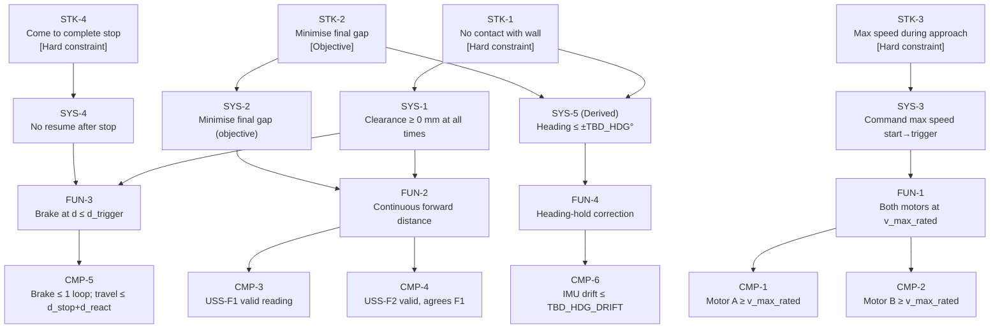

# Requirements Specification — Rover Wall-Stop System
**Version:** 1.0  **Status:** BASELINE  **Date:** 2026-07-21  
**Author:** Claude (Systems Engineering Agent)  
**Standards:** INCOSE GtWR 4th ed. / EARS grammar / ISO/IEC/IEEE 29148:2018 / NASA SP-2016-6105  

---

## 1. Scope

The rover shall drive at maximum motor speed along a straight heading from its marked start line (nominally ~1000 mm from a wall) and stop with no contact with the wall. The objective is to minimise the final gap between the rover's front face and the wall across five scored operation runs. This document decomposes that need to the single-effector leaf level.

---

## 2. Stakeholder Needs (STK)

| ID | EARS Pattern | Statement | Rationale |
|----|-------------|-----------|-----------|
| STK-1 | Unwanted | The rover shall not make contact with the wall at any point during or after the run. | Primary safety/scoring constraint, stated literally in the task. Contact in any scored run counts as a failure. |
| STK-2 | State-driven | While the rover is stopped after the run, the rover should minimise the distance between its front face and the wall. | Task objective (graded score); "should" signals this is an objective, not a pass/fail constraint. |
| STK-3 | Ubiquitous | The rover shall operate at maximum available motor speed during the approach phase. | Explicit task constraint; no speed reduction for safety margin is permitted. |
| STK-4 | Event-driven | When the rover's velocity reaches zero after braking, the rover shall remain stationary. | "Come to a complete stop" implies no rocking, no coasting restart, and no subsequent motion. |

---

## 3. System Requirements (SYS)

*Black-box behaviour; operationalise the STK needs.*

| ID | Parent | EARS Pattern | Statement | Rationale / TBD |
|----|--------|-------------|-----------|-----------------|
| SYS-1 | STK-1 | Unwanted | The rover shall maintain a clearance of ≥ 0 mm between its front face and the wall at all times during and after the run. | Operationalises STK-1 in measurable terms. Clearance = front-face position measured from wall surface. |
| SYS-2 | STK-2 | State-driven | While stopped, the rover's front face shall be as close to the wall as possible (objective; minimise final gap subject to SYS-1). | Graded score. Predicted final gap is the performance metric. **TBD_OBJ**: value set by model after calibration. |
| SYS-3 | STK-3 | Ubiquitous | The rover shall command maximum rated motor speed from the first motion command until the braking trigger fires. | Partial-speed approach is not permitted. Motor commands must be ≥ v_max_rated throughout approach. |
| SYS-4 | STK-4 | Event-driven | When the rover has stopped, the rover shall not resume motion. | Ensures the scored stop is final. Brake command (not coast) is required. |
| SYS-5 | STK-1, STK-2 | Ubiquitous *(Derived)* | The rover shall maintain heading within ± TBD_HDG degrees of initial heading throughout the run. | **Derived.** Heading deviation causes asymmetric approach: one side of the rover closes faster than the other, increasing effective contact risk. It also wastes approach distance. TBD_HDG to be bound by characterisation run that shows worst-case drift. Traces to STK-1 (reduces edge-contact risk) and STK-2 (straight path = minimum approach distance consumed). |

---

## 4. Functional Requirements (FUN)

*Allocate to functions; function → single subsystem.*

| ID | Parent | EARS Pattern | Statement | Rationale |
|----|--------|-------------|-----------|-----------|
| FUN-1 | SYS-3 | State-driven | While in approach phase, the propulsion function shall command both drive motors at maximum rated speed (≥ v_max_rated, **TBD_VMOT**). | Propagates SYS-3 to the propulsion function. |
| FUN-2 | SYS-1, SYS-2 | Ubiquitous | The forward sensing function shall continuously report the distance to the wall to the control loop throughout the approach. | Forward distance is the primary and only hard-constraint enforcement input. |
| FUN-3 | SYS-1, SYS-4 | Event-driven | When the primary forward USS reading ≤ d_trigger (**TBD_TRIGGER** mm), the braking function shall issue stop commands to both drive motors within one control loop period (**TBD_LOOP** ms). | The braking trigger is the deterministic hard-constraint enforcement. Latency bounded to one loop period. |
| FUN-4 | SYS-5 | State-driven | While in approach phase, the heading-hold function shall adjust relative motor speeds to maintain IMU heading within ± TBD_HDG degrees of 0°. | Heading error is the only FUN-level input to SYS-5. |

---

## 5. Component Requirements (CMP)

*Leaf level. Each requirement is verifiable by a test on a single effector.*

| ID | Parent | EARS Pattern | Statement | Rationale / TBD |
|----|--------|-------------|-----------|-----------------|
| CMP-1 | FUN-1 | State-driven | While in approach phase, Motor A shall maintain a shaft speed ≥ v_max_rated (**TBD_VMOT** deg/s). | Unit test: speed telemetry during approach must be ≥ v_max_rated for the full approach duration. |
| CMP-2 | FUN-1 | State-driven | While in approach phase, Motor B shall maintain a shaft speed ≥ v_max_rated (**TBD_VMOT** deg/s). | Symmetric with CMP-1. |
| CMP-3 | FUN-2 | Ubiquitous | Forward ultrasonic sensor USS-F1 shall return a valid, non-saturated reading in the range [**TBD_USS_MIN**, 2000] mm throughout the approach phase. | Ensures USS-F1 does not report invalid/maxed readings that would fail to trigger braking. Lower bound TBD from observed close-range behaviour. |
| CMP-4 | FUN-2 | Ubiquitous | Forward ultrasonic sensor USS-F2 shall return a valid reading in the range [**TBD_USS_MIN**, 2000] mm, agreeing with USS-F1 within **TBD_USS_AGREE** mm. | Redundancy / cross-sourcing check. Disagreement ≥ TBD_USS_AGREE flags a sensor fault. |
| CMP-5 | FUN-3 | Event-driven | When the control loop reads USS-F1 ≤ d_trigger, the motor stop commands shall be issued within **TBD_LOOP** ms and the rover shall travel no farther than d_stop + d_reaction from that trigger point (**TBD_DSTOP** + **TBD_DREACT** mm). | Translates the braking trigger to a measurable stopping-distance constraint. d_stop and d_reaction are TBD from Cal-Run-2. |
| CMP-6 | FUN-4 | State-driven | While in approach phase, the hub IMU shall report heading with a run-to-run drift ≤ **TBD_HDG_DRIFT** °/s, sufficient for the heading-hold function to maintain ± TBD_HDG accuracy. | IMU is the single heading-effector. Drift bound from Cal-Run-2 heading trace. |

---

## 6. TBD Register

All values initially free (uncalibrated); each row binds to a specific calibration activity.

| TBD ID | Symbol | Description | Units | Calibration Activity | Source-of-Truth Tier |
|--------|--------|-------------|-------|---------------------|----------------------|
| TBD_VMOT | v_max_rated | Maximum commanded motor speed (both motors) | deg/s | Cal-Run-2: log motor speed vs. time, read ceiling from slope flatness | T2 (onboard, multi-sample) |
| TBD_VMAX_MMS | v_max_mms | Maximum rover speed in mm/s | mm/s | Cal-Run-2: slope of USS reading vs. hub-clock timestamp during steady-state | T2 |
| TBD_DSTOP | d_stop_mm | Distance traveled from brake command to full stop | mm | Cal-Run-2: Δ(USS-F1) from trigger timestamp to settled reading | T2 |
| TBD_DREACT | d_reaction_mm | Distance traveled in one loop period at v_max | mm | Cal-Run-2: v_max_mms × TBD_LOOP / 1000 | T2 (derived) |
| TBD_LOOP | loop_period_ms | Actual control loop period | ms | Cal-Run-2: median inter-sample interval from hub-clock timestamps | T2 |
| TBD_COMBO | d_combo_mm | Combined offset: d_front_offset + uss_bias_mm | mm | Verification run + operator gap measurement (T1) | T1 (operator ground truth) |
| TBD_TRIGGER | d_trigger_mm | USS reading at which to command brake | mm | Model: TBD_DSTOP + TBD_DREACT + TBD_COMBO + safety_margin | Derived |
| TBD_USS_MIN | uss_valid_min | Minimum valid USS reading | mm | Cal-Run-2: observed minimum reading before saturating | T2 |
| TBD_USS_AGREE | uss_agree_mm | Max allowable USS-F1 / USS-F2 disagreement | mm | Cal-Run-2: F1 vs. F2 spread across full approach | T2 |
| TBD_HDG | heading_tol_deg | Maximum heading deviation budget | ° | Cal-Run-2: max absolute heading reading during approach | T2 |
| TBD_HDG_DRIFT | imu_drift_dps | IMU yaw drift rate with no rotation | °/s | Cal-Run-2: heading slope during straight-line approach | T2 |

**TBD_COMBO is the highest-leverage TBD; it requires one operator measurement (costed).  All other TBDs are bound from onboard telemetry (free).**

---

## 7. Effector Inventory and Traceability

Per REQUIREMENTS METHOD Rule 7: any effector with no requirement tracing to it drops out.

| Effector | Port | Required by | Status |
|----------|------|------------|--------|
| Motor A (drive) | TBD Cal-Run-1 | CMP-1, CMP-5 | **IN** |
| Motor B (drive) | TBD Cal-Run-1 | CMP-2, CMP-5 | **IN** |
| USS-F1 (forward) | TBD Cal-Run-1 | CMP-3, CMP-5 | **IN** |
| USS-F2 (forward) | TBD Cal-Run-1 | CMP-4 | **IN** |
| IMU (hub, built-in) | Hub | CMP-6 | **IN** |
| USS-R (rear) | TBD Cal-Run-1 | None | **OUT** (cross-source only; not required by any CMP. Logged for anomaly detection but not relied upon.) |
| ColorSensor (downward) | TBD Cal-Run-1 | None | **OUT** (no requirement traces to floor reflectance for this task.) |

*Note: USS-R and ColorSensor are discovered in Cal-Run-1 but not relied upon for operation. They may be logged in characterisation for fault detection (cross-sourcing; B1 tenet) but their presence does not affect the operation program.*

---

## 8. Requirement Tree (Mermaid)

---

## 9. Hard Constraints vs. Objectives Summary

| Requirement | Type | Verification Method | Status |
|-------------|------|---------------------|--------|
| SYS-1 (no contact) | Hard constraint | Test (run outcome) | Open — TBDs must close |
| SYS-2 (minimise gap) | Objective (graded) | Test (measured gap) + Analysis | Open |
| SYS-3 (max speed) | Hard constraint | Analysis (motor commands in code) | Open |
| SYS-4 (complete stop) | Hard constraint | Analysis + Inspection | Open |
| SYS-5 (heading) | Hard constraint (Derived) | Test (IMU telemetry) | Open — TBD_HDG |
| CMP-1/2 (motor speed) | Hard constraint | Test (motor telemetry) | Open — TBD_VMOT |
| CMP-3/4 (USS valid) | Hard constraint | Test (USS telemetry) | Open — TBD_USS_MIN |
| CMP-5 (stopping distance) | Hard constraint | Test (USS Δ-reading) | Open — TBD_DSTOP |
| CMP-6 (IMU drift) | Hard constraint | Test (heading slope) | Open — TBD_HDG_DRIFT |

---

*End of Requirements Specification v1.0*
