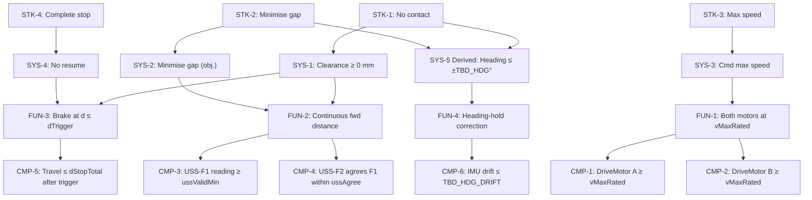

# Requirements Specification — Rover Wall-Stop System
**Version:** 2.0  **Status:** BASELINE  **Date:** 2026-07-21  
**Changes from v1:** TBD register aligned to rover_generic.sysml types
(TBD_LOOP → TBD_TRESP; TBD_DREACT made derived; TBD_DECEL added as
back-solved optional; TBD_COMBO retained as T1 anchor). CMP-3 wording
corrected: RangeRequirement not in rover_generic — lower-bound only.
CMP-5 wording updated to use `dStopTotal` (StoppingDistance composite).
Effector table updated to use DistanceSensor, InertialUnit, DriveMotor.
All STK/SYS/FUN/CMP requirement statements are **unchanged**.

---

## 1. Scope

The rover shall drive at maximum motor speed along a straight heading from its
marked start line (~1000 mm from a wall) and stop with no contact with the
wall. Objective: minimise the final gap between the rover's front face and the
wall across five scored operation runs.

---

## 2. Stakeholder Needs (STK)

| ID | EARS Pattern | Statement | Rationale |
|----|-------------|-----------|-----------|
| STK-1 | Unwanted | The rover shall not make contact with the wall at any point during or after the run. | Primary safety/scoring constraint, stated literally in the task. |
| STK-2 | State-driven | While the rover is stopped after the run, the rover should minimise the distance between its front face and the wall. | Task objective (graded score). |
| STK-3 | Ubiquitous | The rover shall operate at maximum available motor speed during the approach phase. | Explicit task constraint; no speed reduction permitted. |
| STK-4 | Event-driven | When the rover's velocity reaches zero after braking, the rover shall remain stationary. | "Complete stop" — no rocking or restart. |

---

## 3. System Requirements (SYS)

| ID | Parent | EARS Pattern | Statement | Rationale / TBD |
|----|--------|-------------|-----------|-----------------|
| SYS-1 | STK-1 | Unwanted | The rover shall maintain a clearance of ≥ 0 mm between its front face and the wall at all times during and after the run. | Operationalises STK-1. |
| SYS-2 | STK-2 | State-driven | While stopped, the rover's front face shall be as close to the wall as possible (objective; graded). | **TBD_OBJ**: predicted gap set by model post-calibration. |
| SYS-3 | STK-3 | Ubiquitous | The rover shall command maximum rated motor speed from first motion until the braking trigger fires. | Partial speed not permitted. |
| SYS-4 | STK-4 | Event-driven | When the rover has stopped, the rover shall not resume motion. | Brake command only; no subsequent run() in programme. |
| SYS-5 | STK-1, STK-2 | Ubiquitous *(Derived)* | The rover shall maintain heading within ± TBD_HDG degrees of initial heading throughout the run. | Derived: heading deviation causes asymmetric approach; one side closes faster, increasing edge-contact risk. **TBD_HDG** bound from Cal-Run-2. |

---

## 4. Functional Requirements (FUN)

| ID | Parent | EARS Pattern | Statement |
|----|--------|-------------|-----------|
| FUN-1 | SYS-3 | State-driven | While in approach phase, the propulsion function shall command both drive motors at maximum rated speed (≥ v_max_rated, **TBD_VMOT**). |
| FUN-2 | SYS-1, SYS-2 | Ubiquitous | The forward sensing function shall continuously report the distance to the wall to the control loop throughout the approach. |
| FUN-3 | SYS-1, SYS-4 | Event-driven | When the primary forward distance sensor reading ≤ dTrigger (**TBD_TRIGGER** mm), the braking function shall issue stop commands to both drive motors within one tResponse period (**TBD_TRESP** s). |
| FUN-4 | SYS-5 | State-driven | While in approach phase, the heading-hold function shall adjust relative motor speeds to maintain IMU heading within ± TBD_HDG degrees of 0°. |

---

## 5. Component Requirements (CMP)

| ID | Parent | EARS Pattern | Statement | Rationale / TBD |
|----|--------|-------------|-----------|-----------------|
| CMP-1 | FUN-1 | State-driven | While in approach phase, DriveMotor A shall be commanded at ≥ vMaxRated_dps (**TBD_VMOT** deg/s). | Unit test: speed telemetry. |
| CMP-2 | FUN-1 | State-driven | While in approach phase, DriveMotor B shall be commanded at ≥ vMaxRated_dps (**TBD_VMOT** deg/s). | Symmetric with CMP-1. |
| CMP-3 | FUN-2 | Ubiquitous | DistanceSensor USS-F1 shall return a valid reading of ≥ **TBD_USS_MIN** mm throughout the approach phase. | Lower-bound only (no RangeRequirement template exists in rover_generic). Upper bound is geometrically bounded by room size. |
| CMP-4 | FUN-2 | Ubiquitous | DistanceSensor USS-F2 shall return a valid reading agreeing with USS-F1 within **TBD_USS_AGREE** mm. | Redundancy/cross-sourcing check. Disagreement ≥ TBD_USS_AGREE flags a sensor fault. |
| CMP-5 | FUN-3 | Event-driven | When the control loop reads USS-F1 ≤ dTrigger, brake commands shall be issued within one tResponse period, and the rover shall travel no farther than dStopTotal (**TBD_DSTOP** mm) from that trigger point. dStopTotal = vMax_mms × tResponse_s + vMax_mms² / (2 × decel_mms²), measured directly at the operating point. | StoppingDistance template at single operating point. |
| CMP-6 | FUN-4 | State-driven | While in approach phase, the InertialUnit shall report heading with drift ≤ **TBD_HDG_DRIFT** deg/s, enabling heading-hold to maintain ± TBD_HDG accuracy. | IMU is the single heading effector. |

---

## 6. TBD Register (v2 — aligned to rover_generic.sysml)

| TBD ID | SysML Attribute | Description | Units | Cal Activity | Source Tier |
|--------|----------------|-------------|-------|-------------|-------------|
| TBD_VMOT | vMaxRated_dps | Max motor commanded speed | deg/s | Cal-Run-2: speed plateau in USS-slope fit | T2 |
| TBD_VMAX_MMS | vMax_mms | Max rover speed (RotationToSpeed binding) | mm/s | Cal-Run-2: slope of USS-F1 vs. hub-clock timestamp | T2 |
| TBD_DSTOP | dStopTotal_mm | Stopping distance at v_max — composite of reaction + braking (StoppingDistance template) | mm | Cal-Run-2: ΔUSS from trigger to settled reading | T2 |
| TBD_TRESP | tResponse_s | Full latency chain: compute + BLE + cmd-issue + one sensor refresh interval (= RoverLatency.tChain + sensor sample period) | s | Cal-Run-2: median inter-sample interval from hub-clock timestamps | T2 |
| TBD_DECEL | decel_mms2 | Deceleration back-solved from dStopTotal: a = vMax²/(2×(dStop − vMax×tResp)) | mm/s² | Derived from TBD_DSTOP + TBD_TRESP (if feasibility check needed) | T2 derived |
| TBD_COMBO | dCombo_mm | d_front_offset + uss_bias_systematic (task-specific composite; not in generic templates) | mm | Verification Run + T1 operator gap measurement | **T1** |
| TBD_TRIGGER | dTrigger_mm | USS reading at which to command brake = dStopTotal + dCombo + safetyMargin | mm | Model output (derived post-calibration) | Derived |
| TBD_USS_MIN | ussValidMin_mm | Minimum valid distance-sensor reading | mm | Cal-Run-2: min observed reading before saturation | T2 |
| TBD_USS_AGREE | ussAgreement_mm | Max USS-F1 / USS-F2 disagreement | mm | Cal-Run-2: max |F1−F2| across approach | T2 |
| TBD_HDG | headingTol_deg | Maximum heading deviation budget | deg | Cal-Run-2: max |heading| during approach | T2 |
| TBD_HDG_DRIFT | imuDrift_degps | InertialUnit yaw drift rate during straight-line approach | deg/s | Cal-Run-2: heading slope vs. time | T2 |

**Key:** TBD_COMBO is the only T1 item; it requires one operator measurement after the verification run. All other TBDs are bound from onboard T2 telemetry at no additional cost.

**Removed from v1:** TBD_LOOP (superceded by TBD_TRESP — broader scope). TBD_DREACT is now `dReaction_mm = vMax_mms × tResponse_s`, a derived property computed from TBD_VMAX_MMS and TBD_TRESP, not a standalone TBD.

---

## 7. Effector Inventory and Traceability (v2 — canonical type names)

| Effector (rover_generic type) | Instance | Req Traces | Status |
|-------------------------------|----------|-----------|--------|
| DriveMotor | Motor A | CMP-1, CMP-5 | **IN** |
| DriveMotor | Motor B | CMP-2, CMP-5 | **IN** |
| DistanceSensor (forward primary) | USS-F1 | CMP-3, CMP-5 | **IN** |
| DistanceSensor (forward secondary) | USS-F2 | CMP-4 | **IN** |
| InertialUnit (hub IMU) | imu | CMP-6 | **IN** |
| DistanceSensor (rear) | USS-R | None | **OUT** (logged for anomaly cross-check; not required for task) |
| ReflectanceSensor (downward floor) | floor | None | **OUT** (present on platform; no requirement traces to floor reflectance) |

---

## 8. Requirement Tree (Mermaid) — unchanged from v1

---

## 9. Open Items

All requirements are open pending calibration. Priority order matches the sensitivity table in the Calibration Plan: dStopTotal (P1), dCombo (P2), tResponse (P3), vMax (P4). No requirement closes until its TBD is bound; SYS-1/2 (the objective and the hard no-contact constraint) additionally require T1 operator measurement at the verification run to close TBD_COMBO.

---
*End of Requirements Specification v2.0*
