# Requirements Specification — Wall-Approach Rover

**Document type:** specification (the source of truth for requirements). **Version:** 1.0. **Status:** issued at GATE A, before any hardware run.

Authored to INCOSE *Guide to Writing Requirements* (4th ed.) quality rules over ISO/IEC/IEEE 29148:2018, in EARS grammar, with NASA SP-2016-6105 decomposition and V&V framing. The SysML v2 model (`wall_rover.sysml`) is a formal realisation of this document, and the Python module (`wallstop_model.py`) is its computational realisation. **On any disagreement, this document governs.**

## 1. Task statement as received

> There is a wall directly ahead of the rover. Make the rover drive straight at the wall at maximum speed and come to a complete stop as close to it as possible without touching it. Hard constraints: run at maximum speed, do not slow down for safety margin; the rover must not make contact. Objective: minimise the final gap. Setup: squared up at a marked start line, about 1000 mm out, held constant.

## 2. How to read this document

- **Levels.** STK (stakeholder need) → SYS (system, black box) → FUN (function) → CMP (single-effector leaf). Every child traces to exactly one parent; additional many-to-many traces are recorded in §7 rather than duplicated in the tree.
- **EARS pattern** is tagged on every requirement: Ubiquitous, State-driven, Event-driven, Optional, Unwanted, or Objective.
- **Hard constraints vs objectives** are separated (GtWR rule 3): constraints use *shall* and are pass/fail; the objective uses *should* and is graded. They are bridged by the derived margin requirement **SYS-5**, which is what makes “as close as possible” decidable rather than a matter of nerve.
- **DERIVED** marks a requirement not literal in the task statement; each carries its rationale for existing (GtWR rule 4/5).
- **TBD-n** marks an unknown value. Every TBD is bound to a specific calibration activity in §6; no TBD is left dangling and none is filled with an eyeballed number (tenet A3).
- **Decomposition stops** where a requirement is verifiable by a test on a single effector, or where it is irreducibly integrative (GtWR rule 2). SYS-2 (no contact) is the latter: it is a property of the whole loop and is decomposed into the contributors that make it predictable, not into a single testable effector.

## 3. Requirement tree

```mermaid
graph TD
    STK_0([STK-0<br/><b>WallRunNeed</b>])
    STK_1([STK-1<br/><b>SafeMaximumSpeedRun</b>])
    STK_2([STK-2<br/><b>ClosestStopObjective</b>])
    SYS_1[SYS-1<br/><b>MaximumApproachSpeed</b>]
    SYS_2[SYS-2<br/><b>NoWallContact</b>]
    SYS_3[SYS-3<br/><b>CompleteStop</b>]
    SYS_4[SYS-4<br/><b>StraightApproach</b>]
    SYS_5[SYS-5<br/><b>ClearanceMarginFloor</b>]
    SYS_6[SYS-6<br/><b>ConfigurationDiscovery</b>]
    SYS_7[SYS-7<br/><b>ClearanceReporting</b>]
    FUN_1[FUN-1<br/><b>CruiseAtCeiling</b>]
    FUN_2[FUN-2<br/><b>ClearanceEstimation</b>]
    FUN_3[FUN-3<br/><b>StopPointComputation</b>]
    FUN_4[FUN-4<br/><b>BrakeActuation</b>]
    FUN_5[FUN-5<br/><b>FailSafeResponse</b>]
    FUN_6[FUN-6<br/><b>HeadingMaintenance</b>]
    FUN_7[FUN-7<br/><b>PortAndPolarityIdentification</b>]
    FUN_8[FUN-8<br/><b>TelemetryAndEstimate</b>]
    CMP_1[CMP-1<br/><b>LeftMotorCeiling</b>]
    CMP_2[CMP-2<br/><b>RightMotorCeiling</b>]
    CMP_3[CMP-3<br/><b>AccelWithinRunway</b>]
    CMP_4[CMP-4<br/><b>PrimaryRangerBias</b>]
    CMP_5[CMP-5<br/><b>PrimaryRangerRefresh</b>]
    CMP_20[CMP-20<br/><b>PrimaryRangerStaleness</b>]
    CMP_21[CMP-21<br/><b>PrimaryRangerQuantisation</b>]
    CMP_6[CMP-6<br/><b>OdometryScale</b>]
    CMP_7[CMP-7<br/><b>SecondaryRangerAgreement</b>]
    CMP_8[CMP-8<br/><b>TriggerTimingResolution</b>]
    CMP_9[CMP-9<br/><b>PlausibilityBounds</b>]
    CMP_10[CMP-10<br/><b>DeadReckonBackstop</b>]
    CMP_11[CMP-11<br/><b>BrakeTravel</b>]
    CMP_22[CMP-22<br/><b>BrakeTravelRepeatability</b>]
    CMP_12[CMP-12<br/><b>NoPostStopMotion</b>]
    CMP_13[CMP-13<br/><b>HeadingSensing</b>]
    CMP_14[CMP-14<br/><b>WheelSpeedSymmetry</b>]
    CMP_15[CMP-15<br/><b>DeviceTypeIdentification</b>]
    CMP_16[CMP-16<br/><b>DrivePolarityIdentification</b>]
    CMP_17[CMP-17<br/><b>RestRangeEstimator</b>]
    CMP_18[CMP-18<br/><b>OdometricEstimator</b>]
    CMP_19[CMP-19<br/><b>ContactDetection</b>]
    OBJ_1{{OBJ-1<br/><b>MarginEfficiency</b>}}
    STK_0 --> STK_1
    STK_0 --> STK_2
    STK_1 --> SYS_1
    STK_1 --> SYS_2
    STK_1 --> SYS_3
    STK_1 --> SYS_4
    SYS_2 --> SYS_5
    STK_1 --> SYS_6
    STK_1 --> SYS_7
    SYS_1 --> FUN_1
    SYS_2 --> FUN_2
    SYS_2 --> FUN_3
    SYS_3 --> FUN_4
    SYS_2 --> FUN_5
    SYS_4 --> FUN_6
    SYS_6 --> FUN_7
    SYS_7 --> FUN_8
    FUN_1 --> CMP_1
    FUN_1 --> CMP_2
    FUN_1 --> CMP_3
    FUN_2 --> CMP_4
    FUN_2 --> CMP_5
    FUN_2 --> CMP_20
    FUN_2 --> CMP_21
    FUN_2 --> CMP_6
    FUN_2 --> CMP_7
    FUN_3 --> CMP_8
    FUN_5 --> CMP_9
    FUN_5 --> CMP_10
    FUN_4 --> CMP_11
    FUN_4 --> CMP_22
    FUN_4 --> CMP_12
    FUN_6 --> CMP_13
    FUN_6 --> CMP_14
    FUN_7 --> CMP_15
    FUN_7 --> CMP_16
    FUN_8 --> CMP_17
    FUN_8 --> CMP_18
    FUN_8 --> CMP_19
    STK_2 --> OBJ_1
    classDef stk fill:#1f3a5f,stroke:#0d1f33,color:#fff
    classDef sys fill:#2d5a7a,stroke:#0d1f33,color:#fff
    classDef fun fill:#4a7a8c,stroke:#0d1f33,color:#fff
    classDef cmp fill:#7aa5b0,stroke:#0d1f33,color:#000
    classDef obj fill:#8c6a3f,stroke:#33240d,color:#fff
    class STK_0,STK_1,STK_2 stk
    class SYS_1,SYS_2,SYS_3,SYS_4,SYS_5,SYS_6,SYS_7 sys
    class FUN_1,FUN_2,FUN_3,FUN_4,FUN_5,FUN_6,FUN_7,FUN_8 fun
    class CMP_1,CMP_2,CMP_3,CMP_4,CMP_5,CMP_20,CMP_21,CMP_6,CMP_7,CMP_8,CMP_9,CMP_10,CMP_11,CMP_22,CMP_12,CMP_13,CMP_14,CMP_15,CMP_16,CMP_17,CMP_18,CMP_19 cmp
    class OBJ_1 obj
```



## 4. Requirements

### 4.1 STK — Stakeholder need

#### STK-0 · WallRunNeed

> The rover shall perform a wall-approach run that ends in a full stop as close to the wall as achievable without contact, driving at maximum speed.

- **EARS pattern:** Ubiquitous · **kind:** need · **parent:** — (root need) · **from task statement**
- **Allocated to:** `WallRover`
- **Verification:** analysis+test, closed at **GATE-C**
- **Rationale:** The stakeholder need, taken verbatim from the task. It is a compound need and is therefore not verified directly: it is closed by the roll-up of STK-1 (the hard constraints) and STK-2 (the objective).

#### STK-1 · SafeMaximumSpeedRun

> The rover shall traverse from the start line to a complete stop at maximum drivetrain speed without contacting the wall.

- **EARS pattern:** Ubiquitous · **kind:** constraint · **parent:** STK-0 · **from task statement**
- **Allocated to:** `WallRover`
- **Verification:** test, closed at **GATE-C**
- **Rationale:** Separates the pass/fail part of the need from the graded part (GtWR rule 3). Verified by the conjunction of SYS-1..SYS-7.

#### STK-2 · ClosestStopObjective

> The rover should minimise the clearance between its front-most point and the wall at the full stop.

- **EARS pattern:** Objective · **kind:** objective · **parent:** STK-0 · **from task statement**
- **Allocated to:** `WallRover`
- **Verification:** analysis+test, closed at **GATE-C**
- **Rationale:** The scored objective. Stated with 'should' and graded, never as a pass/fail constraint (GtWR rule 3); bridged to the hard constraint SYS-2 by the derived margin requirement SYS-5.

### 4.2 SYS — System (black box)

#### SYS-1 · MaximumApproachSpeed

> While in the APPROACH state, the rover shall command both drive motors at a speed no less than the drivetrain's maximum achievable speed.

- **EARS pattern:** State-driven · **kind:** constraint · **parent:** STK-1 · **from task statement**
- **Allocated to:** `WallRover`
- **Verification:** inspection+test, closed at **CAL-1**
- **Formal shape:** specialises `RequirementTemplates::LowerBoundRequirement`
- **Rationale:** The task forbids slowing down for safety margin. Stated as a command-side lower bound so that 'maximum speed' is a construction property of the program (verifiable by inspection) as well as a measured one.

#### SYS-2 · NoWallContact

> The rover shall not contact the wall.

- **EARS pattern:** Unwanted · **kind:** constraint · **parent:** STK-1 · **from task statement**
- **Allocated to:** `WallRover`
- **Verification:** test, closed at **GATE-C**
- **Formal shape:** specialises `RequirementTemplates::LowerBoundRequirement`
- **Rationale:** The task's hard constraint. Contact is a pass/fail event, so it is stated as an Unwanted-behaviour requirement over the clearance channel with a zero floor, and cross-checked by an independent contact channel (CMP-19).

#### SYS-3 · CompleteStop

> When the brake command is issued, the rover shall reach zero ground speed.

- **EARS pattern:** Event-driven · **kind:** constraint · **parent:** STK-1 · **from task statement**
- **Allocated to:** `WallRover`
- **Verification:** test, closed at **CAL-1**
- **Rationale:** The task requires a complete stop, not merely a slow-down; a run that rolls to a halt outside the observed window would not be a stop.

#### SYS-4 · StraightApproach

> The rover shall not deviate from its initial heading by more than TBD-12 degrees during the approach.

- **EARS pattern:** Ubiquitous · **kind:** constraint · **parent:** STK-1 · **DERIVED**
- **Allocated to:** `WallRover`
- **Verification:** test, closed at **CAL-1**
- **Formal shape:** specialises `RequirementTemplates::UpperBoundRequirement`
- **Contains:** TBD-12
- **Rationale:** DERIVED. The task says drive straight at the wall; quantitatively, heading deviation converts a centre-line clearance into a smaller corner clearance and tilts the ranger's line of sight, so it must be bounded, not just observed.

#### SYS-5 · ClearanceMarginFloor

> The rover's predicted final clearance shall be no less than the derived no-contact margin m_contact.

- **EARS pattern:** Ubiquitous · **kind:** constraint · **parent:** SYS-2 · **DERIVED**
- **Allocated to:** `WallRover`
- **Verification:** analysis, closed at **GATE-B**
- **Formal shape:** specialises `RequirementTemplates::LowerBoundRequirement`
- **Contains:** TBD-16
- **Rationale:** DERIVED margin requirement bridging the hard constraint SYS-2 and the objective STK-2 (GtWR rule 3). m_contact = z_conf * sigma_rss, the RSS of the independent uncertainty contributors (tenet A6) -- it is computed, never guessed, and it is what makes 'as close as possible' decidable.

#### SYS-6 · ConfigurationDiscovery

> When the program starts, the rover shall determine the device type on every port it uses and the drivetrain sign convention before commanding motion.

- **EARS pattern:** Event-driven · **kind:** constraint · **parent:** STK-1 · **DERIVED**
- **Allocated to:** `WallRover`
- **Verification:** test, closed at **CAL-1**
- **Rationale:** DERIVED. The task states the port map and direction conventions are unknown and must be determined; a wrong polarity would drive the rover backwards or spin it, so this gates all motion.

#### SYS-7 · ClearanceReporting

> The rover shall report, for each run, an estimate of its final clearance with an uncertainty not exceeding TBD-14 millimetres.

- **EARS pattern:** Ubiquitous · **kind:** constraint · **parent:** STK-1 · **DERIVED**
- **Allocated to:** `WallRover`
- **Verification:** test, closed at **GATE-C**
- **Formal shape:** specialises `RequirementTemplates::UpperBoundRequirement`
- **Contains:** TBD-14
- **Rationale:** DERIVED. The operation close-out requires a per-run onboard estimate frozen before ground truth is disclosed, and the objective may only be closed on a channel whose accuracy has been validated -- both need a stated uncertainty.

### 4.3 FUN — Function

#### FUN-1 · CruiseAtCeiling

> When the APPROACH state is entered, the rover shall accelerate to the commanded ceiling speed and hold it until the brake command.

- **EARS pattern:** Event-driven · **kind:** constraint · **parent:** SYS-1 · **from task statement**
- **Allocated to:** `WallRover`
- **Verification:** test, closed at **CAL-1**
- **Formal shape:** specialises `RequirementTemplates::LowerBoundRequirement`
- **Rationale:** Allocates SYS-1 to the propulsion function and makes the cruise phase long enough that the stopping travel is calibrated at the speed it is used at.

#### FUN-2 · ClearanceEstimation

> The rover shall estimate the clearance from its front-most point to the wall continuously throughout the approach.

- **EARS pattern:** Ubiquitous · **kind:** constraint · **parent:** SYS-2 · **from task statement**
- **Allocated to:** `WallRover`
- **Verification:** test, closed at **CAL-1**
- **Formal shape:** specialises `RequirementTemplates::UpperBoundRequirement`
- **Rationale:** The stop decision needs clearance, not raw range: the two differ by the ranger's mounting offset and bias, which is a separate calibrated quantity.

#### FUN-3 · StopPointComputation

> The rover shall compute the brake-command instant at which the predicted rest clearance equals the commanded target clearance.

- **EARS pattern:** Ubiquitous · **kind:** constraint · **parent:** SYS-2 · **from task statement**
- **Allocated to:** `WallRover`
- **Verification:** analysis+test, closed at **CAL-1**
- **Formal shape:** specialises `RequirementTemplates::LowerBoundRequirement`
- **Rationale:** Makes the stop criterion an explicit prediction rather than a tuned threshold, so it can be verified against the model before the run and transfers unchanged from calibration to operation.

#### FUN-4 · BrakeActuation

> When the brake instant is reached, the rover shall apply maximum braking to both drive wheels.

- **EARS pattern:** Event-driven · **kind:** constraint · **parent:** SYS-3 · **from task statement**
- **Allocated to:** `WallRover`
- **Verification:** test, closed at **CAL-1**
- **Rationale:** Allocates SYS-3 to the actuation function. Passive braking is chosen so the approach to rest is monotone: the final position equals the closest position, so the scored gap and the contact risk refer to the same point.

#### FUN-5 · FailSafeResponse

> When any monitored channel violates its stated plausibility bound, the rover shall brake immediately.

- **EARS pattern:** Event-driven · **kind:** constraint · **parent:** SYS-2 · **DERIVED**
- **Allocated to:** `WallRover`
- **Verification:** test, closed at **CAL-1**
- **Rationale:** DERIVED. Graded assurance (tenet A1): contact is the high-consequence outcome, so the primary range channel must not be single-string. Every fail-safe path errs toward braking early.

#### FUN-6 · HeadingMaintenance

> The rover shall command both drive wheels at equal speed throughout the approach.

- **EARS pattern:** Ubiquitous · **kind:** constraint · **parent:** SYS-4 · **DERIVED**
- **Allocated to:** `WallRover`
- **Verification:** test, closed at **CAL-1**
- **Rationale:** DERIVED. Equal commanded wheel speed is the open-loop means of meeting SYS-4 without introducing an uncalibrated steering gain (tenet A3); any residual veer is measured and carried as an uncertainty contributor.

#### FUN-7 · PortAndPolarityIdentification

> When the program starts, the rover shall identify the device type on each port and the motor sign pair that produces forward motion.

- **EARS pattern:** Event-driven · **kind:** constraint · **parent:** SYS-6 · **DERIVED**
- **Allocated to:** `WallRover`
- **Verification:** test, closed at **CAL-1**
- **Rationale:** Allocates SYS-6. Identification is done from onboard evidence so no operator input is consumed for it.

#### FUN-8 · TelemetryAndEstimate

> The rover shall report two independent estimates of its final clearance at each rest position.

- **EARS pattern:** Ubiquitous · **kind:** constraint · **parent:** SYS-7 · **DERIVED**
- **Allocated to:** `WallRover`
- **Verification:** test, closed at **CAL-1**
- **Rationale:** DERIVED from SYS-7 and cross-sourcing (GtWR rule 6 / tenet B1): two independent estimates make a disagreement visible, which is the only way an estimate error is detectable without spending operator measurements.

### 4.4 CMP — Component / single effector

#### CMP-1 · LeftMotorCeiling

> The left drive motor shall sustain an angular speed of at least TBD-1 degrees per second when commanded above its ceiling.

- **EARS pattern:** Ubiquitous · **kind:** constraint · **parent:** FUN-1 · **from task statement**
- **Allocated to:** `MotorLeft`
- **Verification:** test, closed at **CAL-1**
- **Formal shape:** specialises `RequirementTemplates::LowerBoundRequirement`
- **Contains:** TBD-1
- **Rationale:** Single-effector leaf of FUN-1: fixes what 'maximum' numerically is for this motor, and makes a weak or dragging motor visible as a unit failure.

#### CMP-2 · RightMotorCeiling

> The right drive motor shall sustain an angular speed of at least TBD-1 degrees per second when commanded above its ceiling.

- **EARS pattern:** Ubiquitous · **kind:** constraint · **parent:** FUN-1 · **from task statement**
- **Allocated to:** `MotorRight`
- **Verification:** test, closed at **CAL-1**
- **Formal shape:** specialises `RequirementTemplates::LowerBoundRequirement`
- **Contains:** TBD-1
- **Rationale:** Single-effector leaf of FUN-1, mirror of CMP-1. Verified separately so a one-sided fault cannot hide inside an average.

#### CMP-3 · AccelWithinRunway

> The drivetrain shall reach its ceiling speed within TBD-2 millimetres of travel from the start line.

- **EARS pattern:** Ubiquitous · **kind:** constraint · **parent:** FUN-1 · **DERIVED**
- **Allocated to:** `Drivetrain`
- **Verification:** analysis, closed at **CAL-1**
- **Formal shape:** specialises `RequirementTemplates::UpperBoundRequirement`
- **Contains:** TBD-2
- **Rationale:** DERIVED feasibility leaf: if the ceiling is not reached before the brake point, the run is not at maximum speed and the stopping travel is calibrated at the wrong speed. Instantiates MaxSpeedFromBudget.

#### CMP-4 · PrimaryRangerBias

> The primary forward ranger shall report the wall range with a fixed offset of TBD-3 millimetres relative to the rover's front-most point over the interval 40 mm to 1000 mm.

- **EARS pattern:** Ubiquitous · **kind:** constraint · **parent:** FUN-2 · **DERIVED**
- **Allocated to:** `RangerPrimary`
- **Verification:** test, closed at **CAL-1**
- **Contains:** TBD-3
- **Rationale:** Single-effector leaf of FUN-2 and the highest-leverage unobservable: no onboard channel can see where the bumper is relative to the sensor datum, so this TBD is bound by the one costed operator measurement.

#### CMP-5 · PrimaryRangerRefresh

> The primary forward ranger shall deliver a fresh sample at intervals not exceeding TBD-4 milliseconds.

- **EARS pattern:** Ubiquitous · **kind:** constraint · **parent:** FUN-2 · **DERIVED**
- **Allocated to:** `RangerPrimary`
- **Verification:** test, closed at **CAL-1**
- **Formal shape:** specialises `RequirementTemplates::UpperBoundRequirement`
- **Contains:** TBD-4
- **Rationale:** Bounds how stale the newest sample can be, which sets how far the rover moves between absolute updates. Split from staleness and quantisation so each is one verifiable claim (GtWR rule 1).

#### CMP-20 · PrimaryRangerStaleness

> The primary forward ranger shall report a range whose age does not exceed TBD-5 milliseconds at the instant it becomes readable.

- **EARS pattern:** Ubiquitous · **kind:** constraint · **parent:** FUN-2 · **DERIVED**
- **Allocated to:** `RangerPrimary`
- **Verification:** test, closed at **CAL-1**
- **Formal shape:** specialises `RequirementTemplates::UpperBoundRequirement`
- **Contains:** TBD-5
- **Rationale:** DERIVED. Staleness is a bias, not noise: at cruise it converts directly into millimetres of unseen travel, so it must be characterised and compensated rather than idealised away (tenet D2).

#### CMP-21 · PrimaryRangerQuantisation

> The primary forward ranger shall report range in steps not exceeding TBD-6 millimetres.

- **EARS pattern:** Ubiquitous · **kind:** constraint · **parent:** FUN-2 · **DERIVED**
- **Allocated to:** `RangerPrimary`
- **Verification:** test, closed at **CAL-1**
- **Formal shape:** specialises `RequirementTemplates::UpperBoundRequirement`
- **Contains:** TBD-6
- **Rationale:** DERIVED. A reporting artifact (tenet D1): the quantisation step, not the physical resolution, is what the estimator sees, and it sets the noise floor of the fused offset.

#### CMP-6 · OdometryScale

> The drive odometry shall report travel with a scale factor of TBD-7 millimetres of wall range per degree of wheel rotation.

- **EARS pattern:** Ubiquitous · **kind:** constraint · **parent:** FUN-2 · **DERIVED**
- **Allocated to:** `Drivetrain`
- **Verification:** test, closed at **CAL-1**
- **Contains:** TBD-7
- **Rationale:** Single-effector leaf of FUN-2. The scale bundles wheel radius, gearing and slip, which is exactly why it is calibrated against the ranger rather than computed from nominal wheel geometry (tenet A3).

#### CMP-7 · SecondaryRangerAgreement

> The secondary forward ranger shall agree with the primary ranger within TBD-8 millimetres, after removal of their fixed mounting difference, over the interval 40 mm to 1000 mm.

- **EARS pattern:** Ubiquitous · **kind:** constraint · **parent:** FUN-2 · **DERIVED**
- **Allocated to:** `RangerSecondary`
- **Verification:** test, closed at **CAL-1**
- **Formal shape:** specialises `RequirementTemplates::UpperBoundRequirement`
- **Contains:** TBD-8
- **Rationale:** DERIVED cross-source (GtWR rule 6). An independent ranger observing the same quantity is the fault-agnostic detector: a disagreement localises a fault without assuming which channel is wrong.

#### CMP-8 · TriggerTimingResolution

> The controller shall issue the brake command within TBD-9 milliseconds of the computed brake instant.

- **EARS pattern:** Ubiquitous · **kind:** constraint · **parent:** FUN-3 · **DERIVED**
- **Allocated to:** `Controller`
- **Verification:** test, closed at **CAL-1**
- **Formal shape:** specialises `RequirementTemplates::UpperBoundRequirement`
- **Contains:** TBD-9
- **Rationale:** DERIVED. Timing error converts to millimetres at cruise speed; a sub-loop wait is what keeps the trigger from inheriting the loop period as error.

#### CMP-9 · PlausibilityBounds

> The controller shall bound every logged channel by a stated physical range and shall flag any sample outside it.

- **EARS pattern:** Ubiquitous · **kind:** constraint · **parent:** FUN-5 · **DERIVED**
- **Allocated to:** `Controller`
- **Verification:** inspection+test, closed at **CAL-1**
- **Rationale:** DERIVED. Makes physically impossible readings surface automatically, which is the trigger for unconditional escalation under ANOMALY DISPOSITION.

#### CMP-10 · DeadReckonBackstop

> The controller shall brake unconditionally when odometric travel reaches the configured backstop distance.

- **EARS pattern:** Ubiquitous · **kind:** constraint · **parent:** FUN-5 · **DERIVED**
- **Allocated to:** `Controller`
- **Verification:** test, closed at **CAL-1**
- **Rationale:** DERIVED. An independent, ranger-free stop path: it covers loss of echo and, set tight, it is what makes the first max-speed brake event safe before any stopping-travel calibration exists.

#### CMP-11 · BrakeTravel

> Each drive motor shall arrest wheel rotation within TBD-10 millimetres of travel from the brake command at cruise speed.

- **EARS pattern:** Ubiquitous · **kind:** constraint · **parent:** FUN-4 · **DERIVED**
- **Allocated to:** `Drivetrain`
- **Verification:** test, closed at **CAL-1**
- **Formal shape:** specialises `RequirementTemplates::UpperBoundRequirement`
- **Contains:** TBD-10
- **Rationale:** Single-effector leaf of FUN-4 and the second-highest-leverage parameter: it is measured directly at the operating point so no extrapolation enters the stop prediction (RelationTemplates::StoppingDistance guidance).

#### CMP-22 · BrakeTravelRepeatability

> The travel from brake command to rest shall not vary by more than TBD-11 millimetres between runs at cruise speed.

- **EARS pattern:** Ubiquitous · **kind:** constraint · **parent:** FUN-4 · **DERIVED**
- **Allocated to:** `Drivetrain`
- **Verification:** test, closed at **CAL-1**
- **Formal shape:** specialises `RequirementTemplates::UpperBoundRequirement`
- **Contains:** TBD-11
- **Rationale:** DERIVED. Run-to-run scatter, not the mean, is what the no-contact margin is made of (tenet A6); split from CMP-11 so each is one verifiable claim.

#### CMP-12 · NoPostStopMotion

> The rover shall not move after reaching the full stop.

- **EARS pattern:** Unwanted · **kind:** constraint · **parent:** FUN-4 · **DERIVED**
- **Allocated to:** `Drivetrain`
- **Verification:** test, closed at **CAL-1**
- **Rationale:** DERIVED. The scored gap is measured by the operator some seconds after the run ends; creep or rollback between the stop and the measurement would make the onboard estimate and the ground truth refer to different positions.

#### CMP-13 · HeadingSensing

> The inertial unit shall report heading with a drift not exceeding TBD-12 degrees over the duration of one run.

- **EARS pattern:** Ubiquitous · **kind:** constraint · **parent:** FUN-6 · **DERIVED**
- **Allocated to:** `Imu`
- **Verification:** test, closed at **CAL-1**
- **Formal shape:** specialises `RequirementTemplates::UpperBoundRequirement`
- **Contains:** TBD-12
- **Rationale:** Single-effector leaf of FUN-6. The hub is power-cycled between runs so heading is always relative to the start pose; only within-run drift matters.

#### CMP-14 · WheelSpeedSymmetry

> The two drive motors shall maintain speeds within TBD-13 degrees per second of each other during cruise.

- **EARS pattern:** Ubiquitous · **kind:** constraint · **parent:** FUN-6 · **DERIVED**
- **Allocated to:** `Drivetrain`
- **Verification:** test, closed at **CAL-1**
- **Formal shape:** specialises `RequirementTemplates::UpperBoundRequirement`
- **Contains:** TBD-13
- **Rationale:** DERIVED. Differential wheel speed is the mechanism behind heading deviation; measuring it separately from the IMU gives a second, independent view of straightness (cross-sourcing).

#### CMP-15 · DeviceTypeIdentification

> When the program starts, the controller shall determine the device type present on each of the hub's six ports.

- **EARS pattern:** Event-driven · **kind:** constraint · **parent:** FUN-7 · **DERIVED**
- **Allocated to:** `Controller`
- **Verification:** test, closed at **CAL-1**
- **Rationale:** Single-effector leaf of FUN-7: the port map is unknown a priori and every later channel depends on it.

#### CMP-16 · DrivePolarityIdentification

> When the port map is known, the controller shall determine the pair of motor speed signs that moves the rover toward the wall.

- **EARS pattern:** Event-driven · **kind:** constraint · **parent:** FUN-7 · **DERIVED**
- **Allocated to:** `Controller`
- **Verification:** test, closed at **CAL-1**
- **Rationale:** Single-effector leaf of FUN-7. Determined from the sign of the range change and the heading change under a short, low-speed probe, so no assumption about drivetrain mirroring is needed.

#### CMP-17 · RestRangeEstimator

> The rover shall report a static-range clearance estimate at rest whenever the reported range is not less than TBD-15 millimetres.

- **EARS pattern:** Ubiquitous · **kind:** constraint · **parent:** FUN-8 · **DERIVED**
- **Allocated to:** `RangerPrimary`
- **Verification:** test, closed at **CAL-1**
- **Formal shape:** specialises `RequirementTemplates::LowerBoundRequirement`
- **Contains:** TBD-15
- **Rationale:** DERIVED. The static estimate is latency-free and therefore the most trusted onboard clearance channel, but it has a validity floor -- the condition is stated so the hand-off to the odometric estimate is planned, not improvised (CHARACTERIZATION METHOD 1).

#### CMP-18 · OdometricEstimator

> The rover shall report an odometric clearance estimate at every rest position, independent of the reported range at rest.

- **EARS pattern:** Ubiquitous · **kind:** constraint · **parent:** FUN-8 · **DERIVED**
- **Allocated to:** `Drivetrain`
- **Verification:** test, closed at **CAL-1**
- **Rationale:** DERIVED. Covers the range below the ranger's validity floor and provides the independent second estimate FUN-8 requires.

#### CMP-19 · ContactDetection

> The inertial unit shall report forward-axis acceleration throughout the brake phase at a rate sufficient to distinguish braking from an impact.

- **EARS pattern:** Ubiquitous · **kind:** constraint · **parent:** FUN-8 · **DERIVED**
- **Allocated to:** `Imu`
- **Verification:** test, closed at **CAL-1**
- **Rationale:** DERIVED. Gives SYS-2 an onboard witness independent of the ranger and of the operator's observation: an impact is a distinctive acceleration transient, so 'no contact' is evidenced rather than assumed.

### 4.5 OBJ — Objective

#### OBJ-1 · MarginEfficiency

> The commanded target clearance should not exceed the derived no-contact margin by more than a factor of TBD-17.

- **EARS pattern:** Objective · **kind:** objective · **parent:** STK-2 · **DERIVED**
- **Allocated to:** `WallRover`
- **Verification:** analysis, closed at **GATE-B**
- **Formal shape:** specialises `RequirementTemplates::UpperBoundRequirement`
- **Contains:** TBD-16, TBD-17
- **Rationale:** DERIVED. Operationalises 'as close as possible': the smallest defensible target is the uncertainty-derived margin itself, so the objective is to leave no clearance beyond that margin. Below it we would be buying score with contact risk; above it we are giving away score for nothing.

## 5. Effector selection (traceability-driven)

Effectors are selected *from* the CMP requirements, not assumed from the platform inventory. An element with no requirement tracing to it drops out — and the drop-out is verified, not asserted (GtWR rule 7).

| Element | Platform type | Status | Requirements tracing to it |
|---|---|---|---|
| `MotorLeft` | DriveMotor | selected | CMP-1 |
| `MotorRight` | DriveMotor | selected | CMP-2 |
| `Drivetrain` | composition of the two DriveMotors | selected | CMP-3, CMP-6, CMP-11, CMP-22, CMP-12, CMP-14, CMP-18 |
| `RangerPrimary` | DistanceSensor (forward) | selected | CMP-4, CMP-5, CMP-20, CMP-21, CMP-17 |
| `RangerSecondary` | DistanceSensor (forward) | selected | CMP-7 |
| `Imu` | InertialUnit | selected | CMP-13, CMP-19 |
| `Controller` | hub program | selected | CMP-8, CMP-9, CMP-10, CMP-15, CMP-16 |
| `RangerRear` | DistanceSensor (rear) | **DROPPED** | none |
| `FloorReflectance` | ReflectanceSensor | **DROPPED** | none |

### 5.1 Dropped elements and how the drop is verified

**`RangerRear`** — No requirement traces to it. It cannot observe the wall ahead, and the quantity it could otherwise serve -- travel from the start line -- is already covered by two better channels (the forward rangers absolutely, the odometry differentially) whose references are controlled, whereas whatever lies behind the rover is not. Dropped by traceability, and the drop is VERIFIED not assumed: CAL-1 logs it at low rate and the drop-out is confirmed only if its reported range increases while the forward ranges decrease (i.e. it is rear-facing and sees no wall ahead).

**`FloorReflectance`** — No requirement traces to it. The start position is fixed and squared by the operator, so no start-line detection function exists; reflectance observes no quantity in the clearance, speed, stop or heading chains. Dropped by traceability, VERIFIED by logging it in CAL-1 and confirming it carries no usable position information (uniform floor, no transition at the start line under the sensor).

Note the asymmetry that justifies the cost: verifying a drop-out is free (both sensors are logged inside a run that happens anyway), whereas wrongly keeping a channel in the control path would put an uncharacterised input on the no-contact chain.

## 6. TBD register

Every unknown value, the model parameter it binds, the activity that will bind it, and the source-of-truth tier that binding will carry. This register is the input list to calibration, together with the model-completion parameters listed in the Calibration Plan §2.

| TBD | Quantity | Model parameter | Bound by | Planned tier |
|---|---|---|---|---|
| **TBD-1** | minimum sustained wheel speed at the ceiling | `omega_cruise` | CAL-1 P4/P6 cruise plateau, per motor | T4-onboard-multi |
| **TBD-2** | travel needed to reach ceiling speed | `a_accel` | CAL-1 P4 speed ramp | T4-onboard-multi |
| **TBD-3** | primary ranger offset to the front-most point | `b_offset` | CAL-1 P8 static block + M1 operator measurement | T5-external |
| **TBD-4** | ranger fresh-sample interval | `t_refresh` | CAL-1 P4 value-change interval histogram | T4-onboard-multi |
| **TBD-5** | ranger sample staleness | `l_sensor` | CAL-1 P4/P6 dynamic-vs-static offset comparison | T4-onboard-multi |
| **TBD-6** | ranger reported quantisation step | `q_range` | CAL-1 P2 static staircase + P4 trace | T4-onboard-multi |
| **TBD-7** | odometry-to-range scale factor | `k_eff` | CAL-1 P2 static staircase regression | T4-onboard-multi |
| **TBD-8** | primary-secondary ranger agreement | `d_agree` | CAL-1 P0/P2/P8 static blocks | T4-onboard-multi |
| **TBD-9** | brake-command timing error | `e_trig` | CAL-1 P4 commanded vs achieved brake instant | T4-onboard-multi |
| **TBD-10** | brake travel from command to rest at cruise | `psi_brake` | CAL-1 P4 and P6, odometry and ranger | T4-onboard-multi |
| **TBD-11** | run-to-run scatter of brake travel | `sigma_psi` | CAL-1 P4 vs P6 (+ VER as a third sample) | T4-onboard-multi |
| **TBD-12** | heading deviation limit and IMU drift | `psi_head / d_psi_head` | CAL-1 P4/P6 IMU yaw and differential odometry | T4-onboard-multi |
| **TBD-13** | wheel-speed symmetry during cruise | `-- (encoder pair)` | CAL-1 P4/P6 per-motor speed traces | T4-onboard-multi |
| **TBD-14** | allowed uncertainty of the reported clearance estimate | `sigma_est_limit` | design decision at GATE B, verified at GATE C | T0-design |
| **TBD-15** | ranger validity floor | `r_min_valid` | CAL-1 P7 fine staircase into the near field | T4-onboard-multi |
| **TBD-16** | no-contact margin | `m_contact` | computed at GATE B from the bound sigma contributors | T4-onboard-multi |
| **TBD-17** | margin-efficiency factor | `k_obj` | design decision at GATE B | T0-design |

One TBD is different in kind from the rest: **TBD-3** (the primary ranger's offset to the rover's front-most point). No onboard channel observes it — it is the geometric relationship between a sensor datum and a bumper, invisible to a sensor that measures from its own datum. It is also the only parameter with unity leverage on the scored objective. That combination is precisely where a costed operator measurement earns its price, and it is where this plan spends one.

## 7. Trace spine (requirement → model → code → evidence)

| Requirement | SysML attribute (`wall_rover.sysml`) | Python variable (`wallstop_model.py`) | Binding activity | Tier when bound |
|---|---|---|---|---|
| SYS-1 MaximumApproachSpeed | `omegaCruise` | `omega_cruise` | CAL-1/P2 | T2-prior |
| SYS-2 NoWallContact | `bOffset` | `b_offset` | CAL-1/P7 + M1 (operator ground truth) | T2-prior |
| SYS-2 NoWallContact | `psiBrake` | `psi_brake` | CAL-1/P2+P4 (direct odometric+ranger measurement at cruise) | T2-prior |
| SYS-4 StraightApproach | `psiHead` | `psi_head` | CAL-1/P2+P4 (IMU yaw + differential odometry) | T4-onboard-multi |
| SYS-5 ClearanceMarginFloor | `sigmaPsi` | `sigma_psi` | CAL-1/P2 vs P4 (+VER run) | T4-onboard-multi |
| SYS-5 ClearanceMarginFloor | `sigmaB` | `sigma_b` | M1 | T4-onboard-multi |
| SYS-5 ClearanceMarginFloor | `sigmaLs` | `sigma_ls` | CAL-1/P2+P4 | T4-onboard-multi |
| SYS-5 ClearanceMarginFloor | `bOffset` | `b_offset` | CAL-1/P7 + M1 (operator ground truth) | T4-onboard-multi |
| SYS-5 ClearanceMarginFloor | `psiBrake` | `psi_brake` | CAL-1/P2+P4 (direct odometric+ranger measurement at cruise) | T4-onboard-multi |
| SYS-7 ClearanceReporting | `sigmaB` | `sigma_b` | M1 | T0-design |
| SYS-7 ClearanceReporting | `qRange` | `q_range` | CAL-1/P2+P6 | T0-design |
| SYS-7 ClearanceReporting | `sigmaPsi` | `sigma_psi` | CAL-1/P2 vs P4 (+VER run) | T0-design |
| CMP-1 LeftMotorCeiling | `omegaLeft` | `omega_left` | CAL-1/P4 (left encoder cruise plateau) | T4-onboard-multi |
| CMP-1 LeftMotorCeiling | `omegaFloor` | `omega_floor` | GATE B (TBD-1 = measured cruise speed - 3 sigma) | T4-onboard-multi |
| CMP-2 RightMotorCeiling | `omegaRight` | `omega_right` | CAL-1/P4 (right encoder cruise plateau) | T4-onboard-multi |
| CMP-2 RightMotorCeiling | `omegaFloor` | `omega_floor` | GATE B (TBD-1 = measured cruise speed - 3 sigma) | T4-onboard-multi |
| CMP-3 AccelWithinRunway | `aAccel` | `a_accel` | CAL-1/P2 | T4-onboard-multi |
| CMP-3 AccelWithinRunway | `psiBrake` | `psi_brake` | CAL-1/P2+P4 (direct odometric+ranger measurement at cruise) | T4-onboard-multi |
| CMP-4 PrimaryRangerBias | `bOffset` | `b_offset` | CAL-1/P7 + M1 (operator ground truth) | T5-external |
| CMP-5 PrimaryRangerRefresh | `tRefresh` | `t_refresh` | CAL-1/P2 | T4-onboard-multi |
| CMP-5 PrimaryRangerRefresh | `tRefreshLimit` | `t_refresh_limit` | GATE B (TBD-4) | T4-onboard-multi |
| CMP-20 PrimaryRangerStaleness | `lSensor` | `l_sensor` | CAL-1/P2+P4 (dynamic-vs-static offset comparison) | T4-onboard-multi |
| CMP-20 PrimaryRangerStaleness | `lSensorLimit` | `l_sensor_limit` | GATE B (TBD-5) | T4-onboard-multi |
| CMP-21 PrimaryRangerQuantisation | `qRange` | `q_range` | CAL-1/P2+P6 | T4-onboard-multi |
| CMP-21 PrimaryRangerQuantisation | `qRangeLimit` | `q_range_limit` | GATE B (TBD-6) | T4-onboard-multi |
| CMP-6 OdometryScale | `kEff` | `k_eff` | CAL-1/P6 (static staircase) + P2 (cruise sweep) | T4-onboard-multi |
| CMP-6 OdometryScale | `epsScale` | `eps_scale` | CAL-1/P6 (static staircase regression) | T4-onboard-multi |
| CMP-7 SecondaryRangerAgreement | `dAgree` | `d_agree` | CAL-1/P0+P6+P7 | T4-onboard-multi |
| CMP-7 SecondaryRangerAgreement | `dAgreeLimit` | `d_agree_limit` | GATE B (TBD-8) | T4-onboard-multi |
| CMP-8 TriggerTimingResolution | `eTrig` | `e_trig` | CAL-1/P2 (commanded vs achieved brake instant) | T4-onboard-multi |
| CMP-8 TriggerTimingResolution | `eTrigLimit` | `e_trig_limit` | GATE B (TBD-9) | T4-onboard-multi |
| CMP-11 BrakeTravel | `psiBrake` | `psi_brake` | CAL-1/P2+P4 (direct odometric+ranger measurement at cruise) | T4-onboard-multi |
| CMP-11 BrakeTravel | `psiTravelLimit` | `psi_travel_limit` | GATE B (TBD-10 = measured psi + 3 sigma) | T4-onboard-multi |
| CMP-11 BrakeTravel | `slipBrake` | `slip_brake` | CAL-1/P2+P4 (o_rest vs o_trigger consistency) | T4-onboard-multi |
| CMP-22 BrakeTravelRepeatability | `sigmaPsi` | `sigma_psi` | CAL-1/P2 vs P4 (+VER run) | T4-onboard-multi |
| CMP-22 BrakeTravelRepeatability | `sigmaPsiLimit` | `sigma_psi_limit` | GATE B (TBD-11) | T4-onboard-multi |
| CMP-13 HeadingSensing | `psiHead` | `psi_head` | CAL-1/P2+P4 (IMU yaw + differential odometry) | T4-onboard-multi |
| CMP-13 HeadingSensing | `dPsiHead` | `d_psi_head` | CAL-1/P2 vs P4 | T4-onboard-multi |
| CMP-14 WheelSpeedSymmetry | `dOmega` | `d_omega` | CAL-1/P4+P6 (per-motor speed traces) | T4-onboard-multi |
| CMP-14 WheelSpeedSymmetry | `track` | `track` | not scheduled -- low leverage; used only to derive the CMP-14 limit | T4-onboard-multi |
| CMP-17 RestRangeEstimator | `bOffset` | `b_offset` | CAL-1/P7 + M1 (operator ground truth) | T4-onboard-multi |
| CMP-17 RestRangeEstimator | `rMinValid` | `r_min_valid` | CAL-1/P6+P7 | T4-onboard-multi |
| CMP-18 OdometricEstimator | `kEff` | `k_eff` | CAL-1/P6 (static staircase) + P2 (cruise sweep) | T2-prior |
| CMP-18 OdometricEstimator | `psiBrake` | `psi_brake` | CAL-1/P2+P4 (direct odometric+ranger measurement at cruise) | T2-prior |
| CMP-18 OdometricEstimator | `dOdoDrift` | `d_odo_drift` | CAL-1/P2..P7 (o_rest vs o_start consistency over the traverse) | T2-prior |
| OBJ-1 MarginEfficiency | `sigmaPsi` | `sigma_psi` | CAL-1/P2 vs P4 (+VER run) | T4-onboard-multi |
| OBJ-1 MarginEfficiency | `sigmaB` | `sigma_b` | M1 | T4-onboard-multi |
| OBJ-1 MarginEfficiency | `sigmaLs` | `sigma_ls` | CAL-1/P2+P4 | T4-onboard-multi |

## 8. GtWR conformance notes

| Rule | How this specification satisfies it |
|---|---|
| 1 — one requirement, one claim | Three compounds were split at the level below: the ranger's timing behaviour became CMP-5 / CMP-20 / CMP-21 (refresh, staleness, quantisation); brake behaviour became CMP-11 / CMP-22 (travel, repeatability); “stop and stay stopped” became SYS-3 / CMP-12. STK-0 remains deliberately compound because it is the need as stated, and it is closed by roll-up rather than directly. |
| 2 — decompose to single-effector or irreducibly integrative | 22 CMP leaves are each testable on one effector. SYS-2 stops as integrative. |
| 3 — constraints vs objectives, bridged | SYS-1..SYS-7 are *shall*; STK-2 and OBJ-1 are *should* and graded; SYS-5 is the derived bridge (predicted clearance ≥ computed margin). |
| 4 — derived requirements flagged with rationale | 29 of 41 are DERIVED, each with its rationale. |
| 5 — rationale on every requirement | Present on all 41. |
| 6 — independent channels deliberately allocated to the same quantity | Clearance: primary ranger (CMP-4/5/20/21), secondary ranger (CMP-7), odometry (CMP-6/18), dead-reckoning backstop (CMP-10). Straightness: IMU yaw (CMP-13) and differential wheel speed (CMP-14). Contact: clearance channel and IMU acceleration (CMP-19). |
| 7 — unused elements drop out, verified | §5: rear ranger and floor reflectance dropped, both logged in CAL-1 to confirm. |
| 8 — every unknown marked TBD and bound to an activity | §6, 17 TBDs, all bound. |

## 9. Structural check of the formal realisation

The SysML model, this specification's dataset, and the executable model are checked against each other mechanically (`structural_check.py`). Grammar conformance is verified out of band; what is checked here is what a grammar checker could not see: requirement identity across the three views, the realised decomposition edge-set against the authored tree, reachability of every requirement from the need claimed by `satisfy`, operand-binding completeness against declared subject attributes, import resolution, and the parameter spine in both directions.

```
===========================================================================================
STRUCTURAL CHECK -- wall_rover.sysml / requirements_data.py / wallstop_model.py
===========================================================================================
  1a spec IDs == SysML IDs                                       PASS
  1b spec IDs == executable-model IDs                            PASS
  1c requirement def names agree spec<->SysML                    PASS
  1d requirement def names agree spec<->executable model         PASS
  2 realised decomposition edge-set == authored tree             PASS
  2b executable-model edge-set == authored tree                  PASS
  3a design claims exactly one top need with satisfy             PASS
  3b every requirement reachable from the claimed need           PASS
  4 every requirement def declares subject rover : WallRover     PASS
  5a bound templates bind BOTH operands                          PASS
  5b every operand resolves to a declared subject attribute      PASS
  5c no operands bound without specialising a template           PASS
  5d template instantiation counts agree: header / SysML / spec  PASS
  6 every private import resolves                                PASS
  7a every executable-model parameter has a SysML attribute      PASS
  7b every SysML attribute maps to an executable-model quantity  PASS
  8 referenced templates exist in RequirementTemplates           PASS
  9 short names unique                                           PASS
  10 A3 audit: nothing bound from a prior tier                   PASS
-------------------------------------------------------------------------------------------
  41 requirement defs, 40 decomposition edges, 67 spine attributes, 36 parameters still free
  19/19 checks pass
```

Two defects were found and fixed by this check while the model was being built: two requirements bound operands to attribute names that did not exist on the subject (`headingDeviation`/`headingLimit` instead of `psiHead`/`psiLimit`), and the tailoring header asserted template-instantiation counts that disagreed with the model. Both are exactly the class of defect that a prose trace table would have carried through to the gate unnoticed.

