# Requirements Specification — Wall-Approach Rover
**Document:** `01_requirements_spec.md` · **Type:** specification (source of truth for requirements)
**Version:** 1.0 · **Status:** issued for GATE A review · **Phase:** pre-hardware

> **Authority.** This specification is the source of truth for requirements. The SysML
> model (`02_wall_stop_model.sysml`) is a formal realisation of it and the Python module
> (`wall_stop_model.py`) is its computation. On any disagreement, **this document governs**.
> Written to INCOSE GtWR (4th ed.) over ISO/IEC/IEEE 29148:2018, in EARS grammar;
> decomposition and V&V framing per NASA SP-2016-6105.

---

## 1. System boundary and mission

A LEGO SPIKE Prime rover (Pybricks firmware) is placed at a marked start line,
squared up to a flat wall approximately 1000 mm ahead. On each run the hub is
power-cycled, so heading reference and hub clock start at zero and no state
survives. The rover must drive at maximum speed at the wall and stop as close to
it as possible without touching it.

**Figures of merit (scored):** number of characterization program runs; number of
operator actions; count of the five operation runs achieving a full stop with no
contact; and the closeness of those stops.

### 1.1 Conventions

| Symbol | Meaning |
|---|---|
| `g` | **true gap** — shortest distance from any part of the rover to the wall |
| `r` | fused forward-ranger reading (sensor frame) |
| `b` | range offset, defined by `g = r − b` at rest |
| `d_est` | onboard estimate of the *current* fused sensor-frame distance |
| `R_trig` | trigger threshold, compared against `d_est` |
| `d_T` | value of `d_est` on the loop iteration that fires the trigger |
| `S` | **composite stop distance** — ground travel from the instant `d_T` refers to, through ranger lag, command chain and braking, to full rest. Observable onboard as `d_T − r_rest` (`b` cancels). |

The governing relation, from which the whole decomposition follows:

```
g_final  =  R_trig  −  E[loop undershoot]  −  S  −  b
```

Only `R_trig` is chosen. `S` is bound by calibration on an onboard channel; `b`
cannot be observed by any onboard channel without contacting the wall and is
therefore the one quantity that requires external ground truth.

---

## 2. Requirement grammar and rules applied

- **EARS pattern** is tagged on every requirement: *Ubiquitous*, *State-driven*,
  *Event-driven*, *Optional*, *Unwanted*.
- **Levels:** STK → SYS → FUN → CMP. Every child names its parent.
- **Rule 1** — one requirement, one verifiable claim; compounds split at the level below.
- **Rule 2** — decomposition stops at a claim testable on a single effector, or where
  the claim is irreducibly integrative (marked *[integrative]*).
- **Rule 3** — hard constraints (**shall**, pass/fail) are separated from objectives
  (**should**, graded) and bridged by the derived margin requirement **SYS-2**.
- **Rule 4** — every requirement not literal in the task statement is flagged **[D]**
  with rationale for the derivation.
- **Rule 5** — rationale on every requirement.
- **Rule 6** — independent channels are deliberately allocated to the same quantity
  (§6, cross-sourcing).
- **Rule 7** — an effector with no requirement tracing to it drops out (§5).
- **Rule 8** — every unknown value is **TBD-nn** and bound to a calibration activity (§7).

---

## 3. Requirements

### 3.1 STK — stakeholder need

**STK-1 — No contact** · *Unwanted* · literal
> The rover **shall not** make contact with the wall.

*Rationale:* stated hard constraint; a run with contact scores as a failure regardless
of gap. *Verification:* test (operation), analysis (SYS-2 roll-up), inspection (guards).

**STK-2 — Minimise gap** · *Ubiquitous* · literal · **OBJECTIVE (graded)**
> The rover **should** minimise the final gap between its nearest point and the wall.

*Rationale:* stated objective. Graded, not pass/fail; bounded from below by STK-1 via SYS-2.

**STK-3 — Maximum speed** · *State-driven* · literal
> While approaching the wall, the rover **shall** travel at its maximum achievable speed.

*Rationale:* stated hard constraint — explicitly, no slowing for safety margin. All
margin must therefore be bought with *knowledge*, not with speed.

**STK-4 — Complete stop** · *Event-driven* · literal
> When the approach ends, the rover **shall** come to a complete stop.

*Rationale:* stated; "full stop with no contact" is the definition of a successful run.

**STK-5 — Onboard gap estimate** · *Ubiquitous* · **[D]**
> The rover **shall** produce, for each run, an onboard estimate of its final gap.

*Rationale:* **[D]** derived from the operation close-out, which requires per-run
estimates frozen before ground truth is disclosed. Without an onboard channel for the
final gap the close-out cannot be executed at all.

**STK-6 — Run independence** · *Ubiquitous* · **[D]**
> Each run **shall** be independent of every other run.

*Rationale:* **[D]** derived from the run protocol — the hub is power-cycled and the
program re-flashed before each of the five operation runs. Any dependence on prior
state would be a latent defect that only appears in the scored sequence.

---

### 3.2 SYS — system, black box

Subject of all SYS requirements: `WallRover`.

| ID | EARS | Statement | Parent |
|---|---|---|---|
| **SYS-1** | Unwanted | The rover **shall not** reduce its minimum clearance to the wall to the contact floor (**TBD-20** = 0 mm) at any time during a run. | STK-1 |
| **SYS-2** **[D]** | Ubiquitous | The predicted final gap **shall** be no less than `k_σ × σ_g`, where `k_σ` = **TBD-21** and `σ_g` is the root-sum-square of the independent gap-uncertainty contributors. | STK-1, STK-2 |
| **SYS-3** | Ubiquitous | The final gap **should** be no greater than the gap goal (**TBD-22**). **OBJECTIVE — graded.** | STK-2 |
| **SYS-4** | State-driven | While in the APPROACH state, the rover **shall** command each drive motor at its maximum achievable speed. | STK-3 |
| **SYS-5** | Event-driven | When the stop is commanded, the rover **shall** reach rest within the settle limit (**TBD-23**). | STK-4 |
| **SYS-6** **[D]** | Unwanted | The rover's heading deviation from its initial heading **shall not** exceed the heading limit (**TBD-24**) at any time up to the trigger. | STK-1 |
| **SYS-7** **[D]** | Event-driven | When the forward-range channel becomes unusable, the rover **shall** stop with clearance greater than the contact floor. | STK-1 |
| **SYS-8** **[D]** | Ubiquitous | The error of the onboard final-gap estimate **shall not** exceed the estimate limit (**TBD-25**). | STK-5 |
| **SYS-9** **[D]** | Unwanted | The rover **shall not** carry any state across runs. | STK-6 |

**Rationales.**

- **SYS-1** restates STK-1 as a measurable clearance over the *whole* run, not only at
  rest. This matters: a braking scheme that overshoots and then retreats would satisfy a
  rest-only reading while having touched the wall. It forces the minimum, not the final,
  clearance to be the constrained quantity — and it is the reason the stop maneuver is
  chosen so that the minimum *is* the final position (§4, FUN-5).
- **SYS-2** **[D]** is the bridge required by Rule 3. STK-1 is pass/fail and STK-2 pulls
  in the opposite direction; with maximum speed mandated by STK-3, the only free variable
  is `R_trig`, and the only principled way to set it is from the *uncertainty* of the
  prediction. Per tenet A6 the margin is sized as the RSS of independent contributors
  (crossing quantisation, stop repeatability, ranger noise, yaw, and the systematic
  uncertainty of the calibrated `S` and `b`) — not guessed.
- **SYS-3** is the graded objective. It carries a **should** and a goal value so the
  result is reportable, but it is never a pass/fail gate.
- **SYS-4** is what makes this task hard: it forbids the obvious mitigation. It is
  verified against the *achievable* ceiling (what the motor controller saturates at),
  not a nominal datasheet number, because the ceiling is what the rover can actually do.
- **SYS-6** **[D]** is derived because yaw is not mentioned in the task yet directly
  consumes clearance: at yaw θ the leading corner is roughly `c_yaw × θ` closer to the
  wall than the along-axis measurement suggests. Left unbounded it is an unmodelled bias
  on the scored quantity.
- **SYS-7** **[D]** is derived from STK-1 under single-channel failure. The forward
  ranger has a validity floor and can be defeated by crosstalk or a bad sample; without
  an independent stop path the failure mode is *driving into the wall*, which is the one
  outcome the task forbids.
- **SYS-8** **[D]** is derived from STK-5. An estimate without a bounded error is not an
  estimate; the bound is what makes the close-out reconciliation meaningful.
- **SYS-9** **[D]** makes STK-6 verifiable by inspection of the program.

---

### 3.3 FUN — functions

| ID | EARS | Statement | Parent |
|---|---|---|---|
| **FUN-1** | Ubiquitous | The rover **shall** sample forward range at no less than 10 Hz throughout the approach. | SYS-1 |
| **FUN-2** **[D]** | Ubiquitous | The rover **shall** compute a current-instant forward-range estimate that compensates for travel since the most recent ranger sample. | SYS-2 |
| **FUN-3** **[D]** | Unwanted | The rover **shall not** admit a range sample outside the plausibility bounds into the trigger decision. | SYS-1 |
| **FUN-4** | Event-driven | When the forward-range estimate first falls to or below `R_trig`, the rover **shall** command the stop within one control-loop period. | SYS-1 |
| **FUN-5** | Event-driven | When the stop is commanded, the rover **shall** apply the maximum available braking effort until rest. | SYS-5 |
| **FUN-6** **[D]** | Event-driven | When accumulated travel exceeds the odometric limit, the rover **shall** command the stop. | SYS-7 |
| **FUN-7** **[D]** | Event-driven | When elapsed run time exceeds the time limit, the rover **shall** command the stop. | SYS-7 |
| **FUN-8** **[D]** | Ubiquitous | The rover **shall** measure travelled distance from drive-motor rotation. | SYS-7 |
| **FUN-9** **[D]** | Ubiquitous | The rover **shall** measure heading deviation throughout the approach. | SYS-6 |
| **FUN-10** **[D]** | Unwanted | The rover **shall not** perform telemetry output while the drive motors are commanded. | SYS-2 |
| **FUN-11** **[D]** | Event-driven | When the rover is at rest, it **shall** report the forward range averaged over a dwell of no fewer than 8 samples. | SYS-8 |
| **FUN-12** **[D]** | Ubiquitous | On every termination path the rover **shall** stop the motors and emit the flush sentinel. | SYS-9, STK-4 |
| **FUN-13** **[D]** | Ubiquitous | The two forward-ranger readings **shall** agree to within the pair-offset limit (**TBD-13**). | SYS-1 |
| **FUN-14** **[D]** | Ubiquitous | The trigger threshold **shall** exceed the forward-ranger validity floor by no less than `k_σ` times the ranger noise. | SYS-1 |

**Rationales.**

- **FUN-1** — the trigger cannot be sharper than the sampling that feeds it.
- **FUN-2** **[D]** is derived and is a *design decision that had to earn its place*.
  Without it the trigger can only fire on a fresh ranger sample, so crossing
  quantisation is set by the refresh interval instead of the loop period. The executable
  model's counterfactual puts that at **8.22 mm vs 2.24 mm (1σ)** at the prior working
  point — about **8 mm of achievable gap**. That is why the function exists. Its error
  direction is also safe: the estimate is always *smaller* than the last raw reading, so
  a modelling error triggers *early*.
- **FUN-3** **[D]** implements the impossible-reading rule as an onboard guard, so a
  physically impossible sample cannot silently drive a scored quantity. Rejecting a
  sample biases the estimate low ⇒ triggers early ⇒ fails safe.
- **FUN-4** bounds the decision latency that lands directly in `S`.
- **FUN-5** — maximum braking minimises `S`, and `σ_S = rel_σ_S × S` is a leading term in
  `σ_g`; a shorter stop is therefore not merely faster but *more repeatable in absolute
  terms*, which is what buys a smaller gap. The maneuver must also not retreat after
  stopping, or the minimum clearance (SYS-1) and the final gap (SYS-3) would be different
  points and the objective would be scored on the worse of the two.
- **FUN-6/FUN-7** **[D]** are the two independent stop paths behind SYS-7.
- **FUN-8** **[D]** supplies the odometric channel used by FUN-2, FUN-6 and the
  cross-source check on `S`.
- **FUN-9** **[D]** makes SYS-6 measurable.
- **FUN-10** **[D]** is derived from test-like-you-fly: BLE output is buffered and can
  block, so any output on the hot path perturbs the very loop timing being calibrated.
- **FUN-11** **[D]** — averaging is what makes the rest reading precise enough for SYS-8.
- **FUN-12** **[D]** — without the sentinel the last samples are lost to BLE buffering,
  and those are exactly the samples that describe the stop.
- **FUN-13** **[D]** is the cross-source fault detector (Rule 6, tenet B1): two rangers
  that disagree beyond their offset are not both observing the wall, and the disagreement
  identifies the fault without assuming which channel is wrong.
- **FUN-14** **[D]** was **discovered by analysis, not anticipated**. The design solve
  drives `R_trig` down until SYS-2 stops it; nothing in that loop knew about the ranger's
  validity floor. A threshold at or below the floor is a threshold the sensor can never
  report, so FUN-4 would silently never fire and the run would be delivered by a
  backstop — which still stops short of the wall and therefore *looks like success*,
  while the primary channel is dead. The design-loop check found this on 4 of 12 draws
  (§ Calibration Plan, appendix). The requirement makes reachability an explicit
  constraint on the design rather than an emergent property of it, and it converts
  `r_floor` from a nuisance parameter into one that gates the achievable gap.

---

### 3.4 CMP — single-effector leaves

| ID | EARS | Statement | Effector | Parent |
|---|---|---|---|---|
| **CMP-1** | State-driven | While commanded at maximum, drive motor L **shall** sustain no less than 95% of its achievable maximum speed (**TBD-01**). | motor L | SYS-4 |
| **CMP-2** | State-driven | While commanded at maximum, drive motor R **shall** sustain no less than 95% of its achievable maximum speed (**TBD-01**). | motor R | SYS-4 |
| **CMP-3** | Ubiquitous | The sustained speeds of the two drive motors **shall not** differ by more than the symmetry limit (**TBD-04**). | motors L+R *[integrative]* | SYS-6 |
| **CMP-4** | Ubiquitous | The drive-rotation-to-ground-distance scale (**TBD-02**) **shall** be accurate to within 2% over the approach. | motors L+R *[integrative]* | FUN-8 |
| **CMP-5** | Event-driven | When braking is commanded, the drivetrain **shall** produce a deceleration no less than the decel floor (**TBD-03**). | motors L+R *[integrative]* | FUN-5 |
| **CMP-6** | Ubiquitous | Forward ranger A **shall** refresh at intervals no greater than 100 ms (**TBD-05**). | ranger A | FUN-1 |
| **CMP-7** | Ubiquitous | Forward ranger B **shall** refresh at intervals no greater than 100 ms (**TBD-05**). | ranger B | FUN-1 |
| **CMP-8** | Ubiquitous | The fused forward-range noise (**TBD-07**) **shall not** exceed 8 mm (1σ) at both the trigger and rest ranges. | rangers A+B *[integrative]* | SYS-2 |
| **CMP-9** | Ubiquitous | The forward-ranger validity floor (**TBD-09**) **shall** lie below the expected rest reading. | rangers A+B *[integrative]* | SYS-8 |
| **CMP-10** | Ubiquitous | IMU heading drift **shall not** exceed 1° over a run duration. | IMU | FUN-9 |
| **CMP-11** | Ubiquitous | The control-loop period (**TBD-11**) **shall not** exceed 25 ms. | hub | FUN-4 |
| **CMP-12** | Optional | Where the rear ranger observes travelled distance, it **shall** be retained as a cross-source channel; otherwise it drops out. | rear ranger | — (candidate) |
| **CMP-13** | Optional | Where the reflectance sensor serves a needed quantity, it **shall** be retained; otherwise it drops out. | reflectance | — (candidate) |

*Rationale, CMP-1/2:* the ceiling is a property of each motor under load and battery
state; 95% is the tolerance within which the cruise plateau still counts as "maximum".
*CMP-3:* speed mismatch is the mechanism by which a differential drive yaws, so it is the
component-level root of SYS-6. *CMP-4:* 2% over ~850 mm is ≈17 mm, the scale at which the
odometric backstop would start to bite. *CMP-5:* a floor, not a target — the model needs
to know braking is at least this strong for SYS-5 to close. *CMP-6/7:* 100 ms is the
point beyond which FUN-1 fails. *CMP-8:* ranger noise enters the trigger 1:1 and is a
leading `σ_g` term. *CMP-9:* if the ranger floors out above the operating gap, the
primary onboard estimate for SYS-8 is unavailable and the fallback channel must be used.
*CMP-10:* heading drift is bias in the SYS-6 measurement, not in the rover.
*CMP-11:* the loop period sets the crossing quantisation.
*CMP-12/13:* stated as *Optional* (EARS "Where…") precisely so that the drop-out is a
**verified** outcome and not an assumption (Rule 7).

---

## 4. Hard constraints vs objective

| | Requirement | Type | Bridge |
|---|---|---|---|
| Hard | STK-1 / SYS-1, SYS-5, SYS-6, SYS-7, SYS-9 | pass/fail | — |
| Hard | STK-3 / SYS-4 | pass/fail | — |
| Objective | STK-2 / SYS-3 | graded | **SYS-2** sets the floor below which the objective may not be pursued |

The design is fully determined by this structure: maximum speed is mandated, so the only
free variable is `R_trig`; SYS-3 pushes it down and SYS-2 stops it; the optimum is the
point where the predicted gap **equals** `k_σ·σ_g`. Every mm of `σ_g` removed by
calibration is a mm of gap gained. **This is why calibration quality, not driving skill,
is the performance lever.**

---

## 5. Effector selection (traceability, Rule 7)

| Effector | Requirements tracing to it | Disposition |
|---|---|---|
| Drive motor L | CMP-1, CMP-3, CMP-4, CMP-5 | **RETAINED** |
| Drive motor R | CMP-2, CMP-3, CMP-4, CMP-5 | **RETAINED** |
| Forward ranger A | CMP-6, CMP-8, CMP-9, FUN-13 | **RETAINED** |
| Forward ranger B | CMP-7, CMP-8, CMP-9, FUN-13 | **RETAINED** |
| IMU (heading + accel) | CMP-10, FUN-9 | **RETAINED** |
| Rear ranger | CMP-12 only, conditionally | **CANDIDATE** — dropped unless RUN-1 shows it observes travelled distance |
| Reflectance sensor | CMP-13 only, conditionally | **DROPPED** — no quantity in §6 requires it |

The rear ranger and reflectance sensor are *inherited from the platform block* but are
not allocated. Both are logged once in RUN-1 at zero marginal cost, so that the drop-out
is evidence-based (Rule 7: "verified, not assumed") rather than asserted.

---

## 6. Cross-sourcing allocation (Rule 6, tenet B1)

Independent channels deliberately allocated to each calibrated quantity. Every
characterization run logs **every** channel bearing on the quantities it touches.

| Quantity | Ch. 1 (most direct) | Ch. 2 | Ch. 3 | Notes |
|---|---|---|---|---|
| Distance to wall | ranger A | ranger B | odometry from `R0` | rangers bounded below by the validity floor; odometry covers the hand-off |
| Travelled distance | odometry L | odometry R | ranger delta | IMU double-integration is catalogued but ranked lowest (drift) |
| Ground speed | motor speed L | motor speed R | ranger slope | odometry slope is a fourth |
| Heading | IMU heading | IMU yaw rate | differential odometry | axis identity confirmed in RUN-1 discovery |
| **Composite stop distance `S`** | ranger `d_T − r_rest` | odometry `Δθ·k` | IMU `∫a dt` | ranger channel is slip-immune; odometry is the slip *detector* |
| **Range offset `b`** | *(none onboard)* | — | — | **requires external ground truth** — see §7, M1 |

The last row is the structural finding of this specification: **`b` is the only
load-bearing parameter with no onboard observer**, and it enters the scored quantity 1:1.
That is precisely where a costed operator measurement earns its price.

---

## 7. TBD register

Every TBD is bound to a specific calibration activity. `Python` names the variable in the
executable model; `SysML` the attribute in the formal model (trace spine).

| TBD | Quantity | Python | Serves | Binding activity | Target tier |
|---|---|---|---|---|---|
| TBD-01 | Max wheel speed | `omega_max_deg_s` | CMP-1/2, SYS-4 | RUN-1 cruise plateau | T2 |
| TBD-02 | Rotation→ground scale | `k_mm_per_deg` | CMP-4, FUN-8 | RUN-1 cruise regression, range vs motor angle | T2 |
| TBD-03 | Braking deceleration | `a_decel_mm_s2` | CMP-5, SYS-5 | RUN-1 stop window (odometry + IMU) | T2 |
| TBD-04 | Motor speed symmetry | `sym_dev_deg_s` | CMP-3 | RUN-1 per-motor cruise speed | T2 |
| TBD-05 | Ranger refresh interval | `T_refresh_s` | CMP-6/7, FUN-1 | RUN-1 value-change timestamps | T2 |
| TBD-06 | Ranger transport lag | `tau_sensor_s` | FUN-2 | RUN-1 — lumped into `S`; separated by the two-speed segments | T2 |
| TBD-07 | Fused ranger noise | `sigma_n_mm` | CMP-8, SYS-2 | RUN-1 static dwells at two ranges | T2 |
| TBD-08 | **Range offset `b`** | `b_offset_mm` | SYS-1, SYS-3, SYS-8 | RUN-1 close pose + **operator measurement M1** | **T3** |
| TBD-09 | Ranger validity floor | `r_floor_mm` | CMP-9, FUN-3 | RUN-1 creep phase to close range | T2 |
| TBD-10 | Ranger pair offset | `delta_AB_mm` | CMP-6/7, FUN-13 | RUN-1 paired samples | T2 |
| TBD-11 | Control-loop period | `t_loop_s` | CMP-11, FUN-4 | RUN-1 loop timestamps | T2 |
| TBD-12 | Command-chain latency | `t_chain_s` | FUN-4/5 | RUN-1 — lumped into `S` | T2 |
| TBD-13 | Pair-offset limit | *(limit on TBD-10)* | FUN-13 | set from RUN-1 observed spread | T2 |
| TBD-14 | Stop repeatability | `rel_sigma_S` | SYS-1, SYS-2 | prior; consistency-checked RUN-1 vs RUN-2 | T1→prior retained |
| TBD-15 | Stop sample count at lock | `n_S_samples` | SYS-2 | plan quantity, known at lock | T2 |
| TBD-16 | Offset uncertainty | `u_b_mm` | SYS-1, SYS-2 | from M1 + yaw transfer to the fast-run pose | T3 |
| TBD-17 | Heading deviation | `theta_dev_deg` | SYS-6, CMP-10 | RUN-1 IMU trace to trigger | T2 |
| TBD-18 | Heading run-to-run spread | `sigma_theta_deg` | SYS-2 | RUN-1 vs RUN-2 heading at trigger | T1 |
| TBD-19 | Yaw clearance coefficient | `c_yaw_mm_per_deg` | SYS-6 | geometry prior; escalate only if θ proves large | T0 (prior) |
| TBD-20 | Contact floor | `contact_floor_mm` | SYS-1 | design constant, 0 mm | fixed |
| TBD-21 | Margin multiplier `k_σ` | `k_sigma` | SYS-2 | design decision; swept | fixed |
| TBD-22 | Gap goal | `g_goal_mm` | SYS-3 | reporting benchmark (graded) | fixed |
| TBD-23 | Stop settle limit | `t_stop_max_s` | SYS-5 | design limit | fixed |
| TBD-24 | Heading limit | `theta_max_deg` | SYS-6 | derived from the clearance budget | fixed |
| TBD-25 | Estimate limit | `eps_est_mm` | SYS-8 | design limit | fixed |
| TBD-26 | Odometry error over approach | `e_odo_mm` | SYS-7, FUN-6 | RUN-1 odometry vs ranger | T2 |
| TBD-27 | Backstop allowance | `delta_bs_mm` | SYS-7, FUN-6 | design value fixed from RUN-1 disagreement | T2 |
| TBD-28 | Operator measurement σ | `sigma_meas_mm` | SYS-3 | declared instrument resolution | T3 |
| TBD-29 | Start range | `R0_mm` | SYS-7, FUN-6 | RUN-1 static pre-run sample | T2 |

**Operator measurements planned (costed):**
- **M1** — gap at the RUN-1 final close pose. Binds TBD-08 and TBD-16 at the operating
  *range*. Justified by §6: no onboard channel observes `b`, and the sensitivity analysis
  puts it at 1:1 on the scored quantity.
- **M2** — gap at the verification-run stop. Validates the frozen predicted gap against
  ground truth *at the operating point*, which is the condition for closing the objective
  at GATE C. It is a different measurement from M1: M1 binds a parameter, M2 tests a
  prediction.

---

## 8. Requirement tree

```mermaid
graph TD
  classDef stk fill:#1f3a5f,stroke:#7fb3ff,color:#fff
  classDef sys fill:#2d4a2b,stroke:#8fd18a,color:#fff
  classDef fun fill:#4a3b1f,stroke:#e0c05a,color:#fff
  classDef cmp fill:#4a2438,stroke:#e58fbb,color:#fff
  classDef obj fill:#5a3a1f,stroke:#ffab5e,color:#fff,stroke-dasharray: 4 3

  NEED[WallRunNeed]:::stk

  NEED --> STK1[STK-1 No contact]:::stk
  NEED --> STK2[STK-2 Minimise gap OBJECTIVE]:::obj
  NEED --> STK3[STK-3 Maximum speed]:::stk
  NEED --> STK4[STK-4 Complete stop]:::stk
  NEED --> STK5[STK-5 Onboard gap estimate D]:::stk
  NEED --> STK6[STK-6 Run independence D]:::stk

  STK1 --> SYS1[SYS-1 Minimum clearance > floor]:::sys
  STK1 --> SYS2[SYS-2 Gap >= k.sigma D margin bridge]:::sys
  STK2 --> SYS2
  STK2 --> SYS3[SYS-3 Gap <= goal OBJECTIVE]:::obj
  STK3 --> SYS4[SYS-4 Command max wheel speed]:::sys
  STK4 --> SYS5[SYS-5 Rest within settle limit]:::sys
  STK1 --> SYS6[SYS-6 Heading within limit D]:::sys
  STK1 --> SYS7[SYS-7 Degraded stop clears wall D]:::sys
  STK5 --> SYS8[SYS-8 Estimate error bounded D]:::sys
  STK6 --> SYS9[SYS-9 No cross-run state D]:::sys

  SYS1 --> FUN1[FUN-1 Sample range >= 10 Hz]:::fun
  SYS2 --> FUN2[FUN-2 Inter-sample extrapolation D]:::fun
  SYS1 --> FUN3[FUN-3 Reject implausible samples D]:::fun
  SYS1 --> FUN4[FUN-4 Trigger within one loop]:::fun
  SYS5 --> FUN5[FUN-5 Maximum braking effort]:::fun
  SYS7 --> FUN6[FUN-6 Odometric backstop D]:::fun
  SYS7 --> FUN7[FUN-7 Time backstop D]:::fun
  SYS7 --> FUN8[FUN-8 Odometry from motor rotation D]:::fun
  SYS6 --> FUN9[FUN-9 Measure heading D]:::fun
  SYS2 --> FUN10[FUN-10 No I/O on hot path D]:::fun
  SYS8 --> FUN11[FUN-11 Dwell-averaged rest range D]:::fun
  SYS9 --> FUN12[FUN-12 Safe termination + sentinel D]:::fun
  STK4 --> FUN12
  SYS1 --> FUN13[FUN-13 Forward pair agreement D]:::fun
  SYS1 --> FUN14[FUN-14 Trigger reachable by ranger D]:::fun

  SYS4 --> CMP1[CMP-1 Motor L max speed]:::cmp
  SYS4 --> CMP2[CMP-2 Motor R max speed]:::cmp
  SYS6 --> CMP3[CMP-3 Motor speed symmetry]:::cmp
  FUN8 --> CMP4[CMP-4 Odometry scale 2 pct]:::cmp
  FUN5 --> CMP5[CMP-5 Deceleration floor]:::cmp
  FUN1 --> CMP6[CMP-6 Ranger A refresh]:::cmp
  FUN1 --> CMP7[CMP-7 Ranger B refresh]:::cmp
  SYS2 --> CMP8[CMP-8 Fused ranger noise]:::cmp
  SYS8 --> CMP9[CMP-9 Validity floor below rest reading]:::cmp
  FUN9 --> CMP10[CMP-10 IMU heading drift]:::cmp
  FUN4 --> CMP11[CMP-11 Loop period <= 25 ms]:::cmp
  FUN13 --> CMP6
  FUN13 --> CMP7
  FUN14 --> CMP9

  CMP12[CMP-12 Rear ranger CANDIDATE]:::cmp
  CMP13[CMP-13 Reflectance DROPPED]:::cmp
  NEED -.absence by traceability.-> CMP12
  NEED -.absence by traceability.-> CMP13
```



---

## 9. Verification method allocation (structure; verdicts close at GATE C)

| Level | Method | Where closed |
|---|---|---|
| CMP-1…CMP-11 | Test (unit, from calibration runs) | Calibration Report → pulled forward to Verification Report |
| CMP-12, CMP-13 | Inspection of RUN-1 evidence (traceability drop-out) | Calibration Report |
| FUN-1, FUN-4, FUN-5, FUN-8, FUN-9, FUN-11, FUN-13, FUN-14 | Test | Verification Report |
| FUN-2, FUN-3, FUN-6, FUN-7, FUN-10, FUN-12 | Inspection + test | Verification Report |
| SYS-1, SYS-2, SYS-5, SYS-6, SYS-7 | Analysis (executable model roll-up) + test (verification run) | Verification Report |
| SYS-3 **objective** | Test **against operator ground truth at the operating point** (M2) | Verification Report — *not* deferred to operation |
| SYS-4 | Test (cruise plateau) | Verification Report |
| SYS-8 | Test (estimate vs M2) | Verification Report |
| SYS-9 | Inspection of the locked program | Verification Report |
| STK-1…STK-6 | Roll-up of the above | Verification Report |

**No requirement is closed on operation runs.** Operation is a scored demonstration and a
repeatability sample; the entire verification argument closes at GATE C.
