# Requirements Specification — Wall-Approach Rover

**Document:** requirements_spec, v1 &nbsp;|&nbsp; **Type:** source of truth for requirements (the SysML model realises it; on any disagreement this document governs)  
**Authored to:** INCOSE GtWR 4th ed. over ISO/IEC/IEEE 29148:2018, EARS grammar; NASA SP-2016-6105 for decomposition and V&V framing.

## 1. Task and interpretation

The rover starts squared up at a marked start line about 1000 mm from a wall. It must drive straight at the wall at maximum speed and come to a complete stop as close to it as possible without touching it. Hard constraints: maximum speed, no contact. Objective: minimise the final gap.

Four interpretations are load-bearing and are recorded here because they change what is built:

| # | Question | Interpretation adopted | Why |
|---|---|---|---|
| I1 | What is *the gap*? | The shortest distance from any part of the rover to the wall at rest — i.e. from its front-most point in the wall-normal direction, which for a yawed chassis is a front corner. | This is what an operator with a rule measures, and it is what 'touching' means. Measuring to the sensor face instead would ship a fixed bias into the scored quantity. |
| I2 | What is *maximum speed*? | The maximum **regulated** speed of the drive motors: each motor commanded at its achievable ceiling under closed-loop speed control. | Unregulated full duty is a few per cent faster but abandons speed regulation, which is what holds the two wheels equal (STK-4) and what makes run-to-run speed repeatable (a term in the margin). The trade is a few per cent of speed for the straightness constraint and a smaller margin. |
| I3 | May the rover creep closer after braking? | **No.** The operation program stops once and does not re-approach. | STK-3 requires the approach at maximum speed; a slow second approach would satisfy the objective by violating the constraint that gives the task its meaning. A creep phase IS used in characterization (CAL-1), after the operational sequence has completed, to anchor the offset — never in the scored program. |
| I4 | When is the no-contact constraint evaluated? | At every instant of the run, not only at rest. | Under braking-only deceleration the approach is monotonic, so the minimum clearance equals the final clearance — but that is a *derived* property of the chosen stopping mode, recorded here, not an assumption. An active-hold stop would overshoot and then retreat, making the two differ; that is one reason the design brakes rather than holds. |

## 2. Requirement levels and conventions

`STK` stakeholder need -> `SYS` system black-box -> `FUN` function -> `CMP` single-effector leaf. Decomposition stops when a requirement is verifiable by a test on a single effector, or when it is irreducibly integrative. **(D)** marks a derived requirement (not literal in the task statement). Hard constraints use *shall* and are pass/fail; the objective uses *should* and is graded; SYS-4 is the derived margin requirement that bridges them.

### 2.1 Stakeholder needs (STK)

| ID | EARS | Requirement | Parent(s) | Rationale | Verif. |
|---|---|---|---|---|---|
| **STK-1** | Ubiquitous | The rover shall come to a complete stop ahead of the wall without contacting it. | NEED | Literal hard constraint in the task statement ('come to a complete stop ... WITHOUT touching it'). Pass/fail. | test |
| **STK-2** | Ubiquitous (objective) | The rover should minimise the final gap between its front-most point and the wall. [OBJECTIVE - graded] | NEED | Literal graded objective ('as close to it as possible'). Graded, not pass/fail; bridged to STK-1 by SYS-4. | analysis |
| **STK-3** | State-driven | While approaching the wall, the rover shall drive at maximum speed. | NEED | Literal hard constraint ('at MAXIMUM speed. Do not slow down for safety margin'). | inspection |
| **STK-4** | Ubiquitous | The rover shall drive straight at the wall. | NEED | Literal ('drive straight at the wall'). Also protects the ranging geometry and the corner clearance of a yawed chassis. | test |
| **STK-5** **(D)** | Ubiquitous | The rover shall produce, for each run, onboard evidence of its final gap sufficient for the close-out reconciliation. | NEED | DERIVED. The close-out requires a per-run onboard gap estimate committed before ground truth is revealed; without an onboard evidence chain that estimate would be unsupported. | test |

### 2.2 System (black-box) (SYS)

| ID | EARS | Requirement | Parent(s) | Rationale | Verif. |
|---|---|---|---|---|---|
| **SYS-1** | Unwanted | The rover shall not reduce its clearance to the wall to the contact threshold at any point during a run. | STK-1 | Black-box form of STK-1: contact is a clearance of zero at ANY instant, not only at rest, so the claim is on the minimum over the run. | analysis |
| **SYS-2** | Event-driven | When braking is commanded, the rover shall reach a complete stop within **the allocated bound**. | STK-1 | 'Complete stop' is a separate claim from 'no contact'; a rover still creeping has not met STK-1 even if it has not touched. | test |
| **SYS-3** **(D)** | Ubiquitous | The rover's commanded cruise speed shall not exceed the maximum speed stoppable within the approach budget. | STK-1 | DERIVED. STK-1 and STK-3 are only jointly satisfiable if maximum speed is stoppable inside the approach budget; without this the specification could be internally infeasible and no design would reveal it. | analysis |
| **SYS-4** **(D)** | Ubiquitous | The rover's predicted final gap shall be no less than the coverage factor times the root-sum-square dispersion of the final gap. | STK-2 | DERIVED margin bridge (GtWR rule 3, tenet A6). Converts the graded objective into a floor sized from the RSS of the independent uncertainty contributors, so 'as close as possible' cannot silently consume the no-contact constraint. | analysis |
| **SYS-5** | State-driven | While cruising, the rover shall command each drive motor at no less than its achievable maximum speed. | STK-3 | Black-box form of STK-3, stated against the achievable ceiling so 'maximum' is verifiable rather than rhetorical. | inspection |
| **SYS-6** | Ubiquitous | The rover's heading deviation from its start heading shall not exceed **the allocated bound** throughout the approach. | STK-4 | Black-box form of STK-4. The limit is allocated from the corner-lead analysis: at 5 deg and 90 mm half-width the near corner leads the axis by 7.8 mm, which the margin can absorb. | test |
| **SYS-7** | Event-driven | After each run the rover shall emit the quantities from which its final gap is computed. | STK-5 | Black-box form of STK-5: the evidence must exist in telemetry, not merely be computable in principle. | test |
| **SYS-8** **(D)** | Ubiquitous | The rover's onboard final-gap estimate shall agree with operator ground truth at the operating point to within **the allocated bound**. | STK-2, STK-5 | DERIVED from the source-of-truth rule: a sensor value driving a scored quantity is a hypothesis until confirmed against a higher-tier source AT THE OPERATING POINT. Without this, a systematic offset ships undetected. | test |

### 2.3 Functions (FUN)

| ID | EARS | Requirement | Parent(s) | Rationale | Verif. |
|---|---|---|---|---|---|
| **FUN-1** | State-driven | While driving, the rover shall refresh its fused forward-clearance estimate at intervals not exceeding **the allocated bound**. | SYS-1 | The trigger cannot be more current than the clearance estimate feeding it; the update interval bounds one term of the stopping distance. | test |
| **FUN-2** | Event-driven | When the fused forward clearance falls to or below the trigger threshold, the rover shall command braking within **the allocated bound**. | SYS-1 | Decomposes the latency chain that FUN-3 spends: every millisecond between the crossing and the brake command is travelled at cruise speed. | analysis |
| **FUN-3** | Ubiquitous | The rover's true range at the trigger instant shall be no less than its stopping distance plus the derived safety margin. | SYS-1, SYS-4 | The core sizing claim: instantiates StoppingDistance so the trigger is derived from calibrated dynamics plus margin, not chosen empirically. | analysis |
| **FUN-4a** **(D)** | Unwanted | The rover shall not base a trigger decision on a range reading below the ranging channel's near-range validity floor. | SYS-1 | DERIVED. Below its near-range floor an ultrasonic channel does not report true range; a trigger decision taken there would be arbitrary. Instruments are imperfect (tenet D2). | analysis |
| **FUN-4b** **(D)** | Unwanted | The rover shall not base a trigger decision on a range reading above the ranging channel's far-range validity ceiling. | SYS-1 | DERIVED. The far-range sentinel (no object detected) is not a distance; treating it as one would defer braking indefinitely. | analysis |
| **FUN-5** **(D)** | Event-driven | When wheel-odometry travel exceeds the interlock limit, the rover shall command braking independently of the ranging channel. | SYS-1 | DERIVED fail-safe (GtWR rule 6, cross-sourcing). If the ranging channel freezes or saturates, wheel odometry is an independent channel that can still stop the rover before the wall. | test |
| **FUN-6** | State-driven | While cruising, the rover shall command both drive motors at equal magnitude in the forward sense. | SYS-5 | Equal commanded magnitude is the open-loop condition for straightness; asymmetry is the first-order cause of yaw. | test |
| **FUN-7** **(D)** | Event-driven | When braking is commanded, the rover shall apply the drivetrain braking mode to both motors within **the allocated bound**. | SYS-2 | DERIVED. Braking mode versus coast changes the stopping distance by a large factor, and a skew between the two motors' brake commands yaws the chassis exactly when clearance is smallest. | inspection |
| **FUN-8** | State-driven | While driving, the rover shall sample heading at intervals not exceeding **the allocated bound**. | SYS-6 | Heading must be observed to be bounded; SYS-6 is otherwise unverifiable. | test |
| **FUN-9** | Event-driven | When motion has ceased, the rover shall emit the trigger-instant fused range, the at-rest fused range and the trigger-to-rest travel. | SYS-7 | Names the three quantities the two estimators need, so 'evidence' is a specific, inspectable list rather than a general intention. | inspection |
| **FUN-10** **(D)** | Ubiquitous | The rover shall log every catalogued channel bearing on the quantities a run touches, off the timing-critical path. | SYS-7 | DERIVED from tenet B1 and CHARACTERIZATION METHOD 3: cross-sourcing only detects faults if every bearing channel is actually logged, and logging must not perturb the timing it is meant to characterise. | inspection |
| **FUN-11** **(D)** | Ubiquitous | The rover shall compute the final gap on two independent channels and emit both, agreeing to within **the allocated bound**. | SYS-8 | DERIVED from the bounded-range hand-off rule: the primary estimator is invalid below the near-range floor, so an independent estimator must cover that region, and their disagreement is the fault detector. | test |

### 2.4 Component (single-effector leaves) (CMP)

| ID | EARS | Requirement | Parent(s) | Rationale | Verif. |
|---|---|---|---|---|---|
| **CMP-1** | Ubiquitous | The forward-left ranger shall report range with a residual against wheel odometry of no more than **the allocated bound** over 120..1000 mm. | FUN-1, FUN-11 | Single-effector claim on the forward-left ranger, verifiable against wheel odometry over the traverse without any external reference. | test |
| **CMP-2** | Ubiquitous | The forward-right ranger shall report range with a residual against wheel odometry of no more than **the allocated bound** over 120..1000 mm. | FUN-1, FUN-11 | As CMP-1 for the forward-right ranger; two independent rangers are the cross-source pair for forward clearance. | test |
| **CMP-3** **(D)** | Ubiquitous | The fused ranging channel's near-range validity floor shall be no greater than the at-rest reading used by the primary estimator. | FUN-4a, FUN-11 | DERIVED. The primary estimator reads the wall at the final stop; if the floor lies above that reading the estimator is invalid exactly where the score is decided. | test |
| **CMP-4** **(D)** | Ubiquitous | The fused ranging channel's reporting lag shall not exceed **the allocated bound**. | FUN-2 | DERIVED. Reporting lag is travelled distance: at cruise speed each 10 ms of lag is several mm of gap, and it is invisible unless separately bound. | test |
| **CMP-5** **(D)** | Ubiquitous | The fused ranging channel's refresh interval shall not exceed **the allocated bound**. | FUN-2 | DERIVED. The refresh interval sets the irreducible staleness jitter, the largest single dispersion term at the priors; it is a property of the device, not of the loop. | test |
| **CMP-6** | State-driven | While cruising, the left drive motor shall sustain at least 98% of its commanded speed. | FUN-6 | The cruise speed the stopping model assumes must actually be achieved by the left motor under load. | test |
| **CMP-7** | State-driven | While cruising, the right drive motor shall sustain at least 98% of its commanded speed. | FUN-6 | As CMP-6 for the right motor. | test |
| **CMP-8** **(D)** | Event-driven | When braking is commanded, the left drive motor shall come to rest within **the allocated bound** of further rotation. | FUN-7 | DERIVED. Bounds the left motor's own contribution to the stopping distance, separating a drivetrain fault from a sensing fault. | test |
| **CMP-9** **(D)** | Event-driven | When braking is commanded, the right drive motor shall come to rest within **the allocated bound** of further rotation. | FUN-7 | As CMP-8 for the right motor. | test |
| **CMP-10** **(D)** | Ubiquitous | The wheel-odometry channel shall track the ranging channel over the calibrated traverse with a residual of no more than **the allocated bound**. | FUN-5, FUN-11 | DERIVED. The odometry scale carries the fallback estimator and the FUN-5 interlock; its residual against the ranging channel bounds both. | test |
| **CMP-11** **(D)** | State-driven | While the rover is at rest, the IMU heading channel shall drift by no more than **the allocated bound** over the run duration. | FUN-8 | DERIVED. A drifting yaw channel would mimic a straightness fault; the static drift must be known before dynamic deviation can be attributed to steering. | test |
| **CMP-12** **(D)** | Optional | Where the IMU forward-acceleration channel is available, the rover shall record it during braking, agreeing with the odometry-derived deceleration to within **the allocated bound**. | FUN-10 | DERIVED (Optional). Inertial deceleration is independent of the wheels, so it distinguishes wheel slip from genuine deceleration during braking. | test |
| **CMP-13** **(D)** | Optional | Where a valid rear reference surface is present, the rover shall record rear range before motion and after the stop, agreeing with wheel odometry to within **the allocated bound**. | FUN-10 | DERIVED (Optional). Where a rear reference exists it gives a travel measurement independent of both wheels and forward ranging, at no cost on the timing-critical path. | test |
| **CMP-14** **(D)** | Ubiquitous | The control-loop period shall not exceed **the allocated bound**, hub-clock measured. | FUN-1 | DERIVED. The loop period quantises the trigger decision and is a term in the latency chain; it is a property of the flight program and must be measured on the hub clock. | test |
| **CMP-15** **(D)** | Ubiquitous | The rotation-to-speed constant shall reproduce the ranging-derived ground speed to within **the allocated bound**. | FUN-3 | DERIVED. The rotation-to-speed constant bundles wheel radius, gearing and slip, which is why it is calibrated rather than computed (RelationTemplates note). | test |

## 3. Effector selection by traceability

Effectors are selected by the CMP requirements that trace to them. An effector with no requirement tracing to it drops out — verified against the trace table, not assumed.

| Platform element | Requirements tracing to it | Disposition |
|---|---|---|
| Drive motor, left | CMP-6, CMP-8, CMP-10, CMP-15 | **SELECTED** |
| Drive motor, right | CMP-7, CMP-9, CMP-10, CMP-15 | **SELECTED** |
| Forward ranger A | CMP-1, CMP-3, CMP-4, CMP-5 | **SELECTED** |
| Forward ranger B | CMP-2, CMP-3, CMP-4, CMP-5 | **SELECTED** |
| IMU — yaw channel | CMP-11 | **SELECTED** |
| IMU — acceleration channel | CMP-12 (Optional) | **SELECTED**, cross-source only; logged off the timing-critical path |
| Rear ranger | CMP-13 (Optional) | **CONDITIONAL** — characterization cross-source only; the Where-precondition is false if no rear reference surface exists, and the requirement is then void. Not constructed by the flight program. |
| Downward reflectance sensor | *none* | **EXCLUDED — absence by traceability.** No quantity in the decomposition is observed by floor reflectance: the start position is fixed by the operator, and travel is already cross-sourced by odometry, ranging and the IMU. Verified by inspection: the flight program constructs no ColorSensor. |

## 4. TBD register

Every unknown value is marked TBD and bound to a named activity. Coverage is checked mechanically: no model parameter may be neither allocated-by-analysis nor listed here (`gen_spec.py` fails otherwise). **CAL-1** is the calibration run, **OP-MEAS-1** the single costed operator measurement, **VER-1** the verification run.

| TBD | Parameter(s) | Quantity | Binding activity | Prior / basis |
|---|---|---|---|---|
| TBD-01 | `v_cruise_mmps` | cruise ground speed | CAL-1 (odometry + ranging, steady segment) | prior 250..800 mm/s |
| TBD-01b | `speed_residual_mmps` | odometry-vs-ranging speed residual | CAL-1 | no prior |
| TBD-02 | `k_odo_mm_per_deg` | rotation-to-speed constant | CAL-1 (ranging traverse regression) | wheel 43..90 mm |
| TBD-02b | `odo_residual_mm` | odometry-vs-ranging residual | CAL-1 | no prior |
| TBD-03 | `motor_speed_cmd_dps, motor_speed_max_dps, motor_speed_ach_left_dps, motor_speed_ach_right_dps` | commanded / achievable / achieved wheel speed | CAL-1 (device limit read + encoder) | 800..1050 deg/s |
| TBD-04 | `tau_ms` | ranging reporting lag | CAL-1 (lag regression, ranging vs odometry) | prior 5..60 ms |
| TBD-05 | `t_refresh_ms` | ranging refresh interval | CAL-1 (staircase edge spacing) | prior 10..60 ms |
| TBD-06 | `loop_dt_ms` | control-loop period | CAL-1 (hub-clock timestamps) | prior 5..20 ms |
| TBD-06b | `clearance_update_ms` | fused clearance update interval | CAL-1 | max(loop, refresh) |
| TBD-06c | `heading_sample_ms` | heading sample interval | CAL-1 | = loop period |
| TBD-07 | `t_act_ms` | brake command to torque onset (latency.tChain) | CAL-1 (encoder speed knee) | prior 5..30 ms |
| TBD-07b | `brake_skew_ms` | skew between the two motors' brake commands | CAL-1 (hub clock) + code inspection | same control cycle |
| TBD-08 | `a_brake_mmps2` | effective braking deceleration | CAL-1 (speed decay fit) | prior 1500..7000 mm/s2 |
| TBD-08b | `decel_residual_frac` | IMU-vs-odometry deceleration residual | CAL-1 | no prior |
| TBD-09 | `d_total_meas_mm` | trigger-reading to rest travel (composite) | CAL-1 (r_trig - r_rest, same channel) | derived from the above |
| TBD-09b | `stop_angle_left_deg, stop_angle_right_deg` | per-motor rotation after the brake command | CAL-1 | no prior |
| TBD-09c | `travel_at_stop_mm` | total travel at the stop | CAL-1 | no prior |
| TBD-10 | `c_us_mm` | fused reading to front-most-point offset | CAL-1 creep stop + OP-MEAS-1 (operator, tier 1) | prior -100..+20 mm; NO onboard channel observes it |
| TBD-10b | `sigma_c_mm` | residual uncertainty on the offset after anchoring | derived from OP-MEAS-1 resolution + at-rest reading noise | prior 1.5..4 mm |
| TBD-11 | `k_us` | ranging scale | CAL-1 (linearity regression vs odometry); absolute scale from device spec, leverage removed by anchoring c near the operating point | prior 0.97..1.03 |
| TBD-11b | `sigma_k_us` | scale uncertainty | CAL-1 residual + device spec | prior 0.005..0.03 |
| TBD-11c | `ranger_fl_residual_mm, ranger_fr_residual_mm` | per-ranger residual vs odometry | CAL-1 | no prior |
| TBD-12 | `us_valid_min_mm` | near-range validity floor | CAL-1 creep (ranging vs odometry to the floor) | device spec ~50 mm |
| TBD-13 | `sigma_us_mm` | at-rest reading noise | CAL-1 (static bursts, pre-roll and post-stop) | prior 1..10 mm |
| TBD-14 | `psi_dev_deg` | heading deviation at the stop | CAL-1 (IMU trace) | prior 0..8 deg |
| TBD-14b | `drive_asymmetry_dps` | commanded/achieved speed asymmetry | CAL-1 (per-motor encoders) | no prior |
| TBD-14c | `heading_drift_static_deg` | IMU yaw drift at rest over the run duration | CAL-1 (pre-roll and post-stop static) | prior <2 deg |
| TBD-15 | `half_width_mm` | chassis half-width (corner lead arm) | NOT MEASURED: carried at its conservative prior bound; sensitivity P3 (3.5 mm objective swing over the full prior range) does not justify a costed measurement | prior 40..90 mm, used at 90 |
| TBD-16 | `sigma_brake_frac` | run-to-run braking dispersion | prior, cross-checked by the CAL-1/VER-1 pair; the operation runs are the repeatability sample | prior 0.04..0.15 |
| TBD-17 | `sigma_v_frac` | run-to-run speed dispersion | CAL-1 (within-run speed regulation) | prior 0.01..0.05 |
| TBD-19 | `t_settle_ms` | brake command to complete stop | CAL-1 | no prior |
| TBD-20 | `d_start_mm` | start-line true gap | CAL-1 (static pre-roll reading + anchored offset) | operator: ~1000 mm |
| TBD-21 | `rear_travel_residual_mm` | rear-ranging vs odometry travel residual | CAL-1 (Optional; void if no rear reference) | no prior |
| TBD-22 | `estimator_error_mm` | onboard estimate vs operator ground truth | VER-1 close-out (uses OP-MEAS-1) | no prior |
| TBD-23 | `estimator_delta_mm` | primary-vs-fallback estimator disagreement | CAL-1 and VER-1 | no prior |
| TBD-24 | `travel_interlock_mm` | odometry fail-safe limit | computed onboard each run from the static start reading | start reading - trigger + 120 mm slack |
| TBD-25 | `evidence_fields_emitted, channels_logged` | telemetry completeness | CAL-1 (inspection of the emitted stream) | no prior |
| TBD-26 | `r_trig_mm` | DESIGN VARIABLE: commanded trigger threshold | solved by the executable model at GATE B from the bound parameters | not a measurement |

### 4.1 Values allocated by analysis (decisions, not measurements)

| Parameter | Value | Basis |
|---|---|---|
| `brake_skew_limit_ms` | 5 | both brake commands must fall in one control cycle |
| `channels_catalogued` | 8 | the 8 channels in the Calibration Plan channel catalog |
| `clearance_update_limit_ms` | 60 | clearance must refresh at least twice per 100 mm travelled |
| `contact_threshold_mm` | 0 | contact is defined as zero clearance |
| `coverage_k` | 3 | 5-run contact-risk trade (Calibration Plan S0.3): k=3 gives E[contacts over 5 runs] = 0.007 |
| `decel_residual_tol_frac` | 0.3 | IMU integration is coarse; 30% agreement still excludes gross slip |
| `drive_asymmetry_limit_dps` | 20 | asymmetry that would yaw the chassis by >5 deg over 1000 mm |
| `estimator_delta_tol_mm` | 12 | disagreement beyond this indicates a channel fault, not noise |
| `estimator_tol_mm` | 8 | the onboard estimate must resolve the gap to better than half the target gap |
| `evidence_fields_required` | 3 | trigger range, at-rest range, trigger-to-rest travel |
| `heading_drift_limit_deg` | 2 | drift must be small against the 5 deg straightness limit |
| `heading_limit_deg` | 5 | corner-lead analysis: 90 mm half-width at 5 deg leads the axis by 7.8 mm |
| `heading_sample_limit_ms` | 60 | heading must be sampled at the clearance update rate |
| `loop_period_limit_ms` | 20 | loop quantisation must stay below the ranging refresh interval |
| `odo_residual_tol_mm` | 15 | as above, for the odometry channel |
| `r_anchor_mm` | 120 | planned creep-stop reading at which the offset is anchored |
| `ranger_residual_tol_mm` | 15 | residual that would move the gap by less than half the target |
| `rear_travel_tol_mm` | 30 | opportunistic channel; loose bound |
| `speed_residual_tol_mmps` | 25 | ~5% of the expected cruise speed |
| `stop_angle_limit_deg` | 1500 | generous per-motor bound; a larger value means a braking fault |
| `stop_time_limit_ms` | 2000 | generous bound on 'complete stop'; a stop longer than this is a fault |
| `t_refresh_limit_ms` | 80 | beyond this the staleness jitter alone would exceed the target gap |
| `t_response_limit_ms` | 120 | latency chain budget: <= 120 ms keeps lag travel under ~60 mm at 500 mm/s |
| `tau_limit_ms` | 80 | beyond this the lag term would dominate the whole margin |
| `us_valid_max_mm` | 1990 | device no-object sentinel is 2000 mm |

## 5. Trace spine

Requirement -> SysML operand -> Python variable. Calibration evidence and result columns are filled in the Calibration and Verification Reports.

| Req | SysML `measured` | SysML `target` | Python parameter | Method |
|---|---|---|---|---|
| STK-1 | `rover.predictedGap` | `rover.contactThreshold` | *(derived quantity)* | test |
| STK-2 | `rover.predictedGap` | `rover.safetyMargin` | *(derived quantity)* | analysis |
| STK-3 | `rover.motorSpeedCmd` | `rover.motorSpeedMax` | `motor_speed_cmd_dps` | inspection |
| STK-4 | `rover.headingDeviation` | `rover.headingLimit` | `psi_dev_deg` | test |
| STK-5 | `rover.estimatorError` | `rover.estimatorTolerance` | `estimator_error_mm` | test |
| SYS-1 | `rover.predictedGap` | `rover.contactThreshold` | *(derived quantity)* | analysis |
| SYS-2 | `rover.stopSettleTime` | `rover.stopTimeLimit` | `t_settle_ms` | test |
| SYS-3 | `rover.vCruise` | `rover.vMaxFromBudget` | `v_cruise_mmps` | analysis |
| SYS-4 | `rover.predictedGap` | `rover.safetyMargin` | *(derived quantity)* | analysis |
| SYS-5 | `rover.motorSpeedCmd` | `rover.motorSpeedMax` | `motor_speed_cmd_dps` | inspection |
| SYS-6 | `rover.headingDeviation` | `rover.headingLimit` | `psi_dev_deg` | test |
| SYS-7 | `rover.evidenceFieldsEmitted` | `rover.evidenceFieldsRequired` | `evidence_fields_emitted` | test |
| SYS-8 | `rover.estimatorError` | `rover.estimatorTolerance` | `estimator_error_mm` | test |
| FUN-1 | `rover.clearanceUpdateInterval` | `rover.clearanceUpdateLimit` | `clearance_update_ms` | test |
| FUN-2 | `rover.tResponse` | `rover.tResponseLimit` | `tau_ms`, `loop_dt_ms`, `t_act_ms` | analysis |
| FUN-3 | `rover.trueRangeAtTrigger` | `rover.stopDistanceRequired` | `k_us`, `r_trig_mm`, `c_us_mm` | analysis |
| FUN-4a | `rover.rTrigger` | `rover.rangeValidMin` | `r_trig_mm` | analysis |
| FUN-4b | `rover.rTrigger` | `rover.rangeValidMax` | `r_trig_mm` | analysis |
| FUN-5 | `rover.travelAtStop` | `rover.travelInterlock` | `travel_at_stop_mm` | test |
| FUN-6 | `rover.driveAsymmetry` | `rover.driveAsymmetryLimit` | `drive_asymmetry_dps` | test |
| FUN-7 | `rover.brakeCommandSkew` | `rover.brakeCommandSkewLimit` | `brake_skew_ms` | inspection |
| FUN-8 | `rover.headingSampleInterval` | `rover.headingSampleLimit` | `heading_sample_ms` | test |
| FUN-9 | `rover.evidenceFieldsEmitted` | `rover.evidenceFieldsRequired` | `evidence_fields_emitted` | inspection |
| FUN-10 | `rover.channelsLogged` | `rover.channelsCatalogued` | `channels_logged` | inspection |
| FUN-11 | `rover.estimatorDelta` | `rover.estimatorDeltaTolerance` | `estimator_delta_mm` | test |
| CMP-1 | `rover.rangerFLResidual` | `rover.rangerResidualTolerance` | `ranger_fl_residual_mm` | test |
| CMP-2 | `rover.rangerFRResidual` | `rover.rangerResidualTolerance` | `ranger_fr_residual_mm` | test |
| CMP-3 | `rover.rangeValidMin` | `rover.restReading` | `us_valid_min_mm` | test |
| CMP-4 | `rover.tauSensor` | `rover.tauLimit` | `tau_ms` | test |
| CMP-5 | `rover.tRefresh` | `rover.tRefreshLimit` | `t_refresh_ms` | test |
| CMP-6 | `rover.motorSpeedAchLeft` | `rover.motorSpeedCmd * 0.98` | `motor_speed_ach_left_dps` | test |
| CMP-7 | `rover.motorSpeedAchRight` | `rover.motorSpeedCmd * 0.98` | `motor_speed_ach_right_dps` | test |
| CMP-8 | `rover.stopAngleLeft` | `rover.stopAngleLimit` | `stop_angle_left_deg` | test |
| CMP-9 | `rover.stopAngleRight` | `rover.stopAngleLimit` | `stop_angle_right_deg` | test |
| CMP-10 | `rover.odoResidual` | `rover.odoResidualTolerance` | `odo_residual_mm` | test |
| CMP-11 | `rover.headingDriftStatic` | `rover.headingDriftLimit` | `heading_drift_static_deg` | test |
| CMP-12 | `rover.decelResidual` | `rover.decelResidualTolerance` | `decel_residual_frac` | test |
| CMP-13 | `rover.rearTravelResidual` | `rover.rearTravelTolerance` | `rear_travel_residual_mm` | test |
| CMP-14 | `rover.loopPeriod` | `rover.loopPeriodLimit` | `loop_dt_ms` | test |
| CMP-15 | `rover.speedResidual` | `rover.speedResidualTolerance` | `speed_residual_mmps` | test |

## 6. Requirement tree

```mermaid
graph TD
  NEED["<b>NEED</b><br/>stop as close as achievable,<br/>no contact, max speed"]
  STK_1["<b>STK-1</b><br/>The rover shall come to a complete stop ahead of the wall without..."]:::stk
  STK_2["<b>STK-2</b><br/>The rover should minimise the final gap between its front-most po..."]:::stk
  STK_3["<b>STK-3</b><br/>While approaching the wall, the rover shall drive at maximum speed"]:::stk
  STK_4["<b>STK-4</b><br/>The rover shall drive straight at the wall"]:::stk
  STK_5["<b>STK-5</b> (D)<br/>The rover shall produce, for each run, onboard evidence of its fi..."]:::stk
  SYS_1["<b>SYS-1</b><br/>The rover shall not reduce its clearance to the wall to the conta..."]:::sys
  SYS_2["<b>SYS-2</b><br/>When braking is commanded, the rover shall reach a complete stop ..."]:::sys
  SYS_3["<b>SYS-3</b> (D)<br/>The rover's commanded cruise speed shall not exceed the maximum s..."]:::sys
  SYS_4["<b>SYS-4</b> (D)<br/>The rover's predicted final gap shall be no less than the coverag..."]:::sys
  SYS_5["<b>SYS-5</b><br/>While cruising, the rover shall command each drive motor at no le..."]:::sys
  SYS_6["<b>SYS-6</b><br/>The rover's heading deviation from its start heading shall not ex..."]:::sys
  SYS_7["<b>SYS-7</b><br/>After each run the rover shall emit the quantities from which its..."]:::sys
  SYS_8["<b>SYS-8</b> (D)<br/>The rover's onboard final-gap estimate shall agree with operator ..."]:::sys
  FUN_1["<b>FUN-1</b><br/>While driving, the rover shall refresh its fused forward-clearanc..."]:::fun
  FUN_10["<b>FUN-10</b> (D)<br/>The rover shall log every catalogued channel bearing on the quant..."]:::fun
  FUN_11["<b>FUN-11</b> (D)<br/>The rover shall compute the final gap on two independent channels..."]:::fun
  FUN_2["<b>FUN-2</b><br/>When the fused forward clearance falls to or below the trigger th..."]:::fun
  FUN_3["<b>FUN-3</b><br/>The rover's true range at the trigger instant shall be no less th..."]:::fun
  FUN_4a["<b>FUN-4a</b> (D)<br/>The rover shall not base a trigger decision on a range reading be..."]:::fun
  FUN_4b["<b>FUN-4b</b> (D)<br/>The rover shall not base a trigger decision on a range reading ab..."]:::fun
  FUN_5["<b>FUN-5</b> (D)<br/>When wheel-odometry travel exceeds the interlock limit, the rover..."]:::fun
  FUN_6["<b>FUN-6</b><br/>While cruising, the rover shall command both drive motors at equa..."]:::fun
  FUN_7["<b>FUN-7</b> (D)<br/>When braking is commanded, the rover shall apply the drivetrain b..."]:::fun
  FUN_8["<b>FUN-8</b><br/>While driving, the rover shall sample heading at intervals not ex..."]:::fun
  FUN_9["<b>FUN-9</b><br/>When motion has ceased, the rover shall emit the trigger-instant ..."]:::fun
  CMP_1["<b>CMP-1</b><br/>The forward-left ranger shall report range with a residual agains..."]:::cmp
  CMP_10["<b>CMP-10</b> (D)<br/>The wheel-odometry channel shall track the ranging channel over t..."]:::cmp
  CMP_11["<b>CMP-11</b> (D)<br/>While the rover is at rest, the IMU heading channel shall drift b..."]:::cmp
  CMP_12["<b>CMP-12</b> (D)<br/>Where the IMU forward-acceleration channel is available, the rove..."]:::cmp
  CMP_13["<b>CMP-13</b> (D)<br/>Where a valid rear reference surface is present, the rover shall ..."]:::cmp
  CMP_14["<b>CMP-14</b> (D)<br/>The control-loop period shall not exceed {target}, hub-clock meas..."]:::cmp
  CMP_15["<b>CMP-15</b> (D)<br/>The rotation-to-speed constant shall reproduce the ranging-derive..."]:::cmp
  CMP_2["<b>CMP-2</b><br/>The forward-right ranger shall report range with a residual again..."]:::cmp
  CMP_3["<b>CMP-3</b> (D)<br/>The fused ranging channel's near-range validity floor shall be no..."]:::cmp
  CMP_4["<b>CMP-4</b> (D)<br/>The fused ranging channel's reporting lag shall not exceed {target}"]:::cmp
  CMP_5["<b>CMP-5</b> (D)<br/>The fused ranging channel's refresh interval shall not exceed {ta..."]:::cmp
  CMP_6["<b>CMP-6</b><br/>While cruising, the left drive motor shall sustain at least 98% o..."]:::cmp
  CMP_7["<b>CMP-7</b><br/>While cruising, the right drive motor shall sustain at least 98% ..."]:::cmp
  CMP_8["<b>CMP-8</b> (D)<br/>When braking is commanded, the left drive motor shall come to res..."]:::cmp
  CMP_9["<b>CMP-9</b> (D)<br/>When braking is commanded, the right drive motor shall come to re..."]:::cmp
  FUN_1 --> CMP_1
  FUN_11 --> CMP_1
  FUN_5 --> CMP_10
  FUN_11 --> CMP_10
  FUN_8 --> CMP_11
  FUN_10 --> CMP_12
  FUN_10 --> CMP_13
  FUN_1 --> CMP_14
  FUN_3 --> CMP_15
  FUN_1 --> CMP_2
  FUN_11 --> CMP_2
  FUN_4a --> CMP_3
  FUN_11 --> CMP_3
  FUN_2 --> CMP_4
  FUN_2 --> CMP_5
  FUN_6 --> CMP_6
  FUN_6 --> CMP_7
  FUN_7 --> CMP_8
  FUN_7 --> CMP_9
  SYS_1 --> FUN_1
  SYS_7 --> FUN_10
  SYS_8 --> FUN_11
  SYS_1 --> FUN_2
  SYS_1 --> FUN_3
  SYS_4 --> FUN_3
  SYS_1 --> FUN_4a
  SYS_1 --> FUN_4b
  SYS_1 --> FUN_5
  SYS_5 --> FUN_6
  SYS_2 --> FUN_7
  SYS_6 --> FUN_8
  SYS_7 --> FUN_9
  NEED --> STK_1
  NEED --> STK_2
  NEED --> STK_3
  NEED --> STK_4
  NEED --> STK_5
  STK_1 --> SYS_1
  STK_1 --> SYS_2
  STK_1 --> SYS_3
  STK_2 --> SYS_4
  STK_3 --> SYS_5
  STK_4 --> SYS_6
  STK_5 --> SYS_7
  STK_2 --> SYS_8
  STK_5 --> SYS_8
  classDef stk fill:#e8f0fe,stroke:#1a73e8;
  classDef sys fill:#e6f4ea,stroke:#137333;
  classDef fun fill:#fef7e0,stroke:#b06000;
  classDef cmp fill:#fce8e6,stroke:#c5221f;
```



## 7. Structural checks on the realisation

Run by `build_model.py` (grammar conformance is verified out of band):

```
STRUCTURAL CHECKS
  OK  (5) requirement parity: 40 ids in both views
  OK  (2) decomposition edges: 46, identical in both views
  OK  (1) reachability: 40/40 requirements reachable from NEED
  OK  (4) operand binding: 62 distinct attributes referenced, all declared
  OK  (3) import resolution: 2 packages, all qualified refs resolve
RESULT: PASS
wrote wall_rover.sysml, requirement_tree.mmd, trace_spine.md
```
