# Requirements Specification — Wall-Approach Stop (WallStop)

**Document** RS-WALLSTOP-001 · **Revision** A · **Status** issued at GATE A · **Type** specification (source of truth for requirements)

Authored to INCOSE GtWR (4th ed.) quality rules over ISO/IEC/IEEE 29148:2018, in EARS grammar; decomposition and V&V framing per NASA SP-2016-6105.

> **Precedence.** This document is the source of truth for requirements. `wall_stop.sysml` is a formal realisation of it and `wallstop_model.py` is its computation. On any disagreement, **this document governs**.

---

## 1. Scope and system boundary

A LEGO SPIKE Prime differential rover, starting squared-up at a marked line approximately 1000 mm from a flat wall, must drive straight at the wall at maximum speed and come to a complete stop as close to it as possible without contact. The hub is power-cycled before every run.

**In scope:** the rover, its onboard sensing and actuation, and the single MicroPython program that runs on it.
**Out of scope:** the wall, the floor, the start-line placement, and the operator's measurement instrument — all treated as fixed environment.

### 1.1 Verification methods used

| Code | Method | Meaning here |
|---|---|---|
| T | Test | Hardware run producing telemetry |
| A | Analysis | Evaluation of the executable model at bound values |
| I | Inspection | Reading the locked source or the model structure |
| GT | Test against external ground truth | Operator measurement (costed) |

---

## 2. Requirement identification and levels

| Level | Meaning | Count |
|---|---|---|
| STK | Stakeholder need | 6 |
| SYS | System black-box | 8 |
| FUN | Function | 10 |
| CMP | Single-effector leaf | 14 |
| | **Total** | **38** |

**Decomposition stop rule** (GtWR rule 2): decompose until a requirement is verifiable by a test on a single effector, or until it is irreducibly integrative. SYS-1 (final clearance ≥ contact margin) is **irreducibly integrative** — no single-effector test can produce it — and is decomposed no further; it is closed by analysis over unit-verified components plus one external ground-truth anchor.

**Hard constraints vs objectives** (GtWR rule 3): STK-2, STK-3, STK-4, STK-6 are *shall* — pass/fail. STK-5 is *should* — graded. They are bridged by the derived margin requirement **SYS-1**.

---

## 3. Stakeholder requirements (STK)

### STK-1 — Wall-run need · *Ubiquitous* · literal
**The rover shall execute the wall-approach task: a maximum-speed approach from the start line terminating in a complete stop clear of the wall, repeatably.**
*Rationale:* the stakeholder need exactly as stated in the task.
*Children:* STK-2, STK-3, STK-4, STK-5, STK-6. *Verification:* A + T (roll-up).

### STK-2 — No contact · *Unwanted* · literal
**The rover shall not contact the wall.**
*Rationale:* literal hard constraint. Contact is a run failure regardless of how close the stop was.
*Children:* SYS-1, SYS-2, SYS-5, SYS-8. *Verification:* A (pre-run) + GT/T (observed).

### STK-3 — Complete stop · *Event-driven* · literal
**When the approach terminates, the rover shall be at a complete stop.**
*Rationale:* literal constraint. Split from STK-2 per GtWR rule 1 — "stopped without touching" is two verifiable claims; a slow residual creep passes a distance check and fails the task.
*Children:* SYS-3. *Verification:* T.

### STK-4 — Maximum speed · *State-driven* · literal
**While approaching the wall, the rover shall travel at the maximum speed its drivetrain can achieve.**
*Rationale:* literal — "Run at maximum speed. Do not slow down for safety margin." This forbids buying margin with speed; margin must come from knowledge instead.
*Children:* SYS-4. *Verification:* T + I.

### STK-5 — Minimise the final gap · *Ubiquitous* · **OBJECTIVE (graded)** · literal
**The rover should minimise the final gap between its foremost point and the wall.**
*Rationale:* literal objective. Bridged to STK-2 by SYS-1: because the achievable floor on the gap *is* the contact margin, minimising the gap is identically minimising `sigmaGap`. The design lever for the objective is therefore measurement quality, not nerve.
*Children:* SYS-1 (bridge), SYS-6. *Verification:* A + GT.

### STK-6 — Repeatability · *Ubiquitous* · **DERIVED**
**The rover shall achieve STK-2 through STK-4 on each of five consecutive power-cycled runs of one unchanged program.**
*Rationale (derived):* not literal at requirement level, but three of the four scored quantities are repeatability quantities and the operation protocol forbids any change between runs. Run-to-run variance is therefore a first-class requirement, and it enters the margin explicitly as `sigmaRunToRun` rather than being absorbed as unmodelled slop.
*Children:* SYS-7. *Verification:* A + T.

---

## 4. System requirements (SYS)

### SYS-1 — Clearance above margin · *Ubiquitous* · **DERIVED** · ← STK-2, STK-5
**The rover's final clearance shall be no less than the contact margin, where the contact margin is `kSigma` times the root-sum-square of the independent final-clearance uncertainty contributors, with `kSigma` = 3.**
*Rationale (derived):* GtWR rule 3 and tenet A6. The task gives a hard constraint and an opposing objective and no margin. Choosing a margin by feel is exactly the failure this requirement exists to prevent, so the margin is *defined* as an RSS of contributors each of which is separately resolved by a named calibration activity. `kSigma` = 3 is chosen because a single contact fails one of five scored runs; at 3σ per run, the expected number of contacts across five runs is ≈0.007.
*Template:* LowerBound (`finalClearance ≥ contactMargin`). *Verification:* A at bound values + GT anchor at the operating point.
*Note:* irreducibly integrative — not decomposed further.

### SYS-2 — Trigger the stop on prediction · *Event-driven* · ← STK-2
**When the estimated clearance less the predicted stopping distance falls to or below the target gap, the rover shall command the drivetrain to stop.**
*Rationale:* the entire task turns on this one decision. Stating it as a *prediction* rather than a fixed distance is what allows STK-4 (maximum speed) and STK-2 (no contact) to hold simultaneously when the achievable speed varies between runs.
*Children:* FUN-1, FUN-2, FUN-3, FUN-4. *Verification:* I + T.

### SYS-3 — At rest at end of run · *Ubiquitous* · ← STK-3
**The rover's ground speed at end of run shall not exceed the at-rest threshold (5 mm/s).**
*Rationale:* makes "complete stop" measurable on an onboard channel. The threshold is set at the encoder's own resolution floor, not at an arbitrary small number.
*Template:* UpperBound. *Children:* FUN-6. *Verification:* T (odometry + IMU, cross-sourced).

### SYS-4 — Approach at maximum · *State-driven* · ← STK-4
**While in the approach state, each drive motor's commanded speed shall be no less than its rated maximum, less only the steering trim of SYS-5.**
*Rationale:* makes STK-4 testable rather than assumed. The explicit exemption for steering trim is deliberate: the trim is a straightness control, not a speed reduction, and CMP-12 bounds it.
*Template:* LowerBound. *Children:* FUN-5. *Verification:* I (locked source) + T (achieved speed).

### SYS-5 — Heading within limit · *Ubiquitous* · **DERIVED** · ← STK-2
**The rover's heading deviation from its start heading shall not exceed the heading limit (5°) throughout the approach.**
*Rationale (derived):* yaw is invisible to every distance channel yet changes the answer twice — it inflates the ranger path length by 1/cos θ, and it advances one front corner ahead of the sensed centreline by roughly `halfWidth · sin θ`. An uncontrolled yaw is therefore a contact mechanism that no range reading reports. 5° is the value at which the corner term (≈5.7 mm at 65 mm half-width) stays below the expected `sigmaGap`.
*Template:* UpperBound. *Children:* FUN-7. *Verification:* T.

### SYS-6 — Report an onboard estimate · *Ubiquitous* · **DERIVED** · ← STK-5
**The rover shall report, for every run, an onboard estimate of the final clearance and the telemetry from which it is derived.**
*Rationale (derived):* the operation close-out requires a per-run estimate frozen before ground truth is disclosed. An estimate that cannot be produced onboard cannot be frozen, and the accuracy check that closes the objective would have nothing to check.
*Children:* FUN-8. *Verification:* T.

### SYS-7 — No cross-run state · *Unwanted* · **DERIVED** · ← STK-6
**The rover shall not depend on any state persisted from a previous run.**
*Rationale (derived):* the hub is power-cycled between runs; heading and hub clock reset to zero. Any carried assumption is silently false from run two onward, and silently-false is the worst failure mode available here.
*Template:* UpperBound (`persistedStateCount ≤ 0`). *Children:* FUN-10. *Verification:* I.

### SYS-8 — Independent channel fallback · *Optional* · **DERIVED** · ← STK-2
**Where the primary forward-range channel returns an invalid or stale value, the rover shall derive its clearance estimate from an independent onboard channel.**
*Rationale (derived):* GtWR rule 6 (cross-sourcing). A ranger dropout inside the last 200 mm has no recovery path at 470 mm/s and ends in contact. Two forward rangers plus wheel odometry give three channels for one quantity.
*Children:* FUN-9. *Verification:* I + T.

---

## 5. Functional requirements (FUN)

| ID | EARS statement | Pattern | Parent | Rationale (abbrev.) | V |
|---|---|---|---|---|---|
| **FUN-1** | The rover shall sample forward clearance on every control cycle. | Ubiquitous | SYS-2 | The trigger cannot be more current than its input. | T |
| **FUN-2** | The rover shall estimate its instantaneous ground speed on every control cycle. | Ubiquitous | SYS-2 | The trigger law is speed-adaptive; a stale speed is a mis-placed stop. | T |
| **FUN-3** | The rover shall compute the predicted stopping distance for its current ground speed on every control cycle, from the calibrated latency and deceleration. | Ubiquitous | SYS-2 | Instantiates `RelationTemplates::StoppingDistance` in flight code. | I+A |
| **FUN-4** | When the estimated clearance less the predicted stopping distance falls to or below the target gap, the rover shall assert the stop trigger within one control cycle. | Event-driven | SYS-2 | Any extra decision latency is indistinguishable from `tResponse` but is *not* in its calibration. | T |
| **FUN-5** | While in the approach state, the rover shall command both drive motors above their speed ceiling. | State-driven | SYS-4 | Commanding above the ceiling is how "maximum" is made unambiguous. | I |
| **FUN-6** | When the stop trigger is asserted, the rover shall brake both drive motors. | Event-driven | SYS-3 | Braking is the only actuation that shortens the stop. | T |
| **FUN-7** | While in the approach state, the rover shall trim the drive pair from the heading error. | State-driven | SYS-5 | Under speed saturation both motors run open-loop and mismatch reappears. | T |
| **FUN-8** | The rover shall buffer telemetry in memory during motion and emit it only after the motors have stopped. | Ubiquitous | SYS-6 | **Derived, test-like-you-fly:** emitting on the hot path would change the loop period between characterisation and operation and invalidate every latency-dependent calibration. | I+T |
| **FUN-9** | The rover shall validity-check every ranger sample and select an in-range channel. | Ubiquitous | SYS-8 | A dead-zone reading is not a small distance, it is a wrong distance. | I+T |
| **FUN-10** | When a run starts, the rover shall establish every reference it uses — heading zero, odometry zero, start clearance, and the device/port check. | Event-driven | SYS-7 | Makes each run standalone. | I |

---

## 6. Component requirements (CMP) — single-effector leaves

Every CMP requirement is verifiable by a test on one effector and is unit-verified in the Calibration Report before any integrated run (tenet C1).

| ID | EARS statement | Pattern | Parent | Effector | TBD | V |
|---|---|---|---|---|---|---|
| **CMP-1** | The forward ranger A longitudinal offset shall be known to within the offset uncertainty allocated by the margin budget. | Ubiquitous | FUN-1 | rangerA | TBD-01 | T+GT |
| **CMP-2** | The forward ranger B longitudinal offset shall be known to within the offset uncertainty allocated by the margin budget. | Ubiquitous | FUN-1 | rangerB | TBD-02 | T+GT |
| **CMP-3** | Each forward ranger shall refresh its reported range at intervals no greater than the refresh limit. | Ubiquitous | FUN-1 | rangerA/B | TBD-10 | T |
| **CMP-4** | The rover shall not treat a ranger reading below the minimum valid range as a clearance. | Unwanted | FUN-9 | rangerA/B | TBD-09 | T+I |
| **CMP-5** | Each drive motor's rotation-to-travel scale shall be bound by calibration. | Ubiquitous | FUN-2 | driveLeft/Right | TBD-03 | T |
| **CMP-6** | Each drive motor shall achieve at least the calibrated maximum ground speed when commanded above its ceiling. | Ubiquitous | FUN-5 | driveLeft/Right | TBD-04 | T |
| **CMP-7** | When commanded to brake, the drive pair shall decelerate the rover at no less than the calibrated floor. | Event-driven | FUN-3, FUN-6 | driveLeft/Right | TBD-05 | T |
| **CMP-8** | The chain from the true clearance crossing the trigger condition to the braking command shall not exceed the calibrated latency bound. | Ubiquitous | FUN-3 | control chain | TBD-06 | T |
| **CMP-9** | The inertial unit's heading error over one run duration shall not exceed the heading limit. | Ubiquitous | FUN-7 | imu | TBD-11 | T |
| **CMP-10** | The control loop shall complete each cycle within the loop period limit. | Ubiquitous | FUN-4 | control chain | TBD-08 | T |
| **CMP-11** | When a run starts, the rover shall confirm the configured devices on their configured ports and a plausible start clearance before commencing the approach. | Event-driven **DERIVED** | FUN-10 | all | TBD-13/14 | T+I |
| **CMP-12** | The steering trim shall not increase any motor's commanded speed above its rated maximum. | Unwanted **DERIVED** | FUN-7 | driveLeft/Right | — | I |
| **CMP-13** | Where the rear ranger returns an in-range reading at the start line, it shall serve as an independent travelled-distance channel. | Optional **DERIVED, CONDITIONAL** | FUN-9 | rangerRear | TBD-15 | T |
| **CMP-14** | The inertial unit shall provide a forward-acceleration channel usable as an independent at-rest and contact indicator. | Ubiquitous **DERIVED** | FUN-6 | imu | — | T |

**CMP-12 rationale (derived).** STK-4 forbids commanding below maximum for safety, and a motor cannot exceed its ceiling. A symmetric trim would therefore be a one-sided trim in disguise — the "increase" half would be silently clipped — and would bias heading in one direction. The trim is specified as reduce-only so that its authority is honest and bounded.

**CMP-13 rationale (derived).** Cross-sourcing per GtWR rule 6. Written as *conditional* so that the effector's retention is closed **on evidence**: if the rear ranger is out of range at the start line it carries no quantity, and it and this requirement drop out together at GATE B rather than being assumed away now.

**CMP-14 rationale (derived).** "Came to a complete stop" and "did it touch the wall" must not both rest on the same odometry channel, since a locked wheel and a stopped rover are the same encoder reading.

---

## 7. Effector selection — traceability and absence (GtWR rule 7)

Derived bottom-up from the CMP requirements. **An effector with no requirement tracing to it drops out — verified, not assumed.**

| Platform element | Requirements tracing to it | Disposition |
|---|---|---|
| DriveMotor ×2 | CMP-5, CMP-6, CMP-7, CMP-12 | **SELECTED** |
| Forward DistanceSensor ×2 | CMP-1, CMP-2, CMP-3, CMP-4 | **SELECTED** (both — two channels for one quantity, GtWR rule 6) |
| InertialUnit (yaw) | CMP-9 | **SELECTED** |
| InertialUnit (forward accel) | CMP-14 | **SELECTED** as cross-source |
| Rear DistanceSensor | CMP-13 (conditional) | **CONDITIONAL** — retained pending C1 evidence; drops out at GATE B if out of range at the start line |
| ReflectanceSensor (downward) | *none* | **DROPPED** |

**Reflectance sensor — dropped, with reasoning.** The quantities the task needs are clearance-to-wall, ground speed, heading, and stop actuation. Downward reflectance observes none of them. The one use that might have justified it — sensing the start line — is excluded because SYS-7 forbids cross-run state and the start clearance is measured directly by the forward rangers at run start, which is both more direct and less coupled (tenet B2). It is identified in the C1 port scan **only** so that no forward ranger can be mis-assigned to it; no requirement is allocated and no data channel is retained.

---

## 8. TBD register

Every unknown value is marked TBD and bound to a specific calibration activity. This register plus the model-completion parameter list is the input to calibration (Process step 4).

| TBD | Quantity | Symbol / Python field | Requirement(s) | Bound by | Source tier target |
|---|---|---|---|---|---|
| TBD-01 | Ranger A longitudinal offset | `c_offset_A` | CMP-1, SYS-1 | C1 creep-to-contact sweep + C1 accel-phase lag fit | T3 → T4 |
| TBD-02 | Ranger B longitudinal offset | `c_offset_B` | CMP-2, SYS-1 | as TBD-01 | T3 → T4 |
| TBD-03 | Travel per motor degree | `k_travel` | CMP-5 | C1 approach regression, odometry vs ranger | T3 |
| TBD-04 | Achievable max ground speed | `v_max_ground` | CMP-6, SYS-4 | C1 approach steady segment | T3 |
| TBD-05 | Braked deceleration | `a_brake` | CMP-7 | C1 braking window, ×2 stops | T3 |
| TBD-06 | Effective response latency | `t_response` | CMP-8 | C1 accel-phase lag fit + overshoot back-solve | T3 |
| TBD-07 | Ranger noise (1σ) | `sigma_u` | CMP-1/2, SYS-1 | C1 static and in-motion residuals | T3 |
| TBD-08 | Control loop period | `dt_loop` | CMP-10 | C1 loop timing statistics | T3 |
| TBD-09 | Ranger minimum valid range | `r_min_valid` | CMP-4 | C1 creep near field | T3 |
| TBD-10 | Ranger refresh interval | `T_refresh` | CMP-3 | C1 brake-window step structure | T3 |
| TBD-11 | Heading deviation / IMU drift | `theta_yaw_deg` | CMP-9, SYS-5 | C1 static segments + approach heading trace | T3 |
| TBD-12 | Target gap / contact margin | `target_gap` | SYS-1, STK-5 | **Analysis only** — 3 × RSS of bound σ's | A |
| TBD-13 | Device-to-port map | port map | CMP-11 | C1 discovery preamble | T3 |
| TBD-14 | Drivetrain polarity and yaw sign | `dirL`,`dirR`,`yaw_sign` | CMP-11 | C1 discovery preamble | T3 |
| TBD-15 | Rear ranger validity at start | `ev_rear_ranger_valid` | CMP-13 | C1 static read | T3 |
| TBD-16 | Run-to-run clearance variability | `sigma_rr` | SYS-1, STK-6 | C1 within-run repeat (2 stops) + C1↔C2 cross-run | T3 |
| TBD-17 | **Final clearance at the operating point** | ground truth | SYS-1, STK-5 | **Operator measurement after the verification run** | **T4** |
| TBD-18 | Ranger range scale | `alpha_scale` | CMP-1/2 | C1 creep sweep slope | T3 |
| TBD-19 | Rover half-width | `w_half` | SYS-5 | C1 geometry from track + inspection | T1 |

**TBD-17 is the only entry that cannot be closed onboard.** Every onboard estimate of the ranger offset is derived from odometry that is itself scaled against the ranger, so the pair is self-referential: it can be internally consistent and jointly wrong. Nothing on the rover observes its own foremost point. This is exactly where the costed operator measurement earns its price, and section 0 of the Calibration Plan quantifies why.

---

## 9. Requirement tree

```mermaid
flowchart TD
  STK1["STK-1 Wall-run need"]

  STK1 --> STK2["STK-2 No contact"]
  STK1 --> STK3["STK-3 Complete stop"]
  STK1 --> STK4["STK-4 Maximum speed"]
  STK1 --> STK5["STK-5 Minimise gap<br/>OBJECTIVE"]
  STK1 --> STK6["STK-6 Repeatable x5<br/>DERIVED"]

  STK2 --> SYS1["SYS-1 Clearance >= margin<br/>DERIVED - bridge"]
  STK5 --> SYS1
  STK2 --> SYS2["SYS-2 Trigger on prediction"]
  STK2 --> SYS5["SYS-5 Heading within limit<br/>DERIVED"]
  STK2 --> SYS8["SYS-8 Channel fallback<br/>DERIVED"]
  STK3 --> SYS3["SYS-3 At rest at end"]
  STK4 --> SYS4["SYS-4 Approach at maximum"]
  STK5 --> SYS6["SYS-6 Onboard estimate<br/>DERIVED"]
  STK6 --> SYS7["SYS-7 No cross-run state<br/>DERIVED"]

  SYS2 --> FUN1["FUN-1 Sense clearance"]
  SYS2 --> FUN2["FUN-2 Estimate speed"]
  SYS2 --> FUN3["FUN-3 Predict stopping distance"]
  SYS2 --> FUN4["FUN-4 Assert trigger"]
  SYS4 --> FUN5["FUN-5 Command at maximum"]
  SYS3 --> FUN6["FUN-6 Apply braking"]
  SYS5 --> FUN7["FUN-7 Hold heading"]
  SYS6 --> FUN8["FUN-8 Log off hot path"]
  SYS8 --> FUN9["FUN-9 Select valid channel"]
  SYS7 --> FUN10["FUN-10 References at start"]

  FUN1 --> CMP1["CMP-1 Ranger A offset"]
  FUN1 --> CMP2["CMP-2 Ranger B offset"]
  FUN1 --> CMP3["CMP-3 Refresh interval"]
  FUN9 --> CMP4["CMP-4 Validity gate"]
  FUN2 --> CMP5["CMP-5 Travel scale"]
  FUN5 --> CMP6["CMP-6 Max speed achieved"]
  FUN3 --> CMP7["CMP-7 Brake deceleration"]
  FUN6 --> CMP7
  FUN3 --> CMP8["CMP-8 Response latency"]
  FUN7 --> CMP9["CMP-9 Heading drift"]
  FUN4 --> CMP10["CMP-10 Loop period"]
  FUN10 --> CMP11["CMP-11 Port self-check<br/>DERIVED"]
  FUN7 --> CMP12["CMP-12 Trim reduce-only<br/>DERIVED"]
  FUN9 --> CMP13["CMP-13 Rear ranger<br/>CONDITIONAL"]
  FUN6 --> CMP14["CMP-14 At-rest indicator<br/>DERIVED"]
```

---

## 10. Cross-sourcing allocation (GtWR rule 6)

Deliberate allocation of **independent channels to the same quantity**. Disagreement between them is the fault detector, and it is fault-agnostic: it says something is wrong without presuming which channel is wrong.

| Quantity | Channel 1 | Channel 2 | Channel 3 |
|---|---|---|---|
| Clearance to wall | ranger A | ranger B | odometry from the start clearance |
| Travelled distance | odometry (left) | odometry (right) | ranger decrement |
| Ground speed | `motor.speed()` | odometry differentiated | ranger decrement rate |
| At rest | odometry rate | IMU forward accel | ranger stationarity |
| Heading | IMU yaw | odometry differential (left−right) | — |
| Ranger offset | creep-to-contact zero | accel-phase lag fit intercept | **operator measurement (T4)** |

---

## 11. Structural verification of this specification

Run by `check_model.py` against `wall_stop.sysml` and `wallstop_model.py`:

| Check | Result |
|---|---|
| Requirement defs declared | 38 |
| Decomposition edges | 39 |
| All requirements reachable from STK-1 | 38 / 38 |
| Realised edge-set ≡ specification tree | **YES** |
| Operand bindings resolving to declared attributes | 52 / 52 |
| ID set identical across spec and model | **YES** |
| Package import graph resolves and is acyclic | **YES** |
| Requirement kind (bound-form) agrees across both views | **YES** |

*Grammar conformance is verified out of band, after the run.*
