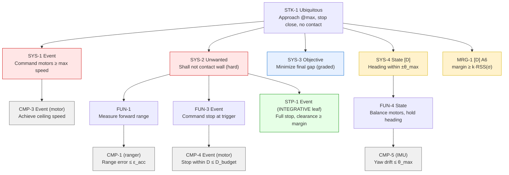

# Requirements Specification & Effector Selection — Wall-Approach Task

**Document type:** Specification (source of truth for requirements) + Effector selection
**Version:** 1.0
**Standards:** INCOSE GtWR 4th ed. over ISO/IEC/IEEE 29148:2018 · EARS grammar · NASA SP‑2016‑6105 (decomposition & V&V framing)
**Task (verbatim intent):** Drive straight at the wall ahead at **maximum speed** and come to a **complete stop as close as possible without touching it**. Hard constraints: run at maximum speed (no slow-down for margin); no contact. Objective: minimize the final gap.

> The SysML model (`02_wallrover_model.sysml`) is a formal realisation of this specification, not a replacement. On any disagreement, **this specification governs.**

---

## 1. Physical model of the task (basis for decomposition)

Everything below rests on one relation, taken from the validated catalog (`RelationTemplates::StoppingDistance`):

```
trigger_distance  =  v·t_response  +  v²/(2a)  +  margin
                     └── reaction ──┘  └ braking ┘   └ safety ┘
```

Interpreting for this task, in the sensor-reading frame:

- Let **s** = forward ranger reading (sensor face → wall), **g** = true gap (front-most point → wall).
- The ranger face sits a fixed offset **δ** behind the front-most point: **s = g + δ** ⇒ **g = s − δ**. Contact (g=0) occurs at **s = δ**. δ is unknown ⇒ **TBD, bound by one operator ground-truth measurement**.
- Define **stopping distance** `D = v·t_response + v²/(2a)` = the displacement travelled *after* the trigger fires until full stop. It is a displacement, so it is identical whether read in the s‑frame or the g‑frame (δ cancels).
- Trigger when `s ≤ s_trig`. Rest reading `s_rest = s_trig − D`. True final gap `g_final = s_rest − δ = s_trig − D − δ`.
- **Design law:** set `s_trig = D + δ + m`. Then `g_final = m` (the contact margin). Minimising the gap ⇒ minimising `m`; not contacting ⇒ keeping `m > 0` across run-to-run variability.

**Single-operating-point consequence (from the `StoppingDistance` doc note):** because the task runs at exactly one speed (maximum), *calibration point = operating point ⇒ zero extrapolation*. We measure **D directly** at max speed (trigger at a safe distance, read `s_trig_cal − s_rest`). We do **not** need to separately fit `a`, `t_response`, or `v` to predict the operation stop — they fold into the one measured D. `a` and `v` are back-solved only as a **feasibility / consistency cross-check**.

**Margin law (tenet A6):** `m` is not guessed. `m = k·√(σ_pred² + σ_meas² + σ_run²)` — the root-sum-square of the independent uncertainty contributors (stop-prediction, clearance-measurement, run-to-run), scaled by a safety multiplier `k` set from the required no-contact assurance. Minimising the gap therefore *is* minimising these calibrated σ's.

---

## 2. Requirements

Conventions: **[D]** = derived (not literal in the task) with rationale · **EARS pattern** tagged · every requirement carries a rationale and a verification method · unknowns marked **TBD-n** and bound in §3.

### STK — Stakeholder need
| ID | Pattern | Requirement | Rationale | Verify |
|---|---|---|---|---|
| **STK‑1** | Ubiquitous | The rover **shall** drive from the start line to the wall ahead at maximum speed and stop as close to the wall as possible without contacting it. | Verbatim stakeholder task; parent of all below. | By roll-up of children (operation phase). |

### SYS — System (black-box)
| ID | Pattern | Requirement | Rationale | Verify |
|---|---|---|---|---|
| **SYS‑1** | Event-driven | *When* executing the approach, the rover **shall** command its drive motors at **no less than** their maximum achievable angular speed. | "Run at maximum speed. Do not slow down." Literal hard constraint. | Read back achieved motor speed (CMP‑3). |
| **SYS‑2** | Unwanted | The rover **shall not** make contact with the wall. | "Must not make contact." Literal hard pass/fail. Integrative. | Integrated verification run (STP‑1) + operation. |
| **SYS‑3** | Ubiquitous (objective) | The rover **should** minimize the final gap between its front-most point and the wall. | "Objective: minimize the final gap." Graded, not pass/fail. | Graded by measured gap (operation). |
| **SYS‑4 [D]** | State-driven | *While* approaching, the rover **shall** keep its heading within **±θ_max** of the start heading. | **[D]** A square, straight approach keeps the ranger aimed normal to the wall (so its range = the true perpendicular gap SYS‑2/3 govern) and makes the front-most point the point that first reaches the wall. Without a straightness bound, `range ≠ true gap` and the no-contact / closeness reasoning is invalid. Derived from SYS‑2, SYS‑3. | IMU drift vs differential-encoder cross-check (CMP‑5). |
| **MRG‑1 [D]** | Ubiquitous | The rover's contact margin **shall** be **no less than** `k·√(σ_pred²+σ_meas²+σ_run²)`. | **[D]** Rule 3 bridge between the hard constraint (SYS‑2) and the objective (SYS‑3); tenet A6. Sizes `m` to exactly the calibrated uncertainty envelope — no larger (keeps gap minimal), no smaller (keeps no-contact within assurance). | Evaluate against calibrated σ's (Calibration/Verification). |

### FUN — Function
| ID | Pattern | Requirement | Parent | Rationale | Verify |
|---|---|---|---|---|---|
| **FUN‑1** | Ubiquitous | The rover **shall** continuously measure the forward range to the wall during the approach. | SYS‑2 | Sensing is the trigger input. | Ranger unit tests (CMP‑1). |
| **FUN‑3** | Event-driven | *When* the measured forward range reaches the trigger distance, the rover **shall** command all drive motors to stop. | SYS‑2 | The stop action. | Ranger+motor stop (CMP‑4, STP‑1). |
| **FUN‑4** | State-driven | *While* approaching, the rover **shall** balance its drive motors to hold heading. | SYS‑4 | Straightness actuation. | Heading channel (CMP‑5). |

### CMP — Component (single-effector leaves) & STP — integrative leaf
| ID | Pattern | Requirement | Parent | Rationale | Verify (tier) |
|---|---|---|---|---|---|
| **CMP‑1** | Ubiquitous | The forward distance sensor **shall** report wall range with absolute error **≤ ε_acc** over `[s_trig, runway]`. | FUN‑1 | Trigger fires on this reading; its error = clearance-measurement σ (feeds MRG‑1). **TBD‑E** ε_acc; **TBD‑1** observed error. | Unit: operator anchor + static noise floor (calibration). |
| **CMP‑3** | Event-driven | *When* commanded above its ceiling, each drive motor **shall** achieve ground speed **≥ v_max** (= ceiling·k). | SYS‑1, FUN‑2* | Establishes cruise speed that drives the stop model. **TBD‑2** ceiling ω_max, **TBD‑3** k, **TBD‑4** v_max. | Unit: read-back achieved speed vs ranger slope (calibration). |
| **CMP‑4** | Event-driven | *When* commanded to stop from cruise, the rover **shall** halt within stopping distance **D ≤ D_budget**. | FUN‑3 | Dominant stop term; feasibility (must fit the runway with clearance). **TBD‑5** D, **TBD‑6** a (feasibility). | Unit: encoder + ranger during a stop from cruise (calibration). |
| **CMP‑5** | Ubiquitous | The inertial unit **shall** estimate yaw with drift **≤ θ_max** over the approach duration. | FUN‑4 | Straightness channel (SYS‑4). **TBD‑7** observed drift; **TBD‑θ** θ_max. | Unit: IMU heading vs differential-encoder (calibration). |
| **STP‑1** | Event-driven | *When* the forward range reaches the trigger distance, the rover **shall** come to a full stop with final clearance **≥ contact margin**. | SYS‑2 | **Irreducibly integrative** (ranger + motor + latency + heading together) — decomposition stops here (rule 2). | **Integration:** verification run (closes the integrated system requirement). |

\*FUN‑2 ("propel forward via drive motors") is the trivial actuation function under SYS‑1; its only leaf is CMP‑3. It is folded into SYS‑1→CMP‑3 to avoid a redundant single-child node.

---

## 3. TBD register (input list to calibration)

Two classes feed calibration (Process step 4): **model-completion parameters** (free params the model must predict with, that no requirement names) and the **requirement-TBD register** (TBDs living inside requirements). Every TBD binds to a specific calibration activity (detailed in `03_calibration_plan.md`).

### 3a. Requirement TBDs
| TBD | Symbol | In requirement | Bound by |
|---|---|---|---|
| TBD‑1 | ε (observed ranger error) | CMP‑1 | Operator anchor + static noise floor |
| TBD‑E | ε_acc (accept limit) | CMP‑1 | Set from margin budget (must be ≪ m) |
| TBD‑2 | ω_max (motor ceiling) | CMP‑3 | Read-back `motor.speed()` at max command |
| TBD‑4 | v_max (cruise ground speed) | CMP‑3 | Ranger slope (× IMU-accel, encoder cross-checks) |
| TBD‑5 | D (stopping distance) | CMP‑4 | `s_trig_cal − s_rest` (× encoder, IMU-accel) |
| TBD‑7 | headingDrift | CMP‑5 | IMU heading (× differential encoder) |
| TBD‑θ | θ_max (drift limit) | SYS‑4/CMP‑5 | Set from geometry (ranger-on-wall + square) |
| TBD‑m | m (contact margin) | SYS‑2/MRG‑1 | `k·RSS(σ)`; **frozen in the Verification Plan** |

### 3b. Model-completion parameters (no requirement names them)
| Param | Symbol | Role in model | Bound by | Source tier |
|---|---|---|---|---|
| k | k (m/rad) | RotationToSpeed: `v = ω·k` | ranger-slope ÷ achieved ω | multi-point onboard |
| a | a (m/s²) | StoppingDistance braking term | back-solve from D, v (feasibility only) | derived |
| t_chain | on-hub latency chain | reaction time (sample→compute→command) | loop timestamps | onboard |
| t_sample | ranger refresh/staleness | reaction time component | value-change timestamps | onboard |
| δ | sensor offset (face→bumper) | s ↔ g conversion; **safety-critical** | **operator ground truth** | **external (top tier)** |
| σ_pred | stop-prediction σ | MRG‑1 | residual of D across channels + verification sample | derived |
| σ_meas | clearance-measurement σ | MRG‑1 | = CMP‑1 ε at operating range | onboard vs anchor |
| σ_run | run-to-run σ | MRG‑1 | calibration + verification D spread; physical bound | multi-run |
| k_safety | margin multiplier | MRG‑1 | set from no-contact assurance (5 clean runs) | design choice, frozen in Verification Plan |

---

## 4. Effector selection (allocation & absence-by-traceability)

Effectors are chosen from the CMP-level requirements (rule 7: *any effector with no requirement tracing to it drops out — verified, not assumed*).

| Platform effector (from `RoverStructure`) | Traces to | Verdict |
|---|---|---|
| Drive motor ×2 (`motors`) | CMP‑3, CMP‑4, FUN‑2/3/4 | **USED** — propel + brake; differential pair also serves heading (CMP‑5 cross-source). |
| Forward distance sensor ×2 (subset of `rangers`) | CMP‑1, FUN‑1, STP‑1 | **USED (both)** — same safety-critical quantity (wall range) deliberately cross-sourced (rule 6). Fusion = `min()` of the two (see note); disagreement = fault detector (B1). |
| Rear distance sensor (member of `rangers`) | — none — | **DROPPED (absence by traceability).** No requirement observes distance behind; forward-only task. |
| Inertial unit (`imu`) | CMP‑5, plus cross-source for CMP‑3/CMP‑4 (forward accel) | **USED** — heading (straightness) + independent accel channel for speed/stop. |
| Reflectance/color sensor (`floor`) | — none — | **DROPPED (absence by traceability).** Downward reflectance observes no task quantity (cannot sense wall range, speed, or heading on a uniform floor). |

**Forward-ranger fusion note.** An angled ranger reads the hypotenuse (longer) than the perpendicular gap, and the perpendicular (shortest) reading is the true gap. Taking `min()` of the two forward readings (a) approximates the true perpendicular distance and (b) is the safe fusion for no-contact: a spurious *long* reading on one channel cannot delay the stop, because the shorter channel still triggers. A spurious *short* reading only stops early (larger gap, still no contact). Their difference is logged as an independent heading-vs-wall check.

---

## 5. Requirement tree (Mermaid)



**Verification allocation.** Unit-verified in **calibration** (Phase 1): CMP‑1, CMP‑3, CMP‑4, CMP‑5. Verified at **integration** (verification run, Phase 1): STP‑1 (the integrated system requirement) — which is what closes SYS‑2. Graded in **operation** (Phase 2): SYS‑3. MRG‑1 is evaluated numerically once the σ's are bound (Calibration Report → Verification Plan).

**Structural checks (grammar is verified out-of-band; these run as the gate):**
- *Reachability:* every requirement above is reachable from STK‑1 (WallRunNeed) along the edges shown — no orphans.
- *Edge-set:* the tree edges here match the nested `requirement :` usages in the SysML model 1:1 (see model §"structural checks").
- *Effector closure:* every USED effector traces to ≥1 CMP; every DROPPED effector has an explicit no-trace verdict (§4).
