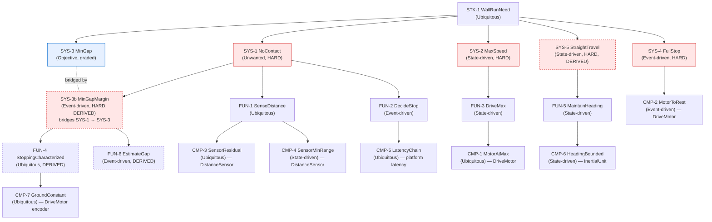

# Requirements Specification — Wall-Approach Rover

**Document type:** specification (source of truth for requirements)
**System:** LEGO SPIKE Prime differential rover, "drive to wall at max speed, stop as close as possible without contact"
**Method:** INCOSE GtWR (4th ed.) over ISO/IEC/IEEE 29148:2018; EARS grammar; NASA SP-2016-6105 decomposition & V&V framing.
**Status at issue:** pre-calibration. Unknown values carried as TBD and bound to calibration activities (see §5).

Conventions: every requirement is one verifiable claim, tagged with its EARS pattern, traced to a parent, and carries a rationale. Derived requirements (not literal in the task statement) are flagged **[DERIVED]** with rationale. Hard constraints use *shall* (pass/fail); the objective uses *should* (graded) and is bridged to a hard floor by a derived margin requirement (§2, SYS-3b). "The trigger" = the forward-distance threshold at which braking is commanded; "clearance" = gap from rover front to wall at the full stop.

---

## 1. Stakeholder need (STK)

**STK-1 — WallRunNeed** *(EARS: Ubiquitous)*
The rover shall traverse from the start line to the wall ahead at its maximum achievable speed and come to rest as close to the wall as possible without contacting it.
- **Rationale:** verbatim stakeholder goal from the task statement. This is a compound capability; it is decomposed at SYS into separately-verifiable claims (the constraint of maximum speed, the constraint of no contact, the graded objective of minimum gap, and the enabling constraints of full stop and straight travel).
- **Satisfied by:** design part `WallRover` (SysML `satisfy`).

---

## 2. System requirements (SYS — black-box)

**SYS-1 — NoContact** *(EARS: Unwanted)* — **HARD**
The rover shall not make contact with the wall.
- **Parent:** STK-1.
- **Rationale:** primary hard constraint; contact is task failure on that run. Realized by triggering the stop early enough that predicted clearance stays positive across all uncertainty; operationalized with a margin by SYS-3b.
- **Verification:** test at operating point (clearance > 0 on every run) + analysis (frozen clearance prediction ≥ margin > 0).

**SYS-2 — MaxSpeed** *(EARS: State-driven)* — **HARD**
While approaching the wall prior to the stop trigger, the rover shall command its drive motors at their maximum achievable speed.
- **Parent:** STK-1.
- **Rationale:** hard constraint "run at maximum speed, do not slow down for safety margin." Stated as a command-level claim (command at max), verified against the achieved cruise speed at CMP-1. The rover buys margin by triggering earlier, never by cruising slower.
- **Verification:** test (commanded speed == rated max; achieved cruise speed == CMP-1 value).

**SYS-3 — MinGap** *(Objective — graded, not pass/fail)*
The rover should minimize the final gap between its front and the wall at the full stop.
- **Parent:** STK-1.
- **Rationale:** the scored objective. Graded (closeness), not a pass/fail claim, so it carries no hard constraint of its own; the hard floor that keeps minimization from causing contact is the derived margin requirement SYS-3b. This requirement is closed at GATE C only on evidence that the predicted final gap was validated against operator ground truth **at the operating point** (never on an unvalidated sensor).
- **Verification:** test — operator-measured gap at the operating point vs. frozen predicted gap; graded by closeness.

**SYS-3b — MinGapMargin** *(EARS: Event-driven)* — **HARD** — **[DERIVED]**
When the rover comes to a full stop, the final clearance to the wall shall be at least the derived safety margin `safetyMargin`.
- **Parent:** SYS-1. **Bridges:** SYS-1 (hard no-contact) ↔ SYS-3 (graded minimize).
- **Derivation & rationale:** required by GtWR rule 3 — the bridge between the hard constraint and the objective. The objective drives the gap toward zero; this requirement holds a positive floor sized *from uncertainty, not guessed*. `safetyMargin` = RSS of the independent uncertainty contributors (prediction, sensor-offset, run-to-run stopping spread) times a coverage factor `k_margin` (tenet A6). Minimizing the gap therefore means characterizing those uncertainties tightly so the floor can be small — this is what ties precision characterization to the objective.
- **Verification:** analysis (clearance prediction ≥ safetyMargin) + test at operating point.

**SYS-4 — FullStop** *(EARS: Event-driven)* — **HARD**
When braking is initiated, the rover shall decelerate to a complete stop (zero ground speed within `restSpeedTol`).
- **Parent:** STK-1.
- **Rationale:** "come to a complete stop" is an explicit success condition (a run that does not fully stop is not a success). Distinct from SYS-1: a rover can avoid contact yet still be creeping; both are required.
- **Verification:** test (rest speed ≤ restSpeedTol via encoder Δ and IMU).

**SYS-5 — StraightTravel** *(EARS: State-driven)* — **HARD** — **[DERIVED]**
While traversing to the wall, the rover shall maintain its heading within ±`headingTol` of the start heading.
- **Parent:** STK-1.
- **Derivation & rationale:** "drive straight at the wall" is literal, but "straight" is not directly a pass/fail quantity; it is derived into a heading-drift bound. Off-heading travel (a) lengthens the true path so the forward sensor's along-beam distance no longer equals travel-to-wall, biasing the stop, and (b) can bring a front corner to the wall before the sensor face, defeating SYS-1. Bounding heading drift controls both. Cross-sourced (IMU heading + left/right encoder differential; see CMP-6).
- **Verification:** test (heading drift ≤ headingTol; encoder differential cross-check).

---

## 3. Functional requirements (FUN)

**FUN-1 — SenseDistance** *(EARS: Ubiquitous)*
The rover shall continuously measure the forward distance to the wall while traversing.
- **Parent:** SYS-1.
- **Rationale:** no-contact requires knowing where the wall is; forward ranging is the primary channel that drives the trigger.
- **Children:** CMP-3, CMP-4.

**FUN-2 — DecideStop** *(EARS: Event-driven)*
When the measured forward distance reaches the trigger threshold `triggerThreshold`, the rover shall command both drive motors to brake.
- **Parent:** SYS-1.
- **Rationale:** the decision/actuation step that converts a sensor reading into a stop. Its timing (sense→brake latency) is the load-bearing quantity for where the rover actually stops.
- **Children:** CMP-5.

**FUN-3 — DriveMax** *(EARS: State-driven)*
While traversing before the trigger, the rover shall drive both drive motors at their rated maximum angular velocity.
- **Parent:** SYS-2.
- **Rationale:** realizes max-speed traverse at the effector level.
- **Children:** CMP-1.

**FUN-4 — StoppingCharacterized** *(EARS: Ubiquitous)* — **[DERIVED]**
The rover shall exhibit a repeatable stopping distance from trigger to rest whose central value `stoppingDistance` and run-to-run spread `sigmaStop` are characterized.
- **Parent:** SYS-3b.
- **Derivation & rationale:** the margin (SYS-3b) and the gap prediction both depend on the stopping distance and its variability. Because operation is at a *single* speed (max), the stopping distance is characterized **directly at the operating point** rather than decomposed into speed/response/deceleration (calibration point = operating point ⇒ zero extrapolation; see Calibration Plan §0 and the StoppingDistance template note). Characterizing its spread sizes the margin.
- **Children:** CMP-7 (the encoder→ground constant that makes the primary stopping-distance channel metric).

**FUN-5 — MaintainHeading** *(EARS: State-driven)*
While traversing, the rover shall limit heading deviation about the start heading.
- **Parent:** SYS-5.
- **Rationale:** the function that keeps the path straight (whether by symmetric drive or active correction); its realized bound is the IMU leaf.
- **Children:** CMP-6.

**FUN-6 — EstimateGap** *(EARS: Event-driven)* — **[DERIVED]**
When the rover reaches rest, the rover shall compute an onboard estimate of the final gap from its own channels.
- **Parent:** SYS-3b.
- **Derivation & rationale:** the operation close-out requires a per-run onboard gap estimate frozen before ground truth, and the objective/margin chain needs an onboard observable of the achieved clearance to validate the prediction. Estimate = `(triggerThreshold − sensorOffset) − stoppingDistance_this_run`, with the encoder Δ giving the per-run stopping distance and the sensor offset entering at the *trigger* range (reliable), not at the tiny final gap.
- **Children:** (none — realized by computation over CMP-3/CMP-7 channels; no additional effector).

---

## 4. Component requirements (CMP — single-effector leaves)

**CMP-1 — MotorAtMax** *(EARS: Ubiquitous)*
Each drive motor shall reach its rated maximum angular velocity `omegaMax` under the drive command.
- **Parent:** FUN-3. **Effector:** DriveMotor.
- **Rationale:** defines the achieved cruise speed feeding SYS-2 and the speed input to the stopping model. **TBD-1** (`omegaMax`).
- **Verification:** test (steady-state angular velocity from encoder during cruise).

**CMP-2 — MotorToRest** *(EARS: Event-driven)*
When commanded to brake, each drive motor shall decelerate to zero angular velocity within `restSpeedTol`.
- **Parent:** SYS-4. **Effector:** DriveMotor.
- **Rationale:** realizes the full stop at the effector; the brake method (hold/brake) is committed a priori and its stopping distance characterized empirically (FUN-4).
- **Verification:** test (post-brake angular velocity ≈ 0).

**CMP-3 — SensorResidual** *(EARS: Ubiquitous)*
Each forward distance sensor's reported distance shall track the true distance within a bounded residual after offset correction (reported = `sensorScale`·true + `sensorOffset`).
- **Parent:** FUN-1. **Effector:** DistanceSensor (forward ×2).
- **Rationale:** the sensor offset `sensorOffset` enters the stop location one-for-one; it must be pinned by a higher-tier reference. Cross-sourced by the second forward sensor (disagreement > ε ⇒ anomaly). **TBD-2** (`sensorOffset`), **TBD-2b** (`sensorScale`, assumed ≈1, checked multi-segment).
- **Verification:** test/analysis (reported vs. operator-referenced true distance at the trigger range; residual after offset ≤ resid_tol).

**CMP-4 — SensorMinRange** *(EARS: State-driven)*
While the trigger threshold is active, the trigger distance shall be at or above the sensor's minimum reliable range `minRange`.
- **Parent:** FUN-1. **Effector:** DistanceSensor (forward).
- **Rationale:** LEGO ultrasonic degrades near its floor; the trigger is deliberately placed at a mid-range distance where the sensor is reliable, so the *prediction* never relies on a near-floor reading. **TBD-3** (`minRange`).
- **Verification:** test (near-wall reading curve; confirm trigger ≥ minRange) + inspection (triggerThreshold value).

**CMP-5 — LatencyChain** *(EARS: Ubiquitous)*
The sense-to-brake latency (compute + BLE-independent on-hub loop + actuation) shall be within the bounded latency budget `tResponse ≤ tChainBound`.
- **Parent:** FUN-2. **Effector:** platform latency chain (hub compute + motor actuation; RoverLatency).
- **Rationale:** during this latency the rover keeps moving at cruise; the distance covered is part of the stopping distance. Because stopping distance is measured directly trigger→rest (FUN-4), this latency is folded into that measurement; the bound here guards against an outlier loop period. **TBD-4** (`tChainBound`/`tResponse`).
- **Verification:** analysis (loop period from timestamps + actuation lag) + test (timing during C1).

**CMP-6 — HeadingBounded** *(EARS: State-driven)*
While traversing, the IMU-reported heading drift shall remain within ±`headingTol`.
- **Parent:** FUN-5. **Effector:** InertialUnit.
- **Rationale:** the measurable realization of straight travel; cross-sourced against left/right encoder differential. **TBD-8** (`headingDrift` actual).
- **Verification:** test (heading trace over traverse; encoder-differential cross-check).

**CMP-7 — GroundConstant** *(EARS: Ubiquitous)*
The encoder-rotation-to-ground-distance constant `kSpeed` shall be calibrated to within `k_tol`.
- **Parent:** FUN-4. **Effector:** DriveMotor (encoder).
- **Rationale:** the primary stopping-distance channel is the encoder Δ from trigger to rest converted to mm by `kSpeed`; this constant also converts cruise angular velocity to ground speed. Calibrated from Δreported-distance / Δencoder-angle over a mid-range segment (the sensor offset cancels in the difference). **TBD-5** (`kSpeed`).
- **Verification:** test/analysis (multi-segment fit; residual ≤ k_tol).

---

## 5. TBD register

Each unknown is bound to a specific calibration activity (Calibration Plan, Phase 1). "Tier" is the source-of-truth tier that will set it: 4 = external operator ground truth, 3 = unknown-onboard (characterized this run), 2 = modelled/onboard-calibratable, 1 = well-known.

| TBD | Quantity (SysML attr / Py var) | Requirement | Bound by (activity) | Tier |
|-----|-------------------------------|-------------|---------------------|------|
| TBD-1 | `omegaMax` / `omega_max` — rated max angular velocity | CMP-1 | C1 cruise: steady-state encoder rate | 2 |
| TBD-2 | `sensorOffset` / `b` — forward-sensor offset | CMP-3 | C1 rest at reliable range, **operator measurement #1** anchors true distance | **4** |
| TBD-2b | `sensorScale` / `alpha` — forward-sensor scale | CMP-3 | Assumed ≈1.0; checked via multi-segment Δ during C1 | 2 |
| TBD-3 | `minRange` / `r_min` — sensor min reliable range | CMP-4 | C1 near-wall reading curve | 2 |
| TBD-4 | `tChainBound`/`tResponse` — sense→brake latency | CMP-5 | Analysis of C1 loop timestamps + actuation lag | 2 |
| TBD-5 | `kSpeed` / `k_speed` — encoder→ground constant | CMP-7 | C1 Δreported-distance / Δencoder-angle, mid-range | 2 |
| TBD-6 | `stoppingDistance` / `D_stop` — trigger→rest distance | FUN-4 | C1 + C2 encoder Δ trigger→rest (measured **directly at operating point**) | 3 |
| TBD-7 | `sigmaStop` / `sigma_stop` — run-to-run stopping spread | FUN-4 / SYS-3b | C1 + C2 spread + within-run jitter | 3 |
| TBD-8 | `headingDrift` / `heading_drift` — actual drift | CMP-6 | C1 IMU heading trace | 3 |
| TBD-9 | `safetyMargin` / `safety_margin` — derived floor | SYS-3b | Computed: `k_margin`·RSS(σ_pred, σ_b, σ_stop) once σ's bound | derived |
| TBD-10 | `triggerThreshold`,`targetGap` / `R_trigger`,`g_target` | SYS-1/FUN-2 | Set from model once TBD-2/5/6/7/9 bound | design |
| TBD-11 | `contactFloor`=0; `restSpeedTol` (small) | SYS-1/SYS-4 | Fixed by definition / set from encoder noise floor | 1 |

---

## 6. Effector selection (absence by traceability)

Every effector on the rover is listed; one with no CMP requirement tracing to it drops out — verified, not assumed.

| Effector (inventory) | Requirement(s) tracing to it | Disposition |
|----------------------|------------------------------|-------------|
| Drive motor A (drivetrain) | CMP-1, CMP-2, CMP-7 | **KEEP** |
| Drive motor B (drivetrain) | CMP-1, CMP-2, CMP-7 | **KEEP** |
| Forward distance sensor #1 | CMP-3, CMP-4 (trigger primary) | **KEEP** |
| Forward distance sensor #2 | CMP-3 (cross-source) | **KEEP** |
| Inertial unit (IMU) | CMP-6 (heading); forwardAccel cross-source | **KEEP** |
| **Rear distance sensor** | none (the wall is ahead; no rearward claim) | **DROP** |
| **Downward reflectance sensor** | none (no line/marking to sense en route; start is squared by the operator) | **DROP** |

Dropped effectors are not constructed or relied upon in the model or program.

---

## 7. Requirement tree (Mermaid)

Structural properties (the checks the grammar cannot see, enforced on the SysML model at GATE A):
- **Reachability:** every requirement above is reachable from STK-1 by parent edges.
- **Edge-set:** the realized decomposition in the SysML model (nested `requirement :` usages) matches this parent/child edge set exactly.
- **Objective bridge:** SYS-3 (graded) carries no hard leaf; its hard floor is SYS-3b (dashed bridge), which owns the characterization/estimation functions.
