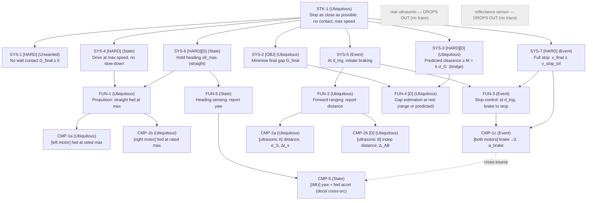

# Requirements Specification — Wall-Approach Rover (WallRun)
**Document type:** PLAN-supporting record (source of truth for requirements)
**Standards:** INCOSE GtWR 4th ed. over ISO/IEC/IEEE 29148:2018 · EARS grammar · NASA SP‑2016‑6105 decomposition/V&V framing
**Status:** Issue 1 (pre‑hardware). This document is the source of truth for requirements; the SysML model realises it. On any disagreement, **this spec governs.**

---

## 1. Task under specification

> There is a wall directly ahead. Drive straight at it at **maximum speed** and come to a **complete stop as close as possible without touching it.** Hard constraints: run at maximum speed (no slow‑down for margin); no contact. Objective: minimise the final gap. Fixed setup: rover squared to the wall at a start line ≈ 1000 mm out.

## 2. Quantities and symbols (used throughout the record)

| Symbol | Meaning | Units | Frame |
|---|---|---|---|
| `v_max` | forward ground speed at max motor command | mm/s | ground |
| `t_lat` | latency from range crossing trigger to brake onset (compute+BLE+actuation+sensor sampling) | s | — |
| `a_brake` | effective deceleration magnitude under passive braking | mm/s² | ground |
| `Δt_s` | ultrasonic sample interval (staleness bound) | ms | — |
| `σ_S` | 1σ noise of a single ultrasonic reading | mm | sensor |
| `c` | **sensor offset** = (sensor‑face→wall) − (frontmost point→wall) at rest, i.e. `S = G + c` | mm | geometry |
| `d_min,d_max` | ultrasonic valid range window | mm | sensor |
| `S` | ultrasonic reported distance (sensor face → wall) | mm | sensor |
| `G` | **physical gap** frontmost point → wall (the operator‑measured, scored quantity) | mm | ground |
| `d_trig` | sensor‑frame braking trigger threshold | mm | sensor |
| `D_stop` | travel from trigger to full stop = `v_max·t_lat + v_max²/(2·a_brake)` | mm | ground |
| `M` | derived no‑contact margin (RSS of uncertainties × k) | mm | ground |
| `G_target` | commanded design clearance (set to `M`) | mm | ground |

**Key geometric identity (defines the systematic‑bias risk this whole process guards):**
`G = S − c`. The rover senses `S`; the operator scores `G`. `c` is a fixed rover‑geometry offset that **no onboard channel can observe** — it is the classic place a systematic bias ships if `G` is closed on the raw sensor.

---

## 3. Requirements

Legend — EARS tag ∈ {Ubiquitous, State‑driven, Event‑driven, Optional, Unwanted}. **[D]** = derived (not literal in the task; rationale given). **[HARD]** = shall / pass‑fail. **[OBJ]** = should / graded.

### 3.1 Stakeholder level (STK)

**STK‑1** *(Ubiquitous)* — The rover **shall** come to a complete stop as close as possible to the wall ahead without contacting it, while approaching at maximum speed.
*Rationale:* the stakeholder task statement, verbatim. Parent of all SYS requirements.

### 3.2 System level (SYS, black‑box). All trace to STK‑1.

**SYS‑1** *(Unwanted)* **[HARD]** — The rover **shall not** make contact with the wall.
*Verifiable claim:* final clearance `G_final ≥ 0`. *Rationale:* task hard constraint ("must not make contact"). *Trace:* STK‑1.

**SYS‑2** *(Ubiquitous)* **[OBJ]** — The rover **should** minimise the final gap `G_final` between its frontmost point and the wall.
*Rationale:* the graded objective ("minimise the final gap"). Graded, not pass/fail; bridged to the hard constraint SYS‑1 by SYS‑3 (rule 3). *Trace:* STK‑1.

**SYS‑3** *(Ubiquitous)* **[HARD] [D]** — The **predicted** final clearance **shall** be no less than the no‑contact margin `M`, where `M = k · σ_G` and `σ_G` is the root‑sum‑square of the prediction, measurement, and run‑to‑run clearance‑uncertainty contributors.
*Rationale (derived):* bridges the SYS‑1 hard constraint and the SYS‑2 objective per requirements rule 3 and tenet A6 — satisfying this margin *guarantees SYS‑1 at confidence k* while letting SYS‑2 push `G_target` down to exactly `M`. `k` and `σ_G` are bound at calibration. *Trace:* STK‑1 (bridges SYS‑1, SYS‑2).

**SYS‑4** *(State‑driven)* **[HARD]** — While approaching the wall, the rover **shall** drive at the maximum speed its drivetrain can achieve, with no reduction for safety margin.
*Rationale:* task ("maximum speed. Do not slow down for safety margin"). *Trace:* STK‑1.

**SYS‑5** *(Event‑driven)* — When the forward distance to the wall reaches the braking trigger threshold `d_trig`, the rover **shall** initiate braking.
*Rationale:* the sense→act decomposition that produces the stop. `d_trig` is a design construct **[D‑partial]** derived from `D_stop`, `c`, and `M`. *Trace:* STK‑1.

**SYS‑6** *(State‑driven)* **[HARD] [D]** — While approaching, the rover **shall** hold heading within ±`θ_max` of the initial heading (straight approach).
*Rationale (derived):* not literal in the task. Straightness keeps the frontmost point tracking along the sensor axis so `G` is well‑defined, keeps the approach normal to the wall, and prevents a corner from contacting before the sensed face. `θ_max` bound at calibration. *Trace:* STK‑1.

**SYS‑7** *(Event‑driven)* **[HARD]** — When braking completes, the rover **shall** be at zero forward speed (a complete stop).
*Verifiable claim:* `v_final ≤ v_stop_tol`. *Rationale:* task ("come to a complete stop"). *Trace:* STK‑1.

### 3.3 Function level (FUN). All trace to a SYS parent.

**FUN‑1** *(Ubiquitous)* — The propulsion function **shall** drive the rover straight forward at maximum drivetrain speed on command.
*Rationale:* realises SYS‑4/SYS‑6 propulsion. *Trace:* SYS‑4, SYS‑6. Parent of CMP‑1a/1b.

**FUN‑2** *(Ubiquitous)* — The forward‑ranging function **shall** report the distance from the rover to the wall ahead throughout the approach.
*Rationale:* provides the trigger input for SYS‑5. *Trace:* SYS‑5. Parent of CMP‑2a/2b.

**FUN‑3** *(Event‑driven)* — When the reported forward distance is at or below `d_trig`, the stop‑control function **shall** command the drivetrain to brake to a full stop.
*Rationale:* realises SYS‑5 and SYS‑7. *Trace:* SYS‑5, SYS‑7. Parent of CMP‑1c (uses FUN‑2 output).

**FUN‑4** *(Ubiquitous)* **[D]** — At rest, the gap‑estimation function **shall** estimate the final clearance `G_est`, using the forward range corrected by `c` when the range lies within `[d_min,d_max]`, and the model‑predicted clearance otherwise.
*Rationale (derived):* supplies the scored onboard gap estimate at close‑out and selects a *valid* channel given the ultrasonic minimum range (range hand‑off). *Trace:* SYS‑2, SYS‑3.

**FUN‑5** *(State‑driven)* — While approaching, the heading function **shall** report the rover's yaw relative to the initial heading.
*Rationale:* provides the straightness signal for SYS‑6 and an independent deceleration cross‑source. *Trace:* SYS‑6. Parent of CMP‑5.

### 3.4 Component level (CMP, single‑effector leaves). All trace to a FUN parent.

**CMP‑1a** *(Ubiquitous)* — **[effector: left drive motor]** — On command, the left drive motor **shall** rotate in the forward‑drive direction at its rated maximum angular speed.
*Verifiable claim:* `commandedSpeed ≥ maxSpeed` (Pybricks `run()` clamps to ceiling). *Rationale:* one half of the differential propulsion at maximum. *Trace:* FUN‑1.

**CMP‑1b** *(Ubiquitous)* — **[effector: right drive motor]** — On command, the right drive motor **shall** rotate in the forward‑drive direction at its rated maximum angular speed.
*Verifiable claim:* `commandedSpeed ≥ maxSpeed`. *Rationale:* other half. *Trace:* FUN‑1.

**CMP‑1c** *(Event‑driven)* — **[effector: both drive motors]** — When braking is commanded, each drive motor **shall** decelerate to zero speed under passive braking, with effective deceleration `a_brake`.
*Verifiable claim:* `v_final ≤ v_stop_tol`; `a_brake` characterised. *Rationale:* produces the stop; `a_brake` is a calibrated model parameter. *Trace:* FUN‑3, SYS‑7.

**CMP‑2a** *(Ubiquitous)* — **[effector: forward ultrasonic sensor A]** — The forward ultrasonic sensor A **shall** report distance to the wall over `[d_min,d_max]` with 1σ noise ≤ `σ_S_max` and sample interval ≤ `Δt_s_max`.
*Rationale:* primary distance channel; noise and rate bound trigger accuracy and quantisation. *Trace:* FUN‑2.

**CMP‑2b** *(Ubiquitous)* **[D]** — **[effector: forward ultrasonic sensor B]** — The forward ultrasonic sensor B **shall** independently report distance to the wall over its valid range, agreeing with sensor A to within `Δ_AB`.
*Rationale (derived):* requirements rule 6 (cross‑sourcing). An independent second channel on the *same* quantity is the fault‑agnostic fault detector for distance. *Trace:* FUN‑2.

**CMP‑5** *(State‑driven)* — **[effector: hub IMU]** — While approaching, the hub IMU **shall** report yaw relative to start (drift ≤ `θ_max` over the approach) and forward‑axis acceleration (independent deceleration channel).
*Rationale:* heading for SYS‑6 straightness and a direct cross‑source for `a_brake`. *Trace:* FUN‑5 (heading) and cross‑source to CMP‑1c (accel).

---

## 4. Effector selection by traceability (rule 7 — verified, not assumed)

The platform (RoverStructure) carries: 2 drive motors, 3 distance sensors (2 forward, 1 rear), 1 IMU, 1 downward reflectance sensor.

| Effector | Requirement(s) tracing to it | Verdict |
|---|---|---|
| Left drive motor | CMP‑1a, CMP‑1c | **USED** |
| Right drive motor | CMP‑1b, CMP‑1c | **USED** |
| Forward ultrasonic **A** | CMP‑2a | **USED** (primary distance) |
| Forward ultrasonic **B** | CMP‑2b | **USED** (cross‑source distance) |
| Hub IMU | CMP‑5 (heading + accel cross‑source) | **USED** |
| **Rear ultrasonic sensor** | *none* | **DROPS OUT** — absence by traceability. No reverse motion or rearward ranging is required. |
| **Downward reflectance sensor** | *none* | **DROPS OUT** — absence by traceability. Considered as a speed cross‑source (reflectance‑texture rate) and **rejected**: floor texture yields no clean, calibratable speed signal. No line/surface function is needed. |

Two effectors drop out *with recorded rationale*, not by silent omission.

---

## 5. Deliberate cross‑sourcing allocation (rule 6; tenet B1)

Independent channels are assigned to each calibrated quantity so disagreement is the fault detector.

| Quantity | Channel 1 (primary) | Channel 2 | Channel 3 | Notes |
|---|---|---|---|---|
| Distance to wall | Ultrasonic A `s.distance()` | Ultrasonic B `s.distance()` | — | same‑units as gap; A/B disagreement ⇒ CMP‑2b flag |
| Forward speed `v` | Ultrasonic Δ`S`/Δt (constant phase) | Motor angle × wheel constant / Δt | IMU accel ∫ (weak) | ultrasonic is in gap units → preferred |
| Deceleration `a_brake` | Ultrasonic Δ`v`/Δt (braking phase) | IMU forward accel (direct) | Motor speed‑readback slope | IMU gives a *direct* decel cross‑check |
| Heading / straightness | IMU `heading()` | IMU `angular_velocity` ∫ | — | drift bound for SYS‑6 |
| Final gap `G` / offset `c` | **Operator ground truth** (tier 1) | Ultrasonic rest `S − c` | Model‑predicted `G_target` | `c` has *no* onboard channel → tier‑1 anchor required |

---

## 6. TBD register (rule 8 — every unknown bound to a calibration activity)

Threshold TBDs (requirement‑named) and model‑completion parameters. Each binds to an activity in the Calibration Plan.

| TBD | Quantity | Type | Requirement(s) | Bound by |
|---|---|---|---|---|
| TBD‑1 | `v_max` | model‑completion | SYS‑4, CMP‑1a/b | C1 constant‑speed phase (ultrasonic Δ`S`/Δt); cross‑check motor angle |
| TBD‑2 | `t_lat` | model‑completion | FUN‑3, SYS‑5 | C1 timing (last supra‑threshold sample → decel onset) |
| TBD‑3 | `a_brake` | model‑completion | CMP‑1c | C1 braking‑phase slope; cross‑check IMU accel |
| TBD‑4 | `c` (sensor offset) | model‑completion **(high‑leverage)** | SYS‑2/3 objective validation, FUN‑4 | **Operator ground truth at operating point** (verification run) |
| TBD‑5 | `σ_S`, `σ_S_max` | both | CMP‑2a/2b | C1 rest‑dwell variance (both sensors) |
| TBD‑6 | `d_min,d_max` | requirement | CMP‑2a/2b, FUN‑4 | C1 close‑range behaviour + datasheet |
| TBD‑7 | `σ_D` (run‑to‑run stop var.) | model‑completion | SYS‑3 margin | Analytic (quantisation `v·Δt_s` + velocity noise); drift controlled between runs; confirmed by verification sample |
| TBD‑8 | `θ_max` / heading drift | both | SYS‑6, CMP‑5 | C1 heading telemetry over approach |
| TBD‑9 | `Δt_s`, `Δt_s_max` | both | CMP‑2a | C1 timestamp spacing |
| TBD‑10 | `Δ_AB` | requirement | CMP‑2b | C1 A‑vs‑B during approach |
| TBD‑11 | `k` (confidence factor), `M`, `G_target` | design | SYS‑3 | Set in Verification Plan from calibrated `σ_G` |
| TBD‑12 | `v_stop_tol` | requirement | SYS‑7, CMP‑1c | C1 rest velocity residual |

---

## 7. Requirement tree (Mermaid)

---

## 8. GtWR quality self‑check (abridged)

- **One claim per requirement** (rule 1): compounds split (e.g. propulsion vs. straightness are FUN‑1 + SYS‑6; brake‑command vs. full‑stop are FUN‑3 + SYS‑7).
- **Decompose to single‑effector or irreducibly integrative** (rule 2): every leaf is CMP on one effector; `d_trig` selection is irreducibly integrative and stops at SYS‑5/FUN‑3.
- **Hard vs. objective separated, bridged** (rule 3): SYS‑1 (hard) / SYS‑2 (objective) / SYS‑3 (derived margin bridge).
- **Derived flagged with rationale** (rule 4): SYS‑3, SYS‑6, FUN‑4, CMP‑2b, plus SYS‑5 `d_trig` (partial).
- **Rationale on every requirement** (rule 5): present.
- **Cross‑sourcing allocated** (rule 6): §5.
- **Untraced effectors dropped** (rule 7): §4 (rear ultrasonic, reflectance).
- **Unknowns TBD, bound to activities** (rule 8): §6.
