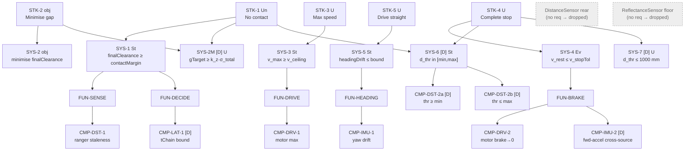

# Requirements Specification — Max-Speed Wall-Stop

**Document type:** Specification (source of truth for requirements)
**Standards:** INCOSE GtWR (4th ed.) over ISO/IEC/IEEE 29148:2018 · EARS grammar · NASA SP-2016-6105 (decomposition & V&V)
**Status:** Baseline v1.0 (pre-hardware)
**Subject:** `WallRover` — the SPIKE Prime differential rover, started squared-up ~1000 mm from a wall.

---

## 1. Scope and task restatement

The rover shall drive straight at a wall at **maximum speed** and come to a **complete stop as close to the wall as possible WITHOUT contact**. Two hard constraints: run at maximum speed (no slow-down for margin) and no contact. One graded objective: minimise the final gap.

This spec decomposes that task top-down to the single-effector (CMP) level, separating hard constraints (`shall`, pass/fail) from the objective (`should`, graded) and bridging them with a derived margin requirement (GtWR rule 3).

## 2. EARS pattern legend

`U`=Ubiquitous · `St`=State-driven (While) · `Ev`=Event-driven (When) · `O`=Optional (Where) · `Un`=Unwanted (shall not). **[D]** = derived (not literal in the task statement; rationale given). Every requirement carries a rationale (rule 5).

## 3. Conventions and key symbols

| Symbol | Meaning | Binding |
|---|---|---|
| `finalClearance` | bumper→wall gap at rest (the scored quantity) | predicted; validated at operating point |
| `contactMargin` | no-contact floor = `k_z · σ_total` (k-sigma protection) | derived |
| `v_max` | achieved ground speed at full throttle | TBD-1 |
| `d_stop_const` | measured-frame stopping distance at `v_max` (reaction+braking) | TBD-9 (direct) |
| `c_offset` | `d_meas_rest − true gap` (sensor bias + geometry + typ. yaw lead) | TBD-5 (operator) |
| `σ_total` | RSS of uncertainty contributors | TBD-8 (+ computed) |
| `k_z` | k-sigma no-contact multiplier (design-set, ≈3) | design |
| `refresh` | forward-ranger sample period / staleness | TBD-4 |

---

## 4. Stakeholder requirements (STK)

| ID | EARS | Requirement | Rationale |
|---|---|---|---|
| **STK-1** | Un | The rover **shall not** contact the wall. | Paramount task constraint; a contacting run scores as failure. |
| **STK-2** | — (obj) | The rover **should** stop as close to the wall as possible. | The graded objective; scored on closeness. |
| **STK-3** | U | The rover **shall** approach the wall at its maximum speed. | Explicit hard constraint; no slow-down for safety margin. |
| **STK-4** | U | The rover **shall** come to a complete stop. | Explicit hard constraint; a full stop defines success. |
| **STK-5** | U | The rover **shall** drive straight toward the wall. | Literal in the task ("drive straight at the wall"); keeps the approach perpendicular so the operating-point offset stays valid. |

---

## 5. System requirements (SYS, black-box)

| ID | EARS | Requirement | Parent | Rationale |
|---|---|---|---|---|
| **SYS-1** | St | While executing the stop, the rover shall hold `finalClearance ≥ contactMargin`. | STK-1 | Hard no-contact expressed as a positive clearance floor; `LowerBoundRequirement`. |
| **SYS-2** | — (obj) | The rover should minimise `finalClearance`. | STK-2 | Objective, graded — carried, not pass/fail. |
| **SYS-2M** **[D]** | U | The rover shall set aim gap `gTarget ≥ k_z · σ_total`. | STK-1,2 | **Derived** margin bridge (rule 3, tenet A6): ties the objective to the hard floor so minimising the gap never crosses no-contact. Rationale: size margin from RSS of uncertainty, not by guess. |
| **SYS-3** | St | While approaching (pre-brake), the rover shall command drive speed at the motor ceiling `v_max ≥ v_ceiling`. | STK-3 | Max-speed as a lower bound on achieved speed; `LowerBoundRequirement`. |
| **SYS-4** | Ev | When the stop trigger fires, the rover shall decelerate to `v_rest ≤ v_stopTol`. | STK-4 | Complete stop as an upper bound on residual speed; `UpperBoundRequirement`. |
| **SYS-5** | St | While approaching, the rover shall keep `headingDrift ≤ headingBound`. | STK-5 | Straightness as bounded drift; `UpperBoundRequirement`. |
| **SYS-6** **[D]** | St | While approaching, the brake threshold `d_thr` shall lie within the ranger's valid range `[sensorMin, sensorMax]`. | STK-1,4 | **Derived** (rule 4): the stop must be commanded on a trustworthy reading (tenets D1/D2). Splits into CMP-DST-2a/b. |
| **SYS-7** **[D]** | U | The brake threshold `d_thr` shall not exceed the start-line budget (`≤ 1000 mm`). | STK-4 | **Derived** (rule 4): the stop must initiate within available runway. Feasibility. |

---

## 6. Function requirements (FUN)

| ID | EARS | Requirement | Parent | Rationale |
|---|---|---|---|---|
| **FUN-SENSE** | St | While approaching, the system shall sense forward distance to the wall. | SYS-1 | The measurement that drives the trigger. |
| **FUN-DECIDE** | Ev | When the projected distance reaches the threshold, the system shall command braking. | SYS-1 | The decision function; its latency governs reaction distance. |
| **FUN-DRIVE** | St | While approaching, the system shall drive both wheels forward at maximum. | SYS-3 | Actuation of max-speed approach. |
| **FUN-BRAKE** | Ev | When commanded, the system shall brake both wheels to a stop. | SYS-4 | Actuation of the stop; monotonic (brake, not hold) so rest = closest approach. |
| **FUN-HEADING** | St | While approaching, the system shall sense heading for straightness. | SYS-5 | Heading observation for drift bound. |

## 7. Component requirements (CMP, single-effector leaves)

Each CMP names exactly one effector and is unit-verifiable by a test on that effector (rule 2).

| ID | EARS | Requirement | Effector | Parent | Rationale |
|---|---|---|---|---|---|
| **CMP-DST-1** | St | While approaching, the forward distance sensor shall report range no less often than its refresh interval. | forward DistanceSensor | FUN-SENSE | Staleness sets trigger quantisation `σ_quant = v_max·refresh/√12`. |
| **CMP-DST-2a** **[D]** | U | The forward distance sensor threshold shall be `≥ sensorMin`. | forward DistanceSensor | SYS-6 | Trigger above the ranger floor. |
| **CMP-DST-2b** **[D]** | U | The forward distance sensor threshold shall be `≤ sensorMax`. | forward DistanceSensor | SYS-6 | Trigger below the ranger ceiling. |
| **CMP-DRV-1** | St | While in approach, each drive motor shall rotate at its maximum achievable speed. | DriveMotor ×2 | FUN-DRIVE | Realises max ground speed; `LowerBoundRequirement`. |
| **CMP-DRV-2** | Ev | When the trigger fires, each drive motor shall brake to zero angular velocity. | DriveMotor ×2 | FUN-BRAKE | Realises the complete stop; `UpperBoundRequirement`. |
| **CMP-IMU-1** | St | While approaching, the IMU shall report yaw with `headingDrift ≤ headingBound`. | InertialUnit (yaw) | FUN-HEADING | Heading channel for straightness. |
| **CMP-IMU-2** **[D]** | U | The IMU shall report forward acceleration sufficient to cross-check deceleration. | InertialUnit (forwardAccel) | FUN-BRAKE | **Derived** (rule 6, cross-sourcing): independent channel for `a`, so the ultrasonic-difference estimate is fault-checked. |
| **CMP-LAT-1** **[D]** | U | The stop-decision chain latency `tChain` shall be characterised and `≤ tChainBound`. | platform latency chain | FUN-DECIDE | **Derived** (rule 4): bounds reaction distance `v_max·tResponse`. Model-completion parameter (RoverCommon::RoverLatency). |

## 8. Effector traceability ledger (rule 7 — disuse verified, not assumed)

| Effector | Requirement(s) tracing to it | Disposition |
|---|---|---|
| DriveMotor ×2 | CMP-DRV-1, CMP-DRV-2 | **USED** |
| DistanceSensor — forward (×2) | CMP-DST-1, CMP-DST-2a/b | **USED** (both forward rangers; cross-sourced, primary + check) |
| InertialUnit — yaw | CMP-IMU-1 | **USED** |
| InertialUnit — forwardAccel | CMP-IMU-2 | **USED** (deceleration cross-source) |
| DistanceSensor — rear | none | **DROPPED** — absence by traceability (wall is ahead; nothing rearward to sense) |
| ReflectanceSensor — floor | none | **DROPPED** — absence by traceability (no line/scale to read; distance handled by rangers) |

## 9. Hard-constraint / objective separation (rule 3)

- **Hard (pass/fail):** SYS-1 (no contact), SYS-3 (max speed), SYS-4 (complete stop), SYS-5 (straight), SYS-6/7 (feasibility). Verified by test/analysis with a verdict.
- **Objective (graded):** SYS-2 (minimise gap). Not pass/fail; reported as a value and scored on closeness.
- **Bridge:** SYS-2M ties them — the aim gap equals the k-sigma uncertainty floor, so the smallest gap we pursue is exactly the one that still guarantees no contact at the chosen confidence.

## 10. TBD register (each bound to a calibration activity)

| TBD | Quantity | Requirement(s)/model role | Binding activity | Source tier target |
|---|---|---|---|---|
| **TBD-1** | `v_max` (ground speed) | CMP-DRV-1, model | Run 1 cruise-segment slope (ultrasonic) | onboard multi-point (direct) |
| **TBD-2** | `a_decel` (deceleration) | CMP-DRV-2, model | Run 1 stop: US-difference **and** IMU forward-accel | onboard, cross-sourced |
| **TBD-3** | `tChain` (command latency) | CMP-LAT-1 | Run 1: trigger-sample→deceleration-onset lag | onboard |
| **TBD-4** | `refresh` (staleness) | CMP-DST-1, model σ_quant | Run 1: ranger value-change step timing | onboard |
| **TBD-5** | `c_offset` (absolute offset) | SYS-1, SYS-2, model | **Run 2 operator ground-truth** at operating point | external ground truth (highest) |
| **TBD-6** | `[sensorMin, sensorMax]` | CMP-DST-2a/b | Run 1 near-range readings; confirmed at Run 2 rest | onboard |
| **TBD-7** | `headingDrift` | CMP-IMU-1 | Run 1 yaw over each approach | onboard |
| **TBD-8** | `σ_brake`, `σ_meas` | SYS-2M, model | Run 1 multi-stop spread + rest-reading noise | onboard multi-sample |
| **TBD-9** | `d_stop_const` (direct) | SYS-1, model | Run 1 direct measured `d_thr_reading − d_meas_rest` | onboard direct (governs formula) |

**Design-set (not calibrated, not TBD):** `k_z = 3` (revisit at GATE B on calibrated σ), `f_samp = 0.5`, `q_proj` (1.0 raw / <1 if velocity-projected), `headingBound`, `v_stopTol`, `contact floor = 0`, `startDistance = 1000 mm`.

---

## 11. Requirement tree (Mermaid)

---

## 12. GtWR quality self-audit (summary)

- **One claim per requirement (rule 1):** compounds split at the level below (e.g., SYS-6 → CMP-DST-2a/b; STK task split into STK-1…5).
- **Decompose to single-effector or irreducible (rule 2):** every leaf CMP names one effector; SYS-2 (objective) is irreducibly integrative and stops at system level, bridged by SYS-2M.
- **Hard vs objective separated + bridged (rule 3):** §9.
- **Derived flagged with rationale (rule 4):** SYS-2M, SYS-6, SYS-7, CMP-DST-2a/b, CMP-IMU-2, CMP-LAT-1.
- **Rationale on every requirement (rule 5):** tables above.
- **Cross-sourcing allocated (rule 6):** `v_max` (US slope / motor angle), `a` (US-difference / IMU accel — CMP-IMU-2), heading (IMU yaw / motor-angle differential). Detailed in the Calibration Plan channel catalog.
- **Disuse verified (rule 7):** §8 ledger — rear ranger and floor sensor dropped.
- **Unknowns marked TBD and bound (rule 8):** §10 register.
